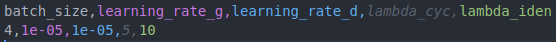
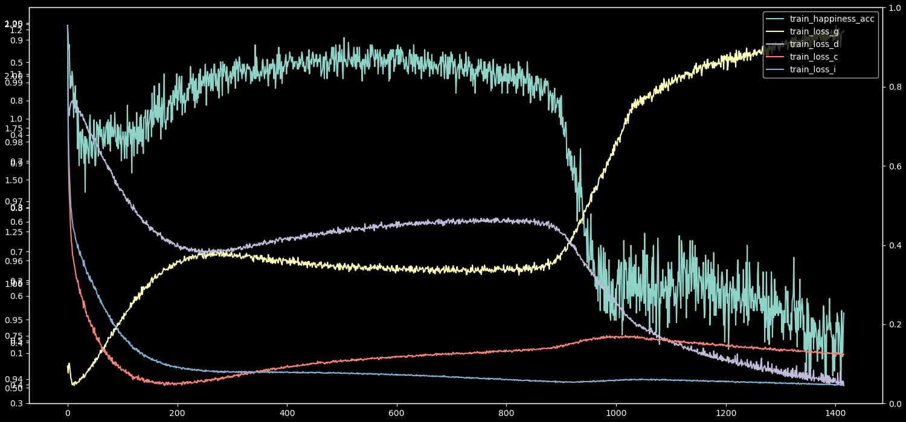
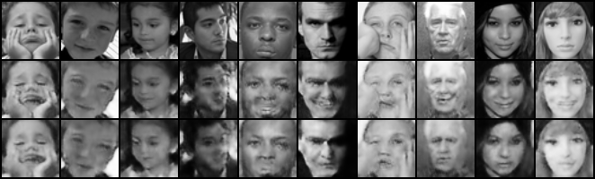
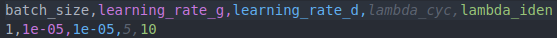
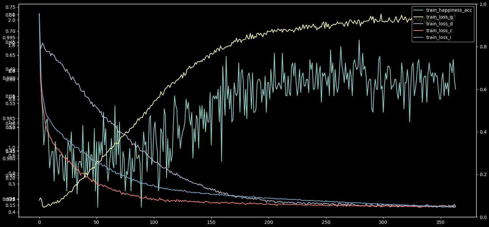
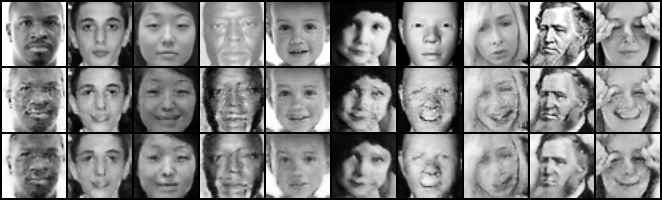
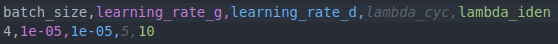
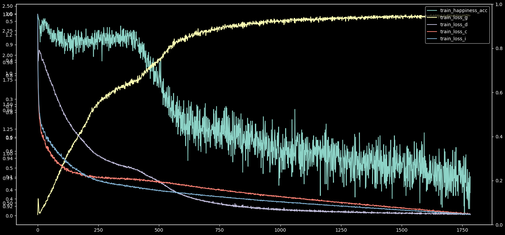
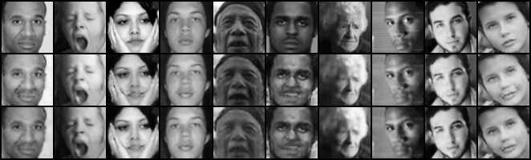

## Teksta darbi un Face-To-Face Pipeline

____

Dzīļās mašīnmācības nodaļas - ✅

Aprakstīt FID score - ✅

____

## Face-to-Face pipeline

___

Had to manualy look for non-face samples and filter out their index because classifier classifies them as emotion. There is not "other" class in classifier output:

```python
# Anomalies for emotions in fer dataset
    anomaly_idxs = {
        'happiness': [7777, 7388, 6441, 6270, 5956, 5890, 5691, 5672, 5453, 5160, 4752,
                      4391, 4123, 3994, 3964, 3834, 3754, 3613, 3314, 3040, 2864, 2819,
                      2647, 2541, 2458, 2250, 2226, 1933, 1817, 1691, 1296, 1091],
        'neutral': [77, 135, 213, 219, 261, 363, 589, 825, 1011, 1058, 1095, 1207, 1760,
                    1774, 2062, 2075, 2156, 2256, 2371, 2458, 2503, 2512, 2545, 2657, 2732,
                    2751, 2997, 3022, 3079, 3118, 3253, 3274, 3392, 3639, 3672, 3767, 3806,
                    3941, 3977, 4074, 4105, 4186, 4268, 4277, 4326, 4352, 4369, 4473, 4606,
                    4660, 4849, 4859, 4879, 5020, 5034, 5037, 5100, 5188, 5210, 5289, 5383,
                    5491, 5532, 5652, 5708, 5723, 5726, 5751, 5811, 5942, 5962, 6123]
    }
```

```python
model = Model(CLASS_NUM=4, in_image_channels=1, pretrained=False)
model.load_state_dict(torch.load('./classificator_models/model-best_4classes.pt', 		      map_location=torch.device('cpu')))
model.eval()

classifier_emo_dict = {
    'neutral': 0,
    'happiness': 1,
    'sadness': 2,
    'anger': 3
}
classifier_emo_label = classifier_emo_dict[EMOTION]

fer_emo_dict = {
    'anger': 0,
    'disgust': 1,
    'fear': 2,
    'happiness': 3,
    'sadness': 4,
    'surprise': 5,
    'neutral': 6
}
fer_emo_label = fer_emo_dict[EMOTION]

# Emotions [0=Angry, 1=Disgust, 2=Fear, 3=Happy, 4=Sad, 5=Surprise, 6=Neutral]
df = pd.read_csv('./data/fer/fer2013/fer2013.csv', sep=',', header=None)
df = df.loc[df[0] == str(fer_emo_label)]  # filter out entries for label
```

Select and write indexes and use classifier to filter again:

```python
train_idxs = []
test_idxs = []
data_len = len(df.values)
iter_done = 0
for idx, val in enumerate(df.values):
    img_flat = np.fromstring(val[1], dtype=int, sep=' ')
    img_np = np.reshape(img_flat, (48, 48))
    img_t = torch.FloatTensor(img_np)
    y_prim = model.forward(img_t.view(1, 1, img_t.size(0), img_t.size(1))).squeeze(dim=0)
    if EMOTION != 'neutral':  # Ignore neutral emotion
        y_real = classifier_emo_dict[EMOTION] - 1
        y_idx = torch.argmax(y_prim[1:])
    else:
        y_real = classifier_emo_dict[EMOTION]
        y_idx = torch.argmax(y_prim)

    if idx not in anomaly_idxs[EMOTION] and y_idx == y_real:
        if val[2] == 'Training':
            train_idxs.append(idx)
            iter_done += 1
        else:
            test_idxs.append(idx)
            iter_done += 1
        if iter_done % 20 == 0:
            print(f'Classifier iterations done: {iter_done}')

# open a hdf5 file and create arrays
if not os.path.exists('../data/'):
    os.makedirs('../data/')
hdf5_path = f'./data/fer_48_{EMOTION}.hdf5'
f = h5py.File(hdf5_path, mode='w')

f.create_dataset("train_labels", (len(train_idxs),), np.uint8)
f.create_dataset("test_labels", (len(test_idxs),), np.uint8)
f.create_dataset("train_imgs", (len(train_idxs), 48, 48), np.float32)
f.create_dataset("test_imgs", (len(test_idxs), 48, 48), np.float32)

# Write train data
for i, val_idx in enumerate(train_idxs):
    f["train_labels"][i] = int(df.values[val_idx][0])
    img_flat = np.fromstring(df.values[val_idx][1], dtype=int, sep=' ')
    img_np = np.reshape(img_flat, (48, 48))
    f["train_imgs"][i] = img_np

# Write test data
for i, val_idx in enumerate(test_idxs):
    f["test_labels"][i] = int(df.values[val_idx][0])
    img_flat = np.fromstring(df.values[val_idx][1], dtype=int, sep=' ')
    img_np = np.reshape(img_flat, (48, 48))
    f["test_imgs"][i] = img_np
```

Using Classifier to get accuracy:

```python
n = 0
for x_s, label_s in tqdm(dataloader_train_source, desc=stage):
    x_t, label_t = next(iter_data_loader_target)

    if x_s.size() != x_t.size():
        continue
    x_s = x_s.to(DEVICE) # source
    x_t = x_t.to(DEVICE) # target

    if n % D_ITER == 0:
       	...
        # Calculate accuracy
        with torch.no_grad():
            y_prim = classificator.forward(g_t).squeeze(dim=0)
            if len(y_prim.shape) == 2:
                y_idx = torch.argmax(y_prim, dim=1)
            else:
                y_idx = torch.argmax(y_prim.unsqueeze(dim=0), dim=1)
            acc = torch.mean((y_idx == classifier_emo_dict[TARGET_EMOTION]) * 1.0)

        metrics_epoch[f'{stage}_loss_i'].append(loss_i.cpu().item())
        metrics_epoch[f'{stage}_loss_g'].append(loss_g.cpu().item())
        metrics_epoch[f'{stage}_loss_c'].append(loss_c.cpu().item())
        metrics_epoch[f'{stage}_{TARGET_EMOTION}_acc'].append(acc.cpu().item())
        ...
```

- Still doing hyper-param search for face-to-face, and saving training data in csv.
- For calculating FID, need to save trained generator model and compare generated images with real images.

Some of results from hyper-parameter searching:



And discriminator iterations 2:



Test acc 1.0.



___



And discriminator iterations 2:



Test acc 1.0.



___



Discriminator iterations 3:



Test acc 0.9.



What works:

- Learning rate ~1e-5
- Discriminator iter 2, need to check with 1. 5 didn't work at all.
- Batch size of 4, trains faster than 1.

Need to try combinations of cycle and identity coefficient. 

___

## Feature-to-Feature

___

Segmenting images and using classificator to filter:

```python
EMOTION = args.emotion

classifier_emo_dict = {
    'neutral': 0,
    'happiness': 1,
    'sadness': 2,
    'anger': 3
}
classifier_emo_label = classifier_emo_dict[EMOTION]

# Setup pretrained segmentator model
segmentator = Segmentator(classes=5).to(DEVICE)
segmentator.load_state_dict(torch.load('./seg-model-best.pt', map_location=torch.device(DEVICE)))
segmentator.eval()
# Setup pretrained segmentation classificator model
classificator = Classificator(CLASS_NUM=4, in_image_channels=4).to(DEVICE)
classificator.load_state_dict(torch.load('./model-best_4m_4c.pt', map_location=torch.device(DEVICE)))
classificator.eval()

transform = torchvision.transforms.Compose([
    transforms.Resize(256)
])

# Works only with pretrained image size (256, 256) on which segmentator was trained. 
loader_params = {'batch_size': 1, 'shuffle': True, 'num_workers': 4}
dataset_train = Dataset(f'../data/fer_48_{EMOTION}.hdf5', mode='train', img_size=48,  transform=transform)
dataloader_train = data.DataLoader(dataset=dataset_train, **loader_params)
loader_params = {'batch_size': 1, 'shuffle': True, 'num_workers': 4}
dataset_test = Dataset(f'../data/fer_48_{EMOTION}.hdf5', mode='test', img_size=48, 	  transform=transform)
dataloader_test = data.DataLoader(dataset_test, **loader_params)

hdf5_path = f'../data/fer_256_segmen_{EMOTION}.hdf5'
f = h5py.File(hdf5_path, mode='w')

f.create_dataset("train_labels", (len(dataset_train),), np.uint8)
f.create_dataset("test_labels", (len(dataset_test),), np.uint8)
f.create_dataset("train_masks", (len(dataset_train), 4, 256, 256), np.float32)
f.create_dataset("test_masks", (len(dataset_test), 4, 256, 256), np.float32)
f.create_dataset("train_imgs", (len(dataset_train), 1, 256, 256), np.float32)
f.create_dataset("test_imgs", (len(dataset_test), 1, 256, 256), np.float32)

# Train dataset
idx = 0
for x_t, label_t in tqdm(dataloader_train):
    x_t = x_t.to(DEVICE)
    with torch.no_grad():
        y_prim = segmentator.forward(x_t)
    y_prim = y_prim.cpu().numpy()
    masks = y_prim[0, :-1, :, :]
    label = label_t.cpu().numpy().squeeze(axis=0)
    img = x_t.cpu().numpy().squeeze(axis=0)

    # Classify masks
    with torch.no_grad():
        masks = torch.FloatTensor(masks).unsqueeze(dim=0).to(DEVICE)
        m_prim = classificator.forward(masks)

    m_idx = torch.argmax(m_prim)
    if m_idx == classifier_emo_dict[EMOTION]:
        # Extract masked regions from img
        condition = masks.squeeze() >= 0.05
        np.putmask(masks.numpy(), condition, img)
        f["train_labels"][idx] = label
        f["train_masks"][idx] = masks
        f["train_imgs"][idx] = img
        idx += 1

# Test dataset
idx = 0
for x_t, label_t in tqdm(dataloader_test):
    x_t = x_t.to(DEVICE)
    with torch.no_grad():
        y_prim = segmentator.forward(x_t)
    y_prim = y_prim.cpu().numpy()
    masks = y_prim[0, :-1, :, :]
    label = label_t.cpu().numpy().squeeze(axis=0)
    img = x_t.cpu().numpy().squeeze(axis=0)

    # Classify masks
    with torch.no_grad():
        masks = torch.FloatTensor(masks).unsqueeze(dim=0).to(DEVICE)
        m_prim = classificator.forward(masks)

    m_idx = torch.argmax(m_prim)
    if m_idx == classifier_emo_dict[EMOTION]:
        # Extract masked regions from img
        condition = masks.squeeze() >= 0.05
        np.putmask(masks.numpy(), condition, img)
        f["test_labels"][idx] = label
        f["test_masks"][idx] = masks
        f["test_imgs"][idx] = img
        idx += 1
```

TODO next apmācīt ar maskām un tad ielīmēt atpakaļ oriģinālajā attēlā.
