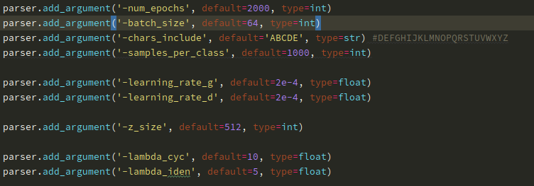

## CycleGAN Ariel Font & Horse2Zebra

____

- Residual Block:

  ```python
  class ResidualBlock(nn.Module):
      def __init__(self, channels):
          super().__init__()
          self.block = nn.Sequential(
              nn.ReflectionPad2d(padding=1),
              nn.Conv2d(in_channels=channels, out_channels=channels, kernel_size=(3, 3)),
              nn.InstanceNorm2d(num_features=channels),
              nn.ReLU(inplace=True),
              nn.ReflectionPad2d(padding=1),
              nn.Conv2d(in_channels=channels, out_channels=channels, kernel_size=(3, 3)),
              nn.InstanceNorm2d(num_features=channels)
          )
  
      def forward(self, x):
          return x + self.block.forward(x)
  ```

  

- Generator model:

  ```python
  class Generator(nn.Module):
      def __init__(self, channels, num_block=9):
          super().__init__()
          self.channels = channels
  
          model = [nn.ReflectionPad2d(padding=3)]
          model += self._create_layer(in_channels=self.channels, out_channels=64, kernel_size=7, stride=1, padding=0)
          # downsample
          model += self._create_layer(in_channels=64, out_channels=128, kernel_size=3)
          model += self._create_layer(in_channels=128, out_channels=256, kernel_size=3)
          # residual blocks
          model += [ResidualBlock(channels=256) for _ in range(num_block)]
          # upsample
          model += self._create_layer(in_channels=256, out_channels=128, kernel_size=3, transposed=True)
          model += self._create_layer(in_channels=128, out_channels=64, kernel_size=3, transposed=True)
          # output
          model += [nn.ReflectionPad2d(padding=3),
                    nn.Conv2d(in_channels=64, out_channels=self.channels, kernel_size=7),
                    nn.Tanh()]
  
          self.model = nn.Sequential(*model)
  
      def _create_layer(self, in_channels, out_channels, kernel_size, stride=2, padding=1, transposed=False):
          layers = []
          if transposed:
              layers.append(
                  nn.ConvTranspose2d(in_channels, out_channels, kernel_size,
                                     stride, padding, output_padding=(1, 1)))
          else:
              layers.append(nn.Conv2d(in_channels, out_channels, kernel_size, stride, padding))
          layers.append(nn.InstanceNorm2d(num_features=out_channels))
          layers.append(nn.ReLU(inplace=True))
          return layers
  
      def forward(self, x):
          return self.model.forward(x)
  ```

- Discriminator:

  ```python
  class Discriminator(nn.Module):
      def __init__(self, channels):
          super().__init__()
          self.channels = channels
  
          self.model = nn.Sequential(
              *self._create_layer(in_channels=self.channels, out_channels=64, stride=2, normalize=False),
              *self._create_layer(in_channels=64, out_channels=128, stride=2),
              *self._create_layer(in_channels=128, out_channels=256, stride=2),
              *self._create_layer(in_channels=256, out_channels=512, stride=1),
              nn.Conv2d(in_channels=512, out_channels=1, kernel_size=4, stride=1, padding=1)
          )
  
      def _create_layer(self, in_channels, out_channels, stride, normalize=True):
          layers = [nn.Conv2d(in_channels, out_channels, kernel_size=4, stride=stride, padding=1)]
          if normalize:
              layers.append(nn.InstanceNorm2d(num_features=out_channels))
          layers.append(nn.LeakyReLU(negative_slope=0.2, inplace=True))
          return layers
  
      def forward(self, x):
          return self.model.forward(x)
  ```

- Training loop:

  Image buffer for sampling fake data for Discriminator:

  ```python
  class ImageBuffer():
      def __init__(self, depth=50):
          self.depth = depth
          self.buffer = []
  
      def update(self, image):
          if len(self.buffer) == self.depth:
              i = random.randint(0, self.depth-1)
              self.buffer[i] = image
          else:
              self.buffer.append(image)
          if random.uniform(0,1) > 0.5:
              i = random.randint(0, len(self.buffer)-1)
              return self.buffer[i]
          else:
              return image
  ```

  

  ```python
  for epoch in range(1, EPOCHS):
      metrics_epoch = {key: [] for key in metrics.keys()}
  
      stage = 'train'
      iter_data_loader_target = iter(data_loader_target)
      x_s_prev = None
      x_t_prev = None
  
      for x_s, label_s in tqdm(data_loader_source, desc=stage):
          x_t, label_t = next(iter_data_loader_target)
  
          if x_s.size() != x_t.size():
              break
  
          x_s = x_s.to(DEVICE) # source
          x_t = x_t.to(DEVICE) # target
          x_s_prev = x_s # for visualization
          x_t_prev = x_t # for visualization
  
          optimizer_G.zero_grad()
          ### Train G
          g_t = model_G_s_t.forward(x_s)
          g_s = model_G_t_s.forward(x_t)
  
          # generator loss
          y_g_t = model_D_t.forward(g_t) # 1 = real, 0 = fake
          y_g_s = model_D_s.forward(g_s)
          loss_g_t = torch.mean((y_g_t - 1.0) ** 2) # L2, MSE, LSGAN => Alternative to W-GAN
          loss_g_s = torch.mean((y_g_s - 1.0) ** 2)
          loss_g = (loss_g_t + loss_g_s) / 2
  
          # cycle loss
          recov_s = model_G_t_s.forward(g_t)
          loss_c_s = torch.mean(torch.abs(recov_s - x_s))
          recov_t = model_G_s_t.forward(g_s)
          loss_c_t = torch.mean(torch.abs(recov_t - x_t))
          loss_c = (loss_c_s + loss_c_t) / 2
  
          # identity loss
          i_t = model_G_s_t.forward(x_t)
          i_s = model_G_t_s.forward(x_s)
          loss_i_t = torch.mean(torch.abs(i_t - x_t))
          loss_i_s = torch.mean(torch.abs(i_s - x_s))
          loss_i = (loss_i_s + loss_i_t) / 2
  
          loss = loss_g + loss_c * args.lambda_cyc + loss_i * args.lambda_iden
          loss.backward()
          optimizer_G.step()
  
          metrics_epoch[f'{stage}_loss_i'].append(loss_i.cpu().item())
          metrics_epoch[f'{stage}_loss_g'].append(loss_g.cpu().item())
          metrics_epoch[f'{stage}_loss_c'].append(loss_c.cpu().item())
  
          ### Train D_s
          optimizer_D_s.zero_grad()
  
          y_x_s = model_D_s.forward(x_s)
          loss_x_s = torch.mean((y_x_s - 1.0) ** 2)
          # g_s = model_G_t_s.forward(x_t)
          g_s = image_buffer_s.update(g_s)
          y_g_s = model_D_s.forward(g_s.detach())
          loss_g_s = torch.mean(y_g_s ** 2)
  
          d_loss_s = (loss_x_s + loss_g_s) / 2
          d_loss_s.backward()
          optimizer_D_s.step()
  
          ### Train D_s
          optimizer_D_t.zero_grad()
  
          y_x_t = model_D_t.forward(x_t)
          loss_x_t = torch.mean((y_x_t - 1.0) ** 2)
          # g_t = model_G_s_t.forward(x_s)
          g_t = image_buffer_t.update(g_t)
          y_g_t = model_D_t.forward(g_t.detach())
          loss_g_t = torch.mean(y_g_t ** 2)
  
          loss_d = (loss_g_t + loss_x_t) / 2
          loss_d.backward()
          optimizer_D_t.step()
  
          metrics_epoch[f'{stage}_loss_d'].append(loss_d.cpu().item())
  
  ```

- Results:

  Hyperparameters:

  

​	

- x_s
- g_t
- x_t
- g_s


### Horse2Zebra dataset:

ImageDataset class:

```python
class ImageDataset(Dataset):
    def __init__(self, root_dir, type, transform=None, unaligned=False, mode='train'):
        self.transform = torchvision.transforms.Compose(transform)
        self.unaligned = unaligned
        self.type = type
        self.train = (mode == 'train')

        self.files = sorted(glob.glob(os.path.join(root_dir, f'{mode}{self.type}') + '/*.*'))

    def __getitem__(self, index):
        img = Image.open(self.files[index % len(self.files)])
        img = img.convert('RGB')
        item = self.transform(img)
        return item

    def __len__(self):
        return len(self.files)
```

Distributed launch code:

```python
torch.distributed.init_process_group(backend='nccl')
DEVICE = torch.device('cuda', args.local_rank)
model_G_s_t = Generator(channels=3).to(DEVICE)
model_G_t_s = Generator(channels=3).to(DEVICE)
model_G_s_t = torch.nn.parallel.DistributedDataParallel(model_G_s_t,
                                                          device_ids=[args.local_rank],
                                                          output_device=args.local_rank)
model_G_t_s = torch.nn.parallel.DistributedDataParallel(model_G_t_s,
                                                          device_ids=[args.local_rank],
                                                          output_device=args.local_rank)
model_D_s = Discriminator(channels=3).to(DEVICE)
model_D_t = Discriminator(channels=3).to(DEVICE)
model_D_s = torch.nn.parallel.DistributedDataParallel(model_D_s,
                                                          device_ids=[args.local_rank],
                                                          output_device=args.local_rank)
model_D_t = torch.nn.parallel.DistributedDataParallel(model_D_t,
                                                          device_ids=[args.local_rank],
                                                          output_device=args.local_rank)

transform = [transforms.Resize(int(INPUT_SIZE*1.12), Image.BICUBIC),
                     transforms.RandomCrop((INPUT_SIZE, INPUT_SIZE)),
                     transforms.RandomHorizontalFlip(),
                     transforms.ToTensor(),
                     transforms.Normalize((0.5), (0.5))]
dataset_source = ImageDataset(os.path.join(DATA_DIR, "horse2zebra"), transform=transform, unaligned=True, mode='train', type='A')
dataset_target = ImageDataset(os.path.join(DATA_DIR, "horse2zebra"), transform=transform, unaligned=True, mode='train', type='B')
test_dataset_source = ImageDataset(os.path.join(DATA_DIR, "horse2zebra"), transform=transform, unaligned=True, mode='test', type='A')
test_dataset_target = ImageDataset(os.path.join(DATA_DIR, "horse2zebra"), transform=transform, unaligned=True, mode='test', type='B')

sampler_source_train = DistributedSampler(dataset_source)
sampler_target_train = DistributedSampler(dataset_target)
sampler_source_test = DistributedSampler(test_dataset_source)
sampler_target_test = DistributedSampler(test_dataset_target)

dataloader_source = torch.utils.data.DataLoader(dataset_source, batch_size=BATCH_SIZE, sampler=sampler_source_train, num_workers=8)
dataloader_target = torch.utils.data.DataLoader(dataset_target, batch_size=BATCH_SIZE, sampler=sampler_target_train, num_workers=8)
test_dataloader_source = DataLoader(test_dataset_source, batch_size=TEST_BATCH_SIZE, sampler=sampler_source_test, num_workers=8)
test_dataloader_target = DataLoader(test_dataset_target, batch_size=TEST_BATCH_SIZE, sampler=sampler_target_test, num_workers=8)

```

Training and model is the same

Hyperaparameters:


Results 530 epoch:


Samples 530 epoch:


Samples 528 epoch:


Samples 524 epoch:

