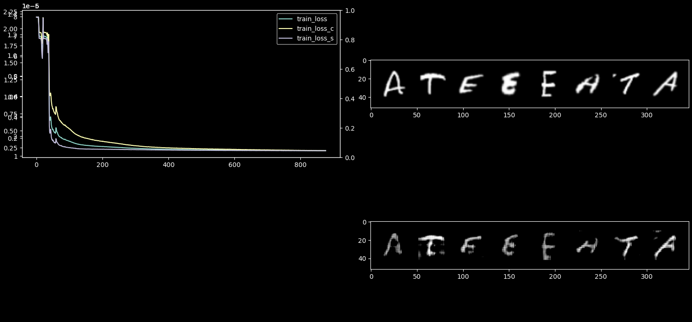

## DTN-GAN / AdaIN

Domain Transfer Network results:

Training parameters:


## Adaptive Instance Normalization:

Encoder/Decoder:

```python
class Encoder(torch.nn.Module):
    def __init__(self):
        super().__init__()
        self.encoder = torch.nn.Sequential(
            torch.nn.ReflectionPad2d(padding=(1, 1, 1, 1)),  # padding=(left, right, top, bottom)
            torch.nn.Conv2d(in_channels=1, out_channels=8, kernel_size=(3, 3), stride=(1, 1)),
            torch.nn.LeakyReLU(),

            torch.nn.ReflectionPad2d(padding=(1, 1, 1, 1)),
            torch.nn.Conv2d(in_channels=8, out_channels=16, kernel_size=(3, 3), stride=(1, 1)),
            torch.nn.LeakyReLU(),
            torch.nn.MaxPool2d(kernel_size=2, stride=2),
            torch.nn.ReflectionPad2d(padding=(1, 1, 1, 1)),
            torch.nn.Conv2d(in_channels=16, out_channels=32, kernel_size=(3, 3), stride=(1, 1)),
            torch.nn.LeakyReLU(),

            torch.nn.ReflectionPad2d(padding=(1, 1, 1, 1)),
            torch.nn.Conv2d(in_channels=32, out_channels=64, kernel_size=(3, 3), stride=(1, 1)),
            torch.nn.LeakyReLU(),
            torch.nn.MaxPool2d(kernel_size=2, stride=2),
            torch.nn.ReflectionPad2d(padding=(1, 1, 1, 1)),
            torch.nn.Conv2d(in_channels=64, out_channels=128, kernel_size=(3, 3), stride=(1, 1)),
            torch.nn.LeakyReLU(),

            torch.nn.ReflectionPad2d(padding=(1, 1, 1, 1)),
            torch.nn.Conv2d(in_channels=128, out_channels=256, kernel_size=(3, 3), stride=(1, 1)),
            torch.nn.LeakyReLU(),
            torch.nn.MaxPool2d(kernel_size=2, stride=2),
            torch.nn.ReflectionPad2d(padding=(1, 1, 1, 1)),
            torch.nn.Conv2d(in_channels=256, out_channels=512, kernel_size=(3, 3), stride=(1, 1)),
            torch.nn.LeakyReLU(),
        )

    def forward(self, x):
        return self.encoder.forward(x)


class Decoder(torch.nn.Module):
    def __init__(self):
        super().__init__()
        self.decoder = torch.nn.Sequential(
            torch.nn.ReflectionPad2d(padding=(1, 1, 1, 1)),  # padding=(left, right, top, bottom)
            torch.nn.Conv2d(in_channels=512, out_channels=256, kernel_size=(3, 3), stride=(1, 1)),
            torch.nn.LeakyReLU(),
            torch.nn.Upsample(scale_factor=2),
            torch.nn.ReflectionPad2d(padding=(1, 1, 1, 1)),  # padding=(left, right, top, bottom)
            torch.nn.Conv2d(in_channels=256, out_channels=128, kernel_size=(3, 3), stride=(1, 1)),
            torch.nn.LeakyReLU(),

            torch.nn.ReflectionPad2d(padding=(1, 1, 1, 1)),  # padding=(left, right, top, bottom)
            torch.nn.Conv2d(in_channels=128, out_channels=64, kernel_size=(3, 3), stride=(1, 1)),
            torch.nn.LeakyReLU(),
            torch.nn.Upsample(scale_factor=2),
            torch.nn.ReflectionPad2d(padding=(1, 1, 1, 1)),  # padding=(left, right, top, bottom)
            torch.nn.Conv2d(in_channels=64, out_channels=32, kernel_size=(3, 3), stride=(1, 1)),
            torch.nn.LeakyReLU(),

            torch.nn.ReflectionPad2d(padding=(1, 1, 1, 1)),  # padding=(left, right, top, bottom)
            torch.nn.Conv2d(in_channels=32, out_channels=16, kernel_size=(3, 3), stride=(1, 1)),
            torch.nn.LeakyReLU(),
            torch.nn.Upsample(scale_factor=2),
            torch.nn.ReflectionPad2d(padding=(1, 1, 1, 1)),  # padding=(left, right, top, bottom)
            torch.nn.Conv2d(in_channels=16, out_channels=8, kernel_size=(3, 3), stride=(1, 1)),
            torch.nn.LeakyReLU(),

            torch.nn.ReflectionPad2d(padding=(1, 1, 1, 1)),  # padding=(left, right, top, bottom)
            torch.nn.Conv2d(in_channels=8, out_channels=1, kernel_size=(3, 3), stride=(1, 1)),
            torch.nn.LeakyReLU()
        )

    def forward(self, z):
        return self.decoder.forward(z)
```

Transfer Network:

```python
class StyleTransferNet(torch.nn.Module):
    def __init__(self, encoder, decoder):
        super().__init__()
        enc_layers = list(encoder.children())
        self.enc_1 = torch.nn.Sequential(*enc_layers[:3])
        self.enc_2 = torch.nn.Sequential(*enc_layers[3:10])
        self.enc_3 = torch.nn.Sequential(*enc_layers[10:17])
        self.enc_4 = torch.nn.Sequential(*enc_layers[17:])
        self.mse_loss = torch.nn.MSELoss()
        self.decoder = decoder

        # Disable gradients for encoder
        for name in ['enc_1', 'enc_2', 'enc_3', 'enc_4']:
            for param in getattr(self, name).parameters():
                param.requires_grad = False

    def encode_with_intermediate(self, input):
        results = [input]
        for i in range(4):
            enc = getattr(self, 'enc_{:d}'.format(i + 1))
            results.append(enc(results[-1]))
        return results[1:] # take only appended results not input

    def encode(self, input):
        for i in range(4):
            input = getattr(self, 'enc_{:d}'.format(i + 1))(input)
        return input

    def content_loss(self, input, target):
        assert (input.size() == target.size())
        assert (target.requires_grad is False)
        return self.mse_loss(input, target)

    def style_loss(self, input, target):
        assert (input.size() == target.size())
        assert (target.requires_grad is False)
        input_mean, input_std = mean_std(input)
        target_mean, target_std = mean_std(target)
        return self.mse_loss(input_mean, target_mean) + \
               self.mse_loss(input_std, target_std)

    def forward(self, content, style, alpha=1.0):
        assert 0 <= alpha <= 1
        style_feats = self.encode_with_intermediate(style)
        content_feat = self.encode(content)
        t = adain(content_feat, style_feats[-1])
        t = alpha * t + (1 - alpha) * content_feat

        g_t = self.decoder(t)
        g_t_feats = self.encode_with_intermediate(g_t)

        loss_c = self.content_loss(g_t_feats[-1], t.detach())
        loss_s = self.style_loss(g_t_feats[0], style_feats[0].detach())
        for i in range(1, 4):
            loss_s += self.style_loss(g_t_feats[i], style_feats[i].detach())
        return loss_c, loss_s, g_t


encoder = Encoder()
decoder = Decoder()
network = StyleTransferNet(encoder, decoder).to(DEVICE)
```

Adain function:

```python
def mean_std(feat, eps=1e-5):
    size = feat.size()
    assert (len(size) == 4)
    N, C = size[:2]
    feat_var = feat.view(N, C, -1).var(dim=2) + eps
    feat_std = feat_var.sqrt().view(N, C, 1, 1)
    feat_mean = feat.view(N, C, -1).mean(dim=2).view(N, C, 1, 1)
    return feat_mean, feat_std

def adain(content, style):
    assert (content.size()[:2] == style.size()[:2])
    size = content.size()
    style_mean, style_std = mean_std(style)
    content_mean, content_std = mean_std(content)

    normalized_feat = (content - content_mean.expand(size)) / content_std.expand(size)
    return normalized_feat * style_std.expand(size) + style_mean.expand(size)
```

Training loop:

```python
for epoch in range(1, EPOCHS):
    metrics_epoch = {key: [] for key in metrics.keys()}

    stage = 'train'
    iter_data_loader_target = iter(data_loader_target)
    for x_content, label_content in tqdm(data_loader_source, desc=stage):
        x_content = x_content.to(DEVICE)
        x_style, label_style = next(iter_data_loader_target)
        x_style = x_style.to(DEVICE)

        loss_c, loss_s, g_t = network(x_content, x_style)
        loss_c = CONT_W*loss_c
        loss_s = STYLE_W*loss_s
        loss = loss_c + loss_s

        optimizer.zero_grad()
        loss.backward()
        optimizer.step()
```

Result:

Training parameters:


