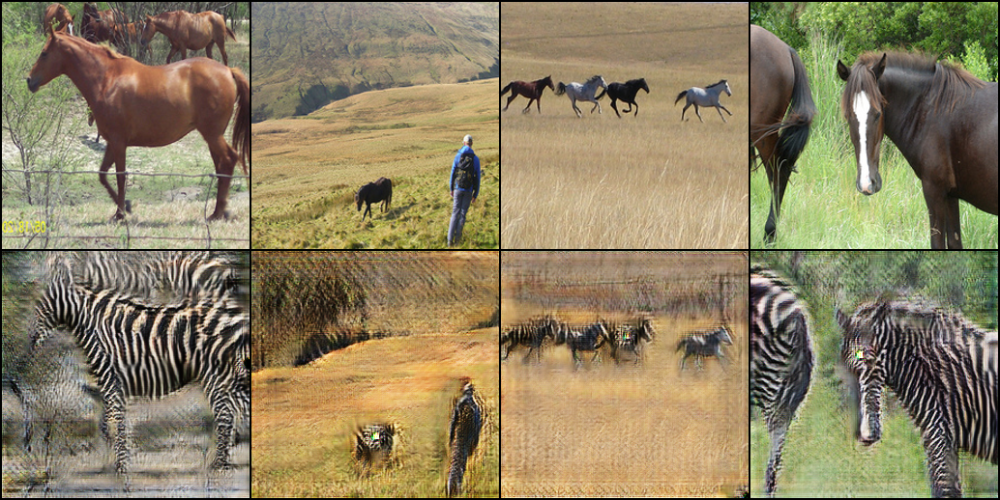
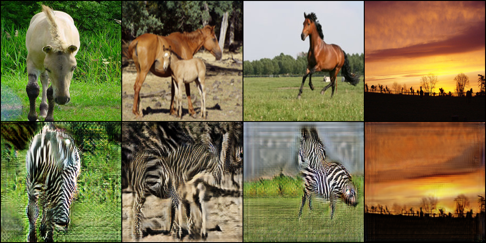
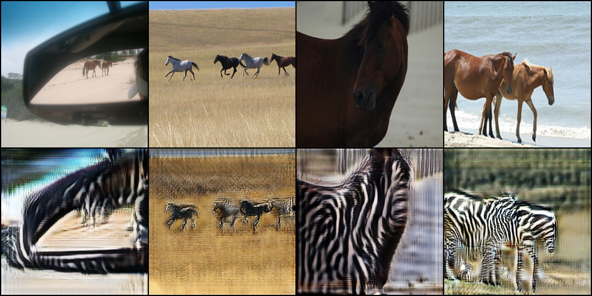
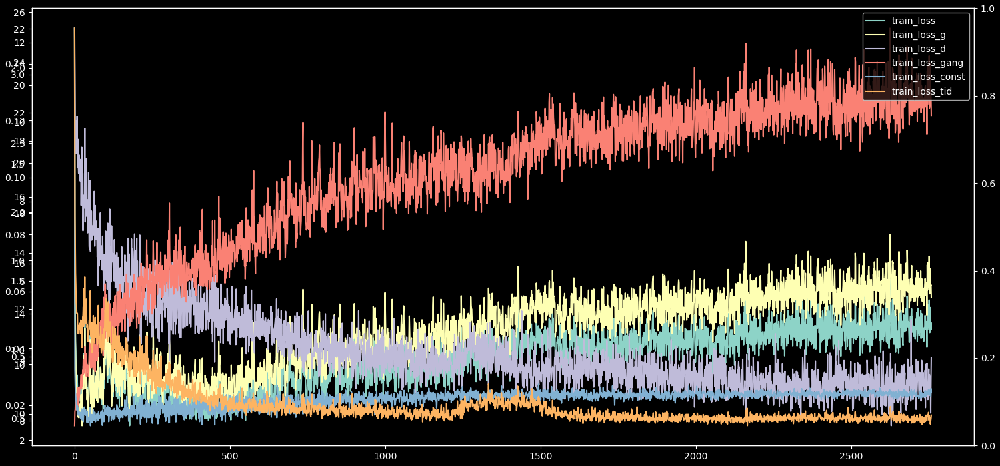
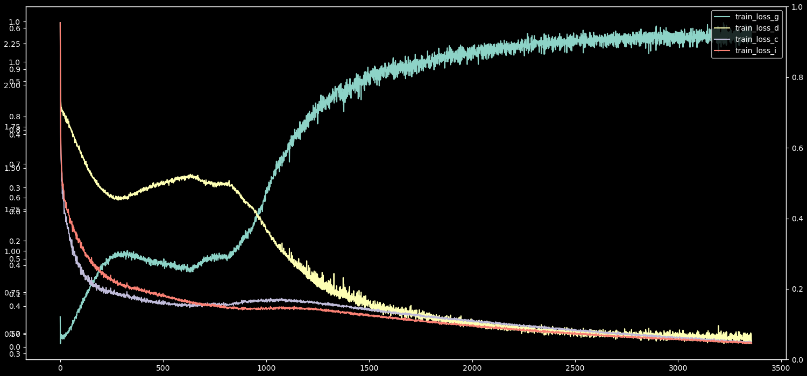
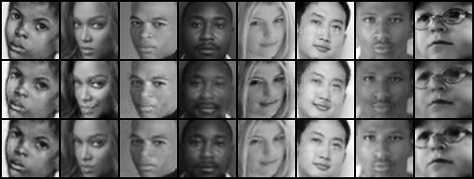
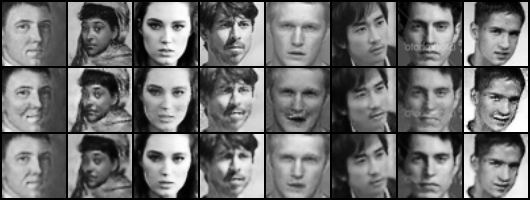
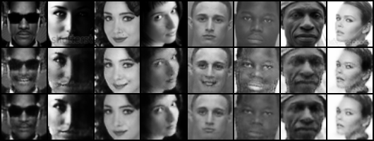

## Meeting #10 Report

DTN-GAN Horse2Zebra:

Labākie rezultāti ko pagaidām varēja dabūt ar dtn-gan horse-to-zebra:










___

HDF5 Data processor priekš FER datu kopas.

```python
import pandas as pd
import numpy as np
import h5py

### Prepare data to be stored
df = pd.read_csv('./fer/fer2013/fer2013.csv', sep=',', header=None)

values = df.values
count = len(values)
col_name = values[0]

labels = []
imgs = []
usage = []

for i in range(1, count):
    # filter out Happiness (3) label
    label = int(values[i][0])
    if label == 6:
        img_flat = np.fromstring(values[i][1], dtype=int, sep=' ')
        img = np.reshape(img_flat, (48, 48))
        imgs.append(img)
        labels.append(label)
        usage.append(values[i][2])

# Sort into training and testing usages
train_imgs = []
train_labels = []
test_imgs = []
test_labels = []
for idx, u in enumerate(usage):
    if u == 'Training':
        train_imgs.append(imgs[idx])
        train_labels.append(labels[idx])
    else:
        test_imgs.append(imgs[idx])
        test_labels.append(labels[idx])

train_imgs = np.array(train_imgs)
train_labels = np.array(train_labels)
test_imgs = np.array(test_imgs)
test_labels = np.array(test_labels)

### Create h5py object
train_shape = (len(train_imgs), 48, 48)
test_shape = (len(test_imgs), 48, 48)

# open a hdf5 file and create arrays
hdf5_path = './fer_48_s.hdf5'
f = h5py.File(hdf5_path, mode='w')

### Store data in .hdf5 file
f.create_dataset("train_labels", (len(train_labels),), np.uint8)
f["train_labels"][...] = train_labels
f.create_dataset("test_labels", (len(test_labels),), np.uint8)
f["test_labels"][...] = test_labels
f.create_dataset("train_imgs", train_shape, np.float32)
f["train_imgs"][...] = train_imgs
f.create_dataset("test_imgs", test_shape, np.float32)
f["test_imgs"][...] = test_imgs

f.close()
```

 Dataset class:

Šī datu kopa nav tik liela tāpēc uzreiz ieliek atmiņā.

```python
import h5py
import numpy as np
import torch
from torch.utils import data


class Dataset(data.Dataset):
    def __init__(self, file_path, mode, img_size, transform):
        super().__init__()
        self.data = []
        self.mode = mode
        self.img_size = img_size
        self.file_path = file_path
        self.transform = transform

        file = h5py.File(self.file_path)

        labels = file[f"{self.mode}_labels"]
        imgs = file[f"{self.mode}_imgs"]
        self.data = list(zip(imgs, labels))

    def __getitem__(self, index):
        x, y = self.data[index]
        y = np.expand_dims(y, axis=0)

        x = np.reshape(x, (1, self.img_size, self.img_size))
        x = torch.FloatTensor(x)
        x = self.transform(x)
        mid = 255.0 / 2
        x = (x - mid) / mid

        y = torch.from_numpy(y)

        return x, y

    def __len__(self):
        return len(self.data)
```

_____

CycleGAN rezultāti pārnesot Happiness emociju uz neutral:



1.rinda Source; 2.rinda Fake Target; 3.rinda Recovered Source

Epoch: 3354 samples:



Epoch: 3356 samples:



Epoch: 2734 samples:



______

Problēmas pieteikties RaFD seju datu kopai (nav nekādas atbildes uz epasta apstiprināšanu). Alternatīva: Flickr Faces Dataset. (FFHQ), kuram ir emotion labels.

https://github.com/NVlabs/ffhq-dataset

https://openprojectrepo.com/project/DCGM-ffhq-features-dataset-python-deep-learning

_____

