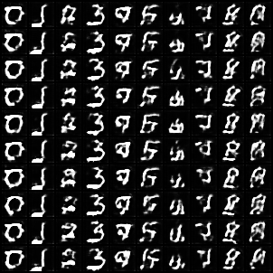
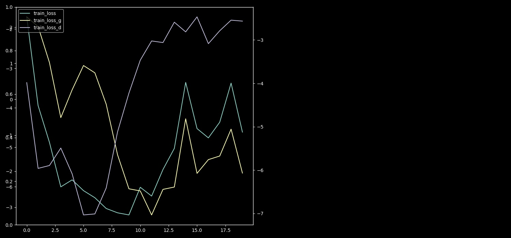
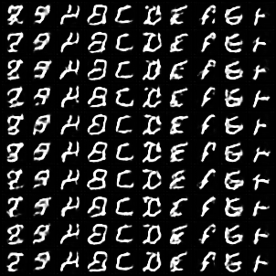
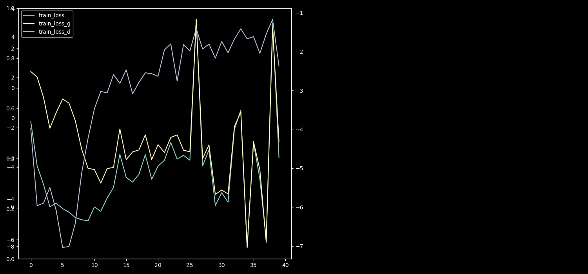
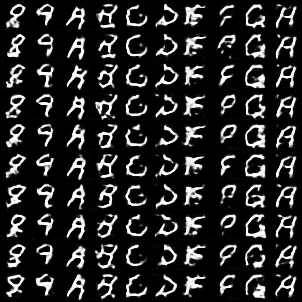
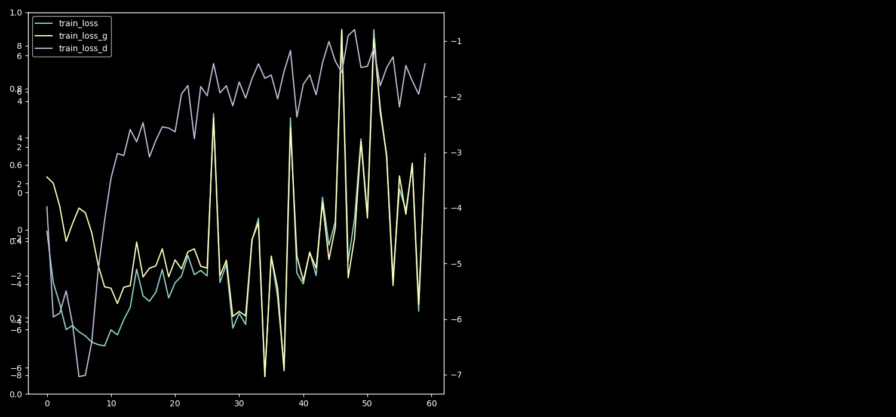
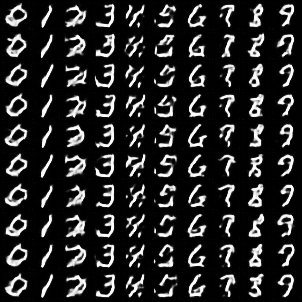
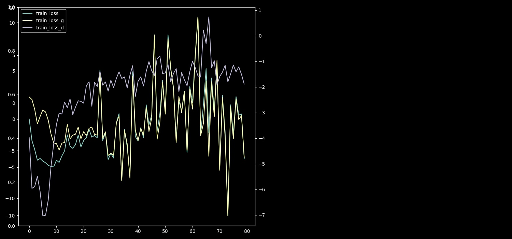
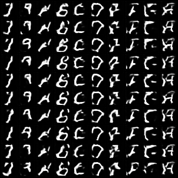
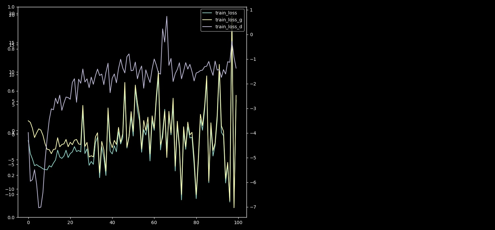

# WGAN / WGAN-Improvements

#### Ievestie uzlabojumi:

###### (Pagaidām nav skaidra optimālā modeļa arhitektūra un hiperparametru izvēle):

- BatchNorm vietā lieto LayerNorm (Discriminator/Critic).
- Izmantoti klašu labels, lai iekodētu papildus informāciju (Generator un Critic).
- Gradient clip vietā labāk izmantot Gradient penalty. (https://arxiv.org/abs/1606.03498)
- Generator modelim izmanto ResNet līdzīgus blokus.

1) Critic ar LayerNorm un iekodētiem labels, forward daļā:

   ```python
   class ModelD(torch.nn.Module):
       def __init__(self):
           super().__init__()
   
           self.label_embedding = torch.nn.Sequential(
               torch.nn.Embedding(num_embeddings=MAX_CLASSES, embedding_dim=MAX_CLASSES),
               torch.nn.Linear(in_features=MAX_CLASSES, out_features=INPUT_SIZE ** 2)
           )
   
           self.encoder = torch.nn.Sequential(
               torch.nn.Conv2d(in_channels=2, out_channels=8, kernel_size=(3, 3), stride=(1, 1), padding=1),
               torch.nn.LayerNorm(normalized_shape=[8, 28, 28]),
               torch.nn.LeakyReLU(),
   
               torch.nn.Conv2d(in_channels=8, out_channels=16, kernel_size=(3, 3), stride=(1, 1), padding=1),
               torch.nn.LayerNorm(normalized_shape=[16, 28, 28]),
               torch.nn.LeakyReLU(),
               torch.nn.AvgPool2d(kernel_size=4, stride=2, padding=1),
   
               torch.nn.Conv2d(in_channels=16, out_channels=16, kernel_size=(3, 3), stride=(1, 1), padding=1),
               torch.nn.LayerNorm(normalized_shape=[16, 14, 14]),
               torch.nn.LeakyReLU(),
   
               torch.nn.Conv2d(in_channels=16, out_channels=32, kernel_size=(3, 3), stride=(1, 1), padding=1),
               torch.nn.LayerNorm(normalized_shape=[32, 14, 14]),
               torch.nn.LeakyReLU(),
               torch.nn.AvgPool2d(kernel_size=4, stride=2, padding=1),
   
               torch.nn.Conv2d(in_channels=32, out_channels=64, kernel_size=(3, 3), stride=(1, 1), padding=1),
               torch.nn.LayerNorm(normalized_shape=[64, 7, 7]),
               torch.nn.LeakyReLU(),
   
               torch.nn.Conv2d(in_channels=64, out_channels=128, kernel_size=(3, 3), stride=(1, 1), padding=1),
               torch.nn.LayerNorm(normalized_shape=[128, 7, 7]),
               torch.nn.LeakyReLU(),
   
               torch.nn.Conv2d(in_channels=128, out_channels=128, kernel_size=(3, 3), stride=(1, 1), padding=1),
               torch.nn.LayerNorm(normalized_shape=[128, 7, 7]),
               torch.nn.LeakyReLU(),
               torch.nn.AvgPool2d(kernel_size=4, stride=2, padding=1),
               torch.nn.AdaptiveAvgPool2d(output_size=(1, 1))
           )
           self.mlp = torch.nn.Sequential(
               torch.nn.Linear(in_features=128, out_features=1)
           )
   
       def forward(self, x, labels):
           label_enc = self.label_embedding.forward(labels)
           label_enc = label_enc.view(labels.size(0), 1, INPUT_SIZE, INPUT_SIZE)
   
           x_labels_cat = torch.cat((x, label_enc), dim=1)
           x_enc = self.encoder.forward(x_labels_cat)
   
           x_enc_flat = x_enc.squeeze()
           y_prim = self.mlp.forward(x_enc_flat)
   
           return y_prim
   ```

2) Gradient Penalty:

   ```python
   def gradient_penalty(critic, real_data, fake_data, labels, penalty, device):
       n_elements = real_data.nelement()
       batch_size = real_data.size()[0]
       colors = real_data.size()[1]
       image_width = real_data.size()[2]
       image_height = real_data.size()[3]
       alpha = torch.rand(batch_size, 1).expand(batch_size, int(n_elements / batch_size)).contiguous()
       alpha = alpha.view(batch_size, colors, image_width, image_height).to(device)
   
       interpolates = alpha * real_data.detach() + ((1 - alpha) * fake_data.detach())
   
       interpolates = interpolates.to(device)
       interpolates.requires_grad_(True)
       critic_interpolates = critic(interpolates, labels)
   
       gradients = torch.autograd.grad(
           outputs=critic_interpolates,
           inputs=interpolates,
           grad_outputs=torch.ones(critic_interpolates.size()).to(device),
           create_graph=True,
           retain_graph=True,
           only_inputs=True
       )[0]
   
       gradients = gradients.view(gradients.size(0), -1)
       gradient_penalty = ((gradients.norm(2, dim=1) - 1) ** 2).mean() * penalty
       return gradient_penalty
   ```

   ```python
   ...
           for n in range(8):
               z = dist_z.sample((x.size(0), Z_SIZE)).to(DEVICE)
               x_fake = model_G.forward(z, labels)
               for param in model_D.parameters():
                   param.requires_grad = True
               y_fake = model_D.forward(x_fake.detach(), labels)
               y_real = model_D.forward(x, labels)
   
               penalty = gradient_penalty(critic=model_D,
                                          real_data=x,
                                          fake_data=x_fake,
                                          labels=labels,
                                          penalty=10,
                                          device=DEVICE)
   
               loss_D = torch.mean(y_fake) - torch.mean(y_real) + penalty
               loss_D.backward()
   
               # torch.nn.utils.clip_grad_norm(model_D.parameters(), max_norm=1e-2, norm_type=1)
               optimizer_D.step()
               optimizer_D.zero_grad()
   
           loss = loss_D + loss_G
   ```

   Piemērs no rezultātiem (neesmu atradis pieņemamus ar šo modeli):

   Generator model:

   ```python
   class ResBlock(torch.nn.Module):
       def __init__(self, in_channels, out_channels, stride=1, upsample=False, dropout=False):
           super().__init__()
           self.conv1 = torch.nn.Conv2d(in_channels=in_channels, out_channels=out_channels,
                                        kernel_size=(3, 3), stride=(stride, stride), padding=(1, 1), bias=False)
           self.bn1 = torch.nn.BatchNorm2d(num_features=out_channels)
           self.conv2 = torch.nn.Conv2d(in_channels=out_channels, out_channels=out_channels,
                                        kernel_size=(3, 3), stride=(1, 1), padding=(1, 1), bias=False)
           self.bn2 = torch.nn.BatchNorm2d(num_features=out_channels)
   
           # Add regularization in form of dropout (25%)
           self.reg = False
           if dropout:
               self.reg = True
               self.dropout = torch.nn.Dropout(p=0.25)
   
           self.upsample = False
           if upsample:
               self.upsample = True
   
           # Check if input and output channels are changing
           self.bottle_neck = False
           if in_channels != out_channels:
               self.bottle_neck = True
               self.shortcut = torch.nn.Conv2d(in_channels=in_channels, out_channels=out_channels,
                                   kernel_size=(3, 3), stride=(1, 1), padding=(1, 1), bias=False)
   
       def forward(self, x):
           residual = x
   
           out = x
           if self.upsample:
               out = F.upsample(out, scale_factor=2)
               residual = F.upsample(residual, scale_factor=2)
           out = self.conv1.forward(out)
           out = self.bn1.forward(out)
           out = F.leaky_relu_(out)
   
           out = self.conv2.forward(out)
           if self.bottle_neck:
               residual = self.shortcut.forward(residual)
           out += residual
           out = self.bn2.forward(out)
           out = F.leaky_relu_(out)
           if self.reg:
               out = self.dropout.forward(out)
   
           return out
   
   
   class ModelG(torch.nn.Module):
       def __init__(self):
           super().__init__()
   
           self.decoder_size = INPUT_SIZE // 4
           self.mlp = torch.nn.Sequential(
               torch.nn.Linear(in_features=Z_SIZE, out_features=self.decoder_size ** 2 * 255),
           )
           self.label_embedding = torch.nn.Sequential(
               torch.nn.Embedding(num_embeddings=MAX_CLASSES, embedding_dim=MAX_CLASSES),
               torch.nn.Linear(in_features=MAX_CLASSES, out_features=self.decoder_size ** 2)
           )
   
           self.decoder = torch.nn.Sequential(
               torch.nn.BatchNorm2d(num_features=256),
   
               ResBlock(in_channels=256, out_channels=256, upsample=True),
               ResBlock(in_channels=256, out_channels=256, dropout=True),
               ResBlock(in_channels=256, out_channels=128, upsample=True),
               ResBlock(in_channels=128, out_channels=64),
               ResBlock(in_channels=64, out_channels=32, dropout=True),
               ResBlock(in_channels=32, out_channels=16),
               ResBlock(in_channels=16, out_channels=8),
   
               torch.nn.BatchNorm2d(num_features=8),
               torch.nn.Conv2d(in_channels=8, out_channels=1, kernel_size=(3, 3), stride=(1, 1), padding=1),
               torch.nn.Tanh()
           )
   
       def forward(self, z, labels):
           label_enc = self.label_embedding.forward(labels)
           label_2d = label_enc.view(labels.size(0), 1, self.decoder_size, self.decoder_size)
           z_flat = self.mlp.forward(z)
           z_2d = z_flat.view(z.size(0), 255, self.decoder_size, self.decoder_size)
           z_label_enc = torch.cat((label_2d, z_2d), dim=1)
           y_prim = self.decoder.forward(z_label_enc)
   
           return y_prim
   ```

   

   Parametru attiecība:

   model_D params: 353017
   model_G params: 6557661

   Paraugi ir ģenerēti no random skaitļa līdz +10.

   ```python
   s = np.random.randint(0, MAX_CLASSES-10)
   sample_image(labels_interval=[s, s+10], epoch=epoch)
   ```

   

   - batch_size=64, lr=5e-5, 4 critic iterācijas uz vienu ģeneratora.

     20epoch gen

     

​			20epoch loss

​			

​			40epoch gen



​			40epoch loss

​			

​			60epoch gen



​			60epoch loss

​			

​			80epoch gen



​			80epoch loss

​			

​			100epoch gen



​			100epoch loss

​			

Tālāk rezultāti nemainās un loss svārstās ap vienu vidējo vērtību.


