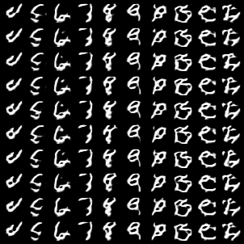

# WGAN / WGAN-Improvements

#### Sākotnējais WGAN + Conditional labels:

Critic:

````python
class ModelD(torch.nn.Module):
    def __init__(self):
        super().__init__()

        self.label_embedding = torch.nn.Sequential(
            torch.nn.Embedding(num_embeddings=MAX_CLASSES, embedding_dim=MAX_CLASSES),
            torch.nn.Linear(in_features=MAX_CLASSES, out_features=INPUT_SIZE ** 2)
        )

        self.encoder = torch.nn.Sequential(
            torch.nn.Conv2d(in_channels=2, out_channels=8, kernel_size=(3, 3), stride=(1, 1), padding=1),
            torch.nn.LayerNorm(normalized_shape=[8, 28, 28]),
            torch.nn.LeakyReLU(),
            torch.nn.AvgPool2d(kernel_size=4, stride=2, padding=1),

            torch.nn.Conv2d(in_channels=8, out_channels=32, kernel_size=(3, 3), stride=(1, 1), padding=1),
            torch.nn.LayerNorm(normalized_shape=[32, 14, 14]),
            torch.nn.LeakyReLU(),
            torch.nn.AvgPool2d(kernel_size=4, stride=2, padding=1),

            torch.nn.Conv2d(in_channels=32, out_channels=64, kernel_size=(3, 3), stride=(1, 1), padding=1),
            torch.nn.LayerNorm(normalized_shape=[64, 7, 7]),
            torch.nn.LeakyReLU(),
            torch.nn.AvgPool2d(kernel_size=4, stride=2, padding=1),
            torch.nn.AdaptiveAvgPool2d(output_size=(1, 1))
        )
        self.mlp = torch.nn.Sequential(
            torch.nn.Linear(in_features=64, out_features=1)
        )

    def forward(self, x, labels):
        label_enc = self.label_embedding.forward(labels)
        label_enc = label_enc.view(labels.size(0), 1, INPUT_SIZE, INPUT_SIZE)

        x_labels_cat = torch.cat((x, label_enc), dim=1)
        x_enc = self.encoder.forward(x_labels_cat)

        x_enc_flat = x_enc.squeeze()
        y_prim = self.mlp.forward(x_enc_flat)

        return y_prim
````

Generator:

````python
class ModelG(torch.nn.Module):
    def __init__(self):
        super().__init__()

        self.decoder_size = INPUT_SIZE // 4
        self.mlp = torch.nn.Sequential(
            torch.nn.Linear(in_features=Z_SIZE, out_features=self.decoder_size ** 2 * 127),
        )
        self.label_embedding = torch.nn.Sequential(
            torch.nn.Embedding(num_embeddings=MAX_CLASSES, embedding_dim=MAX_CLASSES),
            torch.nn.Linear(in_features=MAX_CLASSES, out_features=self.decoder_size ** 2)
        )

        self.decoder = torch.nn.Sequential(
            torch.nn.BatchNorm2d(num_features=128),
            torch.nn.Upsample(scale_factor=2),
            torch.nn.Conv2d(in_channels=128, out_channels=128, kernel_size=(3, 3), stride=(1, 1), padding=1),
            torch.nn.BatchNorm2d(num_features=128),
            torch.nn.LeakyReLU(),

            torch.nn.Upsample(scale_factor=2),
            torch.nn.Conv2d(in_channels=128, out_channels=64, kernel_size=(3, 3), stride=(1, 1), padding=1),
            torch.nn.BatchNorm2d(num_features=64),
            torch.nn.LeakyReLU(),

            torch.nn.Conv2d(in_channels=64, out_channels=32, kernel_size=(3, 3), stride=(1, 1), padding=1),
            torch.nn.BatchNorm2d(num_features=32),
            torch.nn.LeakyReLU(),

            torch.nn.Conv2d(in_channels=32, out_channels=16, kernel_size=(3, 3), stride=(1, 1), padding=1),
            torch.nn.BatchNorm2d(num_features=16),
            torch.nn.LeakyReLU(),

            torch.nn.Conv2d(in_channels=16, out_channels=8, kernel_size=(3, 3), stride=(1, 1), padding=1),
            torch.nn.BatchNorm2d(num_features=8),
            torch.nn.LeakyReLU(),

            torch.nn.BatchNorm2d(num_features=8),
            torch.nn.Conv2d(in_channels=8, out_channels=1, kernel_size=(3, 3), stride=(1, 1), padding=1),
            torch.nn.Tanh()
        )

    def forward(self, z, labels):
        label_enc = self.label_embedding.forward(labels)
        label_2d = label_enc.view(labels.size(0), 1, self.decoder_size, self.decoder_size)
        z_flat = self.mlp.forward(z)
        z_2d = z_flat.view(z.size(0), 127, self.decoder_size, self.decoder_size)
        z_label_enc = torch.cat((label_2d, z_2d), dim=1)
        y_prim = self.decoder.forward(z_label_enc)

        return y_prim
````

Train loop:

```python
dist_z = torch.distributions.Normal(
    loc=0.0,
    scale=1.0
)

for epoch in range(epoch_start, EPOCHS):
    metrics_epoch = {key: [] for key in metrics.keys()}
    stage = 'train'

    for x, labels in tqdm(data_loader_train, desc=stage):
        x = x.to(DEVICE)
        labels = labels.to(DEVICE)

        z = dist_z.sample((x.size(0), Z_SIZE)).to(DEVICE)
        x_gen = model_G.forward(z, labels)
        for param in model_D.parameters():
            param.requires_grad = False
        y_gen = model_D.forward(x_gen, labels)

        loss_G = -torch.mean(y_gen)
        loss_G.backward()
        optimizer_G.step()
        optimizer_G.zero_grad()

        for n in range(5):
            z = dist_z.sample((x.size(0), Z_SIZE)).to(DEVICE)
            x_fake = model_G.forward(z, labels)
            for param in model_D.parameters():
                param.requires_grad = True
            y_fake = model_D.forward(x_fake.detach(), labels)
            y_real = model_D.forward(x, labels)

            loss_D = torch.mean(y_fake) - torch.mean(y_real)
            loss_D.backward()

            torch.nn.utils.clip_grad_norm(model_D.parameters(), max_norm=1e-2, norm_type=1)
            optimizer_D.step()
            optimizer_D.zero_grad()

        loss = loss_D + loss_G
```

Rezultāti:

Hiperparametri:

```python
parser.add_argument('-num_epochs', default=1000, type=int)
parser.add_argument('-batch_size', default=64, type=int)
parser.add_argument('-classes_count', default=20, type=int)
parser.add_argument('-samples_per_class', default=400, type=int) # 400 is max per label

parser.add_argument('-learning_rate', default=1e-4, type=float)
parser.add_argument('-z_size', default=128, type=int)
```

Plot:


Interpolation code:

```python
class ModelG(torch.nn.Module):
    def __init__(self):
        super().__init__()

        self.decoder_size = INPUT_SIZE // 4
        self.mlp = torch.nn.Sequential(
            torch.nn.Linear(in_features=Z_SIZE, out_features=self.decoder_size ** 2 * 127),
        )
        self.label_embedding = torch.nn.Sequential(
            torch.nn.Embedding(num_embeddings=MAX_CLASSES, embedding_dim=MAX_CLASSES),
            torch.nn.Linear(in_features=MAX_CLASSES, out_features=self.decoder_size ** 2)
        )

        self.decoder = torch.nn.Sequential(
            torch.nn.BatchNorm2d(num_features=128),
            torch.nn.Upsample(scale_factor=2),
            torch.nn.Conv2d(in_channels=128, out_channels=128, kernel_size=(3, 3), stride=(1, 1), padding=1),
            torch.nn.BatchNorm2d(num_features=128),
            torch.nn.LeakyReLU(),

            torch.nn.Upsample(scale_factor=2),
            torch.nn.Conv2d(in_channels=128, out_channels=64, kernel_size=(3, 3), stride=(1, 1), padding=1),
            torch.nn.BatchNorm2d(num_features=64),
            torch.nn.LeakyReLU(),

            torch.nn.Conv2d(in_channels=64, out_channels=32, kernel_size=(3, 3), stride=(1, 1), padding=1),
            torch.nn.BatchNorm2d(num_features=32),
            torch.nn.LeakyReLU(),

            torch.nn.Conv2d(in_channels=32, out_channels=16, kernel_size=(3, 3), stride=(1, 1), padding=1),
            torch.nn.BatchNorm2d(num_features=16),
            torch.nn.LeakyReLU(),

            torch.nn.Conv2d(in_channels=16, out_channels=8, kernel_size=(3, 3), stride=(1, 1), padding=1),
            torch.nn.BatchNorm2d(num_features=8),
            torch.nn.LeakyReLU(),

            torch.nn.BatchNorm2d(num_features=8),
            torch.nn.Conv2d(in_channels=8, out_channels=1, kernel_size=(3, 3), stride=(1, 1), padding=1),
            torch.nn.Tanh()
        )

    def forward(self, z, labels):
        label_enc = self.label_embedding.forward(labels)
        label_2d = label_enc.view(labels.size(0), 1, self.decoder_size, self.decoder_size)
        z_flat = self.mlp.forward(z)
        z_2d = z_flat.view(z.size(0), 127, self.decoder_size, self.decoder_size)
        z_label_enc = torch.cat((label_2d, z_2d), dim=1)
        y_prim = self.decoder.forward(z_label_enc)

        return y_prim

    def create_latent_var(self, batch_size, label, seed=None):
        """Create latent variable z with label info"""
        if seed:
            torch.manual_seed(seed)
        z = torch.randn(batch_size, Z_SIZE).to(DEVICE)
        labels = torch.LongTensor([label])
        label_enc = self.label_embedding.forward(labels)
        label_2d = label_enc.view(labels.size(0), 1, self.decoder_size, self.decoder_size)

        z_flat = self.mlp.forward(z)
        z_2d = z_flat.view(z.size(0), 127, self.decoder_size, self.decoder_size)

        z_label_enc = torch.cat((label_2d, z_2d), dim=1)
        return z_label_enc


dataset_full = DatasetEMNIST()

model_G = ModelG()
checkpoint = torch.load('./wgan_emnist/emnist-model-540.pt', map_location='cpu')
model_G.load_state_dict(checkpoint['model_G_state_dict'])
model_G.train()
torch.set_grad_enabled(False)


def image_grid(class_idx, n_row=5):
    # Sample noise
    z = torch.FloatTensor(np.random.normal(0, 1, ((n_row) ** 2, Z_SIZE)))
    # Get labels ranging from 0 to n_classes for n rows
    labels = np.array([class_idx for _ in range(n_row) for num in range(n_row)])
    labels = torch.LongTensor(labels)
    gen_imgs = model_G(z, labels)
    exist = os.path.exists("./images")
    if not exist:
        os.makedirs("./images")
    save_image(gen_imgs.data, f"images/images_generated_{dataset_full.labels[class_idx]}.png", nrow=n_row, normalize=True)

def latent_lerp(gan, z0, z1, n_frames): # from z0 -> z1
    """Interpolate between two images in latent space"""
    imgs = []
    for i in range(n_frames):
        alpha = i / n_frames
        z = (1 - alpha) * z0 + alpha * z1
        imgs.append(gan.decoder.forward(z).squeeze(dim=0))
    return imgs

def latent_slerp(gan, z0, z1, n_frames): # from z0 -> z1
    """Interpolate between two images in spherical latent space"""
    # Compute angle between vectors
    unit_vector_1 = z0 / np.linalg.norm(z0, axis=1)
    unit_vector_2 = z1 / np.linalg.norm(z1, axis=1)
    product = np.matmul(unit_vector_1, unit_vector_2)
    angle = np.arccos(product)

    imgs = []
    for i in range(n_frames):
        alpha = i / n_frames
        z = (torch.sin((1 - alpha) * angle) / torch.sin(angle)) * z0 + \
            (torch.sin(alpha * angle) / torch.sin(angle)) * z1
        imgs.append(gan.decoder.forward(z).squeeze(dim=0))
    return imgs

n_frames = 100
label_1 = 2 
label_2 = 13

z0 = model_G.create_latent_var(batch_size=1, label=label_1, seed=55)
z1 = model_G.create_latent_var(batch_size=1, label=label_2, seed=55)

imgs_l = latent_lerp(gan=model_G, z0=z0, z1=z1, n_frames=n_frames)
imgs_s = latent_slerp(gan=model_G, z0=z0, z1=z1, n_frames=n_frames)

save_image(imgs_l, f"images/linear_interpolation_{dataset_full.labels[label_1]}_{dataset_full.labels[label_2]}.png", nrow=10, normalize=True)
save_image(imgs_s, f"images/spherical_interpolation_{dataset_full.labels[label_1]}_{dataset_full.labels[label_2]}.png", nrow=10, normalize=True)
```

Dažas interpolācijas. Arī ieviesta slerp interpolācija (Spheric Interpolation), tomēr maz atšķirību starp lineāro. Varbūt implementācijas kļūda:

Linear:


Spheric (https://github.com/soumith/ganhacks#authors):


LFW datu kopa. Ieviesu label_weights, lai kompensētu balansu:


```python
class DatasetLFW(torch.utils.data.Dataset):
    def __init__(self):
        super().__init__()
        self.data = []
        self.labels = []
        self.label_weights = []
        self.load_lfw()
        self.class_count()

    def __len__(self):
        return len(self.data)

    def __getitem__(self, idx):
        # list tuple np.array torch.FloatTensor
        np_x, y_idx = self.data[idx]
        mid = 255.0 / 2.0
        np_x = (np_x - mid) / mid
        np_x = np.transpose(np_x, (2, 0, 1))

        return np_x, y_idx

    def class_count(self):
        counter = 0
        label_count = []
        for i in range(len(self.labels)):
            for sample in self.data:
                if sample[1] == i:
                    counter += 1
            label_count.append(counter)
            print(f"Class {i}:{self.labels[i]} => {counter}")
            counter = 0

        self.label_weights = 1 - (np.array(label_count) / sum(label_count))

    def load_lfw(self):
        dataset = fetch_lfw_people(
            data_home='../data',
            slice_= (slice(75, 187), slice(75, 187)),
            color=True,
            min_faces_per_person=MIN_FACES_PER_PERSON)
        images = dataset.images
        self.labels = dataset.target_names

        self.data = [(images[idx], target) for idx, target in enumerate(dataset.target)]
```

```python
...
label_weights = dataset_full.label_weights
label_weights = torch.FloatTensor(label_weights).unsqueeze(dim=1).to(DEVICE)

for epoch in range(epoch_start, EPOCHS):
    metrics_epoch = {key: [] for key in metrics.keys()}
    stage = 'train'

    for x, labels in tqdm(data_loader_train, desc=stage):
        x = x.to(DEVICE)
        labels = labels.to(DEVICE)

        z = dist_z.sample((x.size(0), Z_SIZE)).to(DEVICE)
        x_gen = model_G.forward(z, labels)
        for param in model_D.parameters():
            param.requires_grad = False
        y_gen = model_D.forward(x_gen, labels)

        y_label_weights = label_weights[labels]
        loss_G = -torch.mean(y_gen * y_label_weights) # Weight the y_gen because of significant class imbalance
        loss_G.backward()
        optimizer_G.step()
        optimizer_G.zero_grad()

        for n in range(5):
            z = dist_z.sample((x.size(0), Z_SIZE)).to(DEVICE)
            x_fake = model_G.forward(z, labels)
            for param in model_D.parameters():
                param.requires_grad = True
            y_fake = model_D.forward(x_fake.detach(), labels)
            y_real = model_D.forward(x, labels)

            y_label_weights = label_weights[labels]

            penalty = gradient_penalty(critic=model_D,
                                       real_data=x,
                                       fake_data=x_fake,
                                       labels=labels,
                                       penalty=10,
                                       device=DEVICE)

            loss_D = torch.mean(y_fake * y_label_weights) - torch.mean(y_real * y_label_weights) + penalty
            loss_D.backward()
```


#### Mēģinājumi ieviest uzlabojumus:

###### (Pagaidām nav skaidra optimālā modeļa arhitektūra un hiperparametru izvēle):

- BatchNorm vietā lieto LayerNorm (Discriminator/Critic).
- Izmantoti klašu labels, lai iekodētu papildus informāciju (Generator un Critic).
- Gradient clip vietā labāk izmantot Gradient penalty. (https://arxiv.org/abs/1606.03498)
- Generator modelim izmanto ResNet līdzīgus blokus.

1) Critic ar LayerNorm:

   ```python
   class ModelD(torch.nn.Module):
       def __init__(self):
           super().__init__()
   
           self.label_embedding = torch.nn.Sequential(
               torch.nn.Embedding(num_embeddings=MAX_CLASSES, embedding_dim=MAX_CLASSES),
               torch.nn.Linear(in_features=MAX_CLASSES, out_features=INPUT_SIZE ** 2)
           )
   
           self.encoder = torch.nn.Sequential(
               torch.nn.Conv2d(in_channels=2, out_channels=8, kernel_size=(3, 3), stride=(1, 1), padding=1),
               torch.nn.LayerNorm(normalized_shape=[8, 28, 28]),
               torch.nn.LeakyReLU(),
   
               torch.nn.Conv2d(in_channels=8, out_channels=16, kernel_size=(3, 3), stride=(1, 1), padding=1),
               torch.nn.LayerNorm(normalized_shape=[16, 28, 28]),
               torch.nn.LeakyReLU(),
               torch.nn.AvgPool2d(kernel_size=4, stride=2, padding=1),
   
               torch.nn.Conv2d(in_channels=16, out_channels=16, kernel_size=(3, 3), stride=(1, 1), padding=1),
               torch.nn.LayerNorm(normalized_shape=[16, 14, 14]),
               torch.nn.LeakyReLU(),
   
               torch.nn.Conv2d(in_channels=16, out_channels=32, kernel_size=(3, 3), stride=(1, 1), padding=1),
               torch.nn.LayerNorm(normalized_shape=[32, 14, 14]),
               torch.nn.LeakyReLU(),
               torch.nn.AvgPool2d(kernel_size=4, stride=2, padding=1),
   
               torch.nn.Conv2d(in_channels=32, out_channels=64, kernel_size=(3, 3), stride=(1, 1), padding=1),
               torch.nn.LayerNorm(normalized_shape=[64, 7, 7]),
               torch.nn.LeakyReLU(),
   
               torch.nn.Conv2d(in_channels=64, out_channels=128, kernel_size=(3, 3), stride=(1, 1), padding=1),
               torch.nn.LayerNorm(normalized_shape=[128, 7, 7]),
               torch.nn.LeakyReLU(),
   
               torch.nn.Conv2d(in_channels=128, out_channels=128, kernel_size=(3, 3), stride=(1, 1), padding=1),
               torch.nn.LayerNorm(normalized_shape=[128, 7, 7]),
               torch.nn.LeakyReLU(),
               torch.nn.AvgPool2d(kernel_size=4, stride=2, padding=1),
               torch.nn.AdaptiveAvgPool2d(output_size=(1, 1))
           )
           self.mlp = torch.nn.Sequential(
               torch.nn.Linear(in_features=128, out_features=1)
           )
   
       def forward(self, x, labels):
           label_enc = self.label_embedding.forward(labels)
           label_enc = label_enc.view(labels.size(0), 1, INPUT_SIZE, INPUT_SIZE)
   
           x_labels_cat = torch.cat((x, label_enc), dim=1)
           x_enc = self.encoder.forward(x_labels_cat)
   
           x_enc_flat = x_enc.squeeze()
           y_prim = self.mlp.forward(x_enc_flat)
   
           return y_prim
   ```

2) Gradient Penalty:

   ```python
   def gradient_penalty(critic, real_data, fake_data, labels, penalty, device):
       n_elements = real_data.nelement()
       batch_size = real_data.size()[0]
       colors = real_data.size()[1]
       image_width = real_data.size()[2]
       image_height = real_data.size()[3]
       alpha = torch.rand(batch_size, 1).expand(batch_size, int(n_elements / batch_size)).contiguous()
       alpha = alpha.view(batch_size, colors, image_width, image_height).to(device)
   
       interpolates = alpha * real_data.detach() + ((1 - alpha) * fake_data.detach())
   
       interpolates = interpolates.to(device)
       interpolates.requires_grad_(True)
       critic_interpolates = critic(interpolates, labels)
   
       gradients = torch.autograd.grad(
           outputs=critic_interpolates,
           inputs=interpolates,
           grad_outputs=torch.ones(critic_interpolates.size()).to(device),
           create_graph=True,
           retain_graph=True,
           only_inputs=True
       )[0]
   
       gradients = gradients.view(gradients.size(0), -1)
       gradient_penalty = ((gradients.norm(2, dim=1) - 1) ** 2).mean() * penalty
       return gradient_penalty
   ```

   ```python
   ...
           for n in range(5):
               z = dist_z.sample((x.size(0), Z_SIZE)).to(DEVICE)
               x_fake = model_G.forward(z, labels)
               for param in model_D.parameters():
                   param.requires_grad = True
               y_fake = model_D.forward(x_fake.detach(), labels)
               y_real = model_D.forward(x, labels)
   
               penalty = gradient_penalty(critic=model_D,
                                          real_data=x,
                                          fake_data=x_fake,
                                          labels=labels,
                                          penalty=10,
                                          device=DEVICE)
   
               loss_D = torch.mean(y_fake) - torch.mean(y_real) + penalty
               loss_D.backward()
   
               # torch.nn.utils.clip_grad_norm(model_D.parameters(), max_norm=1e-2, norm_type=1)
               optimizer_D.step()
               optimizer_D.zero_grad()
   
           loss = loss_D + loss_G
   ```

   Generator model:

   ```python
   class ResBlock(torch.nn.Module):
       def __init__(self, in_channels, out_channels, stride=1, upsample=False, dropout=False):
           super().__init__()
           self.conv1 = torch.nn.Conv2d(in_channels=in_channels, out_channels=out_channels,
                                        kernel_size=(3, 3), stride=(stride, stride), padding=(1, 1), bias=False)
           self.bn1 = torch.nn.BatchNorm2d(num_features=out_channels)
           self.conv2 = torch.nn.Conv2d(in_channels=out_channels, out_channels=out_channels,
                                        kernel_size=(3, 3), stride=(1, 1), padding=(1, 1), bias=False)
           self.bn2 = torch.nn.BatchNorm2d(num_features=out_channels)
   
           # Add regularization in form of dropout (25%)
           self.reg = False
           if dropout:
               self.reg = True
               self.dropout = torch.nn.Dropout(p=0.25)
   
           self.upsample = False
           if upsample:
               self.upsample = True
   
           # Check if input and output channels are changing
           self.bottle_neck = False
           if in_channels != out_channels:
               self.bottle_neck = True
               self.shortcut = torch.nn.Conv2d(in_channels=in_channels, out_channels=out_channels,
                                   kernel_size=(3, 3), stride=(1, 1), padding=(1, 1), bias=False)
   
       def forward(self, x):
           residual = x
   
           out = x
           if self.upsample:
               out = F.upsample(out, scale_factor=2)
               residual = F.upsample(residual, scale_factor=2)
           out = self.conv1.forward(out)
           out = self.bn1.forward(out)
           out = F.leaky_relu_(out)
   
           out = self.conv2.forward(out)
           if self.bottle_neck:
               residual = self.shortcut.forward(residual)
           out += residual
           out = self.bn2.forward(out)
           out = F.leaky_relu_(out)
           if self.reg:
               out = self.dropout.forward(out)
   
           return out
   
   
   class ModelG(torch.nn.Module):
       def __init__(self):
           super().__init__()
   
           self.decoder_size = INPUT_SIZE // 4
           self.mlp = torch.nn.Sequential(
               torch.nn.Linear(in_features=Z_SIZE, out_features=self.decoder_size ** 2 * 255),
           )
           self.label_embedding = torch.nn.Sequential(
               torch.nn.Embedding(num_embeddings=MAX_CLASSES, embedding_dim=MAX_CLASSES),
               torch.nn.Linear(in_features=MAX_CLASSES, out_features=self.decoder_size ** 2)
           )
   
           self.decoder = torch.nn.Sequential(
               torch.nn.BatchNorm2d(num_features=256),
   
               ResBlock(in_channels=256, out_channels=256, upsample=True),
               ResBlock(in_channels=256, out_channels=256, dropout=True),
               ResBlock(in_channels=256, out_channels=128, upsample=True),
               ResBlock(in_channels=128, out_channels=64),
               ResBlock(in_channels=64, out_channels=32, dropout=True),
               ResBlock(in_channels=32, out_channels=16),
               ResBlock(in_channels=16, out_channels=8),
   
               torch.nn.BatchNorm2d(num_features=8),
               torch.nn.Conv2d(in_channels=8, out_channels=1, kernel_size=(3, 3), stride=(1, 1), padding=1),
               torch.nn.Tanh()
           )
   
       def forward(self, z, labels):
           label_enc = self.label_embedding.forward(labels)
           label_2d = label_enc.view(labels.size(0), 1, self.decoder_size, self.decoder_size)
           z_flat = self.mlp.forward(z)
           z_2d = z_flat.view(z.size(0), 255, self.decoder_size, self.decoder_size)
           z_label_enc = torch.cat((label_2d, z_2d), dim=1)
           y_prim = self.decoder.forward(z_label_enc)
   
           return y_prim
   ```
   
   Piemērs no rezultātiem un loss plot (neesmu atradis pieņemamus ar šo modeli):

   

   

LFW:


