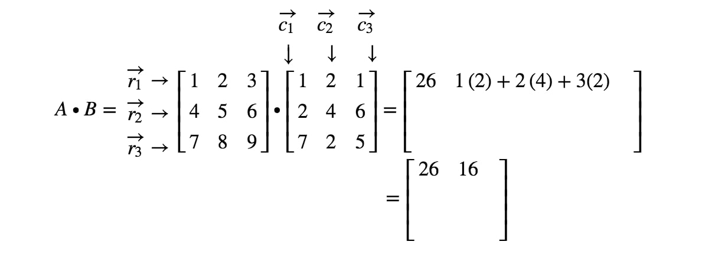
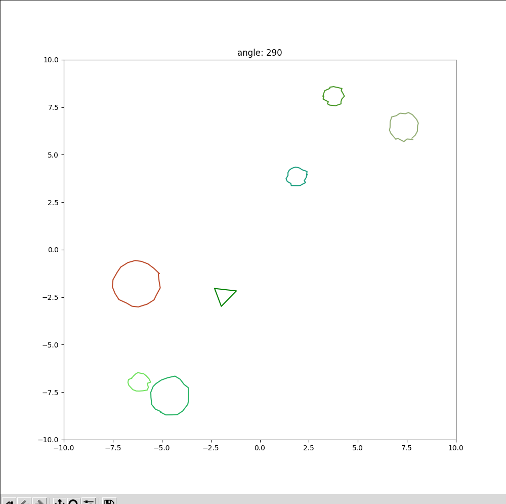

___

# Uzdevums 1

1.1 Python uzdevums (pow() funkcija)

Izmantojot rekursiju

```python
def pow(num, exp):
    if exp > 0:
        return num * pow(num, exp - 1)
    return 1
```

Pārbaude:
```python
print(pow(num=2, exp=4))
print(pow(num=3, exp=1))
print(pow(num=10, exp=0))
print(pow(num=5, exp=3))
```
Izvade:
```
16
3
1
125
```
___
1.2 Python uzdevums (uml implementācija)

Bāzes klase Animal. Klases mainīgā "_hungerPerc" deklarācijā tiek izmantota viena apakšsvītra, lai to uztvertu kā 'protected' mainīgo.
> - "__name" privāts
> - "_name" pasargāts
> - "name" publisks
```python
class Animal(object):
    def __init__(self):
        super().__init__()
        self._hungerPerc = 0.5
    
    def getHungerPerc(self):
        return self._hungerPerc

    def eat(self):
        self._hungerPerc -= 0.1
        self._hungerPerc = max(0, self._hungerPerc)
    
    def sleep(self, hours):
        self._hungerPerc += hours * 0.1
        self._hungerPerc = min(1, self._hungerPerc)

    def move(self):
        pass
```
Apakšklases Dog un Cat:
```python
class Dog(Animal):
    def __init__(self):
        super().__init__()
        self.__bonesHidden = 0
    
    def move(self):
        self._hungerPerc += 1e-1
        self._hungerPerc = min(1, self._hungerPerc)
    
    def bark(self):
        print("Bark bark.")


class Cat(Animal):
    def __init__(self):
        super().__init__()
        self.__itemsDestoryed = 0
    
    def move(self):
        self._hungerPerc += 1e-2
        self._hungerPerc = min(1, self._hungerPerc)
    
    def meow(self):
        print("Meow.")

class Robot:
    def __init__(self):
        super().__init__()
        self.__batteryPerc = 1.0
    
    def move(self):
        self.__batteryPerc -= 1e-1
        self.__batteryPerc = max(0, self.__batteryPerc)
    
    def charge(self, hours):
        self.__batteryPerc += 1e-1 * hours
        self.__batteryPerc = min(1, self.__batteryPerc)
```
Pārbaude:
```python
whoIsInTheRoom = []
whoIsInTheRoom.append(Dog())
dog_1 = Dog()
whoIsInTheRoom.append(dog_1)
whoIsInTheRoom.append(Cat())
whoIsInTheRoom.append(Robot())

for entity in whoIsInTheRoom:
    entity.move()
    if isinstance(entity, Animal):
        print(f'entity: {entity.getHungerPerc()}')
        entity.eat()
        if isinstance(entity, Dog):
            entity.bark()
    elif isinstance(entity, Robot):
        entity.charge(hours=2)
```
Izvade:
```
entity: 0.6
Bark bark.
entity: 0.6
Bark bark.
entity: 0.51
```
___
___

# Uzdevums 2

Asteroīdu spēle izmantojot Matplotlib un numpy bibliotēkas.

> - Kods pieejams failā -> asteroid_game.py

Dot funkcija

> 1. Iegūst gala matricas/vektora izmēru ņemot X rindu skaitu un Y kolonnu skaitu.
> 2. Veic X rindu reizinājumu ar Y kolonnām.



Piemērs python funkcija:
```python
def dot(X, Y):
    # shape of dot product result is X rows and Y columns
    result = np.zeros((X.shape[0], Y.shape[1]))

    for i in range(X.shape[0]):  # iterate over X rows
        for j in range(Y.shape[1]):  # iterate over Y columns
            # multiply according elements from both matrix/vectors and sum them up
            result[i][j] = sum(X[i][k] * Y[k][j] for k in range(Y.shape[0]))

    return result
```
Izveido matricu transformācijas funkcijas:
```python
def rotMatrix(degrees):
    theta = np.radians(degrees)
    R = np.array([
        [np.cos(theta), -np.sin(theta), 0],
        [np.sin(theta), np.cos(theta), 0],
        [0, 0, 1]
    ])
    return R

def translateMatrix(dx, dy):
    T = np.array([
        [1, 0, dx],
        [0, 1, dy],
        [0, 0, 1]
    ])
    return T

def scaleMatrix(sx, sy):
    S = np.array([
        [sx, 0, 0],
        [0, sy, 0],
        [0, 0, 1]
    ])
    return S
```
___
Character klase:

Katru reizi, kad ir veikts pagrieziens, tiek fiksēts pagriešanās leņķis, aprēķināta rotācijas matrica un, izmantojot sin un cos vērtības no matricas, atjauno virziena orientāciju, uz kuru notiek kustība.
```python
...
def setAngle(self, angle):
        self.__angle = angle
        self.R = rotMatrix(self.__angle)
        # keep track of direction angle
        self.dir = np.array([
            [self.R[0][1]],
            [self.R[0][0]]
        ])
...
```
> - Katru iterāciju spēlētājs tiek virzīts uz priekšu balstoties uz "speed" un "dir" mainīgajiem.
```python
...
def draw(self):
        x_data = []
        y_data = []
        
        # move 0.1 in forward direction every frame
        # move ship in each axis according to rotation
        d_x = self.dir[0] * self.speed
        d_y = self.dir[1] * self.speed
        self.pos[0] += d_x
        self.pos[1] += d_y
        self.T = translateMatrix(dx=self.pos[0], dy=self.pos[1])
```
Tiklīdz spēlētāja ģeometrijas attiecība x un y ass virzienos ir atšķirīga, tā izmēri dinamiski mainīsies veicot pārvietošanu un rotāciju. Lai no tā izvairītos var veikt šīs ģeometrijas izlīdzināšanu, jeb pielīdzināt x un y, lai tie būtu vienādi uzsvaru liekot uz lielāko vērtību.
> - Piemēram: x un y = (0.8, 0.6), tad pirms transformācijām to pārveido uz (0.8, 0.8) un pēctam atgriež atpakaļ sākotnējā izmērā.
```python
        # rescale to (1:1 ratio) to avoid skew effect when rotating
        diff = np.abs(self.s[0] - self.s[1])
        if self.s[0] > self.s[1]:
            sy = self.s[1] + diff
            sx = self.s[0]
        elif self.s[1] > self.s[0]:
            sy = self.s[1]
            sx = self.s[0] + diff
        else:
            sy = self.s[1]
            sx = self.s[0]
        self.S = scaleMatrix(sx, sy)

        # chain dot products
        self.C = self.S
        self.C = dot(self.C, self.T)
        self.C = dot(self.C, self.R)

        # Scale back to default scale
        self.S = scaleMatrix(sx=self.s[0], sy=self.s[1])
        self.C = dot(self.C, self.S)

        for vec2 in self.geometry:
            # reshape the dimension to have a valid shape for dot. (2, 1) instead of (2,)
            vec2_resh = np.array(vec2).reshape((2,1))

            vec3 = vec_2dto3d(vec2_resh)
            vec3_r = dot(self.C, vec3)
            vec2_ = vec_3dto2d(vec3_r)    
        
            x_data.append(vec2_[0])
            y_data.append(vec2_[1])

        plt.plot(x_data, y_data, c=self.color)
```

Asteroīda ģeometrijas izveidošanas funkcija (ar dažādiem izmēriem):

```python
# generate points using sin and cos functins and add some distortion to the lines
    def generateGeometry(self):
        self.geometry = [
            (
                (np.cos(2 * np.pi/self.n * x) * self.r + np.random.uniform(low=0.1, high=0.3)),
                (np.sin(2 * np.pi/self.n * x) * self.r)
            ) for x in range(0, self.n+1)
        ]
```

Screenshot:

___
___

# Uzdevums 3

Karpathy tutorial implementācija Python.

> - -> session_1/karpathy.ipynb
