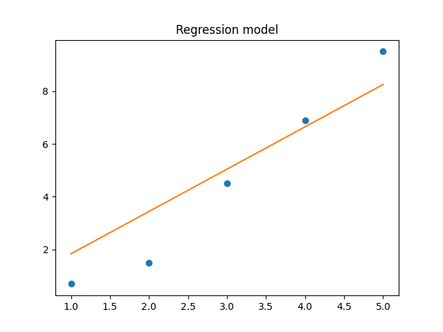

___

# Asteroid game (Updated)

1. <h3>Dot function:</h3>

```python
def dot(X, Y):
    # Check if passed array is pure python or numpy.ndarray
    if type(X) == list:
        X = np.array(X)
    if type(Y) == list:
        Y = np.array(Y)

    # Check if X is vector
    if len(X.shape) == 1:
        X = np.expand_dims(X, axis=0)   # Change shape from (n,) to (1,n)

    # Check if Y is vector
    if len(Y.shape) == 1:
        Y = np.expand_dims(Y, axis=1)   # Change shape from (n,) to (n,1)

    # shape of dot product is X rows and Y columns
    dot_product = np.zeros((X.shape[0], Y.shape[1]), dtype='f')

    for x in range(X.shape[0]):  # iterate over X rows
        for y in range(Y.shape[1]):  # iterate over Y columns
            # multiply according elements from both matrix/vectors and sum them up
            dot_product[x][y] = sum(X[x][k] * Y[k][y] for k in range(Y.shape[0]))

    # Remove added axis from shape
    return np.squeeze(dot_product)
```
Testing:
```python
a = np.array([
    [1, 2, 3],
    [1, 2, 3],
    [1, 2, 3]
])
b = np.array([3, 2, 1])
print(dot(a, b))
```
Output
```python
[10., 10., 10.]
```

2. <h3>Transformations and rotation change:</h3>

```python
    def setAngle(self, angle):
        self.__angle = angle
        self.R = rotMatrix(self.__angle)
        self.direction = np.array([
            self.R[0][1],
            self.R[0][0]
        ])

        self.C = translateMatrix(self.pos[0], self.pos[1])
        self.C = dot(self.C, self.R)
        self.C = dot(self.C, self.S)
        self.C = dot(self.C, translateMatrix(0, -0.333))  # Centre of mass for player is ~ -0.333
```
- Calculate center of mass by taking average of x and y co-ordinates. <br>
Example for player used in this asteroid game (triangle):
- [[-1, 0], [1, 0], [0, 1]]
- x_center_of_mass = (-1 + 1 + 0) / 3 = 0
- y_center_of_mass = (0 + 0 + 1) / 3 = ~0.33

3. <h3>Ability to shoot asteroids:</h3>
Bullet Class, which takes players current Transformation matrix to move in the same direction.

```python
class Bullet(Character):
    def __init__(self, start_pos, direction, trans_matrix, scale=[1, 1]):
        super().__init__(start_pos, scale)
        self.C = trans_matrix
        self.speed = 0.5
        self.generateGeometry()

    def generateGeometry(self):
        self.geometry = np.array([
            [-0.1, 0],
            [0.1, 0],
            [0, 0.1],
            [-0.1, 0]
        ])
```

Also added utility functions for collision detection between bullet and asteroid:
```python
def checkOutOfRangeBullet(character):
    bullet_pos = character.getCurPos()
    if bullet_pos[0] >= 10 \
            or bullet_pos[0] <= -10 \
            or bullet_pos[1] >= 10 \
            or bullet_pos[1] <= -10:
        characters.remove(character)

def checkAsteroidHit(character):
    bullet_pos = character.getCurPos()
    # Iterate over to check if asteroid is hit
    for character_ in characters:
        if isinstance(character_, Asteroid):
            asteroid_pos = character_.getCurPos()
            asteroid_radius = character_.getRadius()

            # Check if bullet is in asteroid's collision box
            x_positive_bound = bullet_pos[0] <= (asteroid_pos[0] + asteroid_radius)
            x_negative_bound = bullet_pos[0] >= (asteroid_pos[0] - asteroid_radius)
            y_positive_bound = bullet_pos[1] <= (asteroid_pos[1] + asteroid_radius)
            y_negative_bound = bullet_pos[1] >= (asteroid_pos[1] - asteroid_radius)
            # If true then remove both asteroid and bullet
            if (x_positive_bound and x_negative_bound) and (y_positive_bound and y_negative_bound):
                characters.remove(character_)
                characters.remove(character)
```
<h3>Main loop:</h3>
```python
num_asteroids = 0

for character in characters:
    if isinstance(character, Bullet):
        checkOutOfRangeBullet(character)
        checkAsteroidHit(character)

    # Bounce back asteroid
    if isinstance(character, Asteroid):
        character.checkOutOfBounds()

    # Move every character one update forward
    character.move()

    # Draw everything on plot
    character.draw()

    # Display score
    if isinstance(character, Asteroid):
        num_asteroids += 1

plt.title(f"Asteroids left: {num_asteroids}")

if num_asteroids == 0:
    plt.title(f"Game finished!")
    plt.pause(2)
    is_running = False
    plt.close('all')
```

<h3>Fixed spaghetti code</h3>

```python
# generate points using sin and cos functions and add some distortion to the lines
def generateGeometry(self):
    for x in range(0, self.n + 1):
        random_noise = np.random.uniform(low=0.1, high=0.3)
        x_point = np.cos(2 * np.pi/self.n * x) * self.r + random_noise
        y_point = np.sin(2 * np.pi/self.n * x) * self.r
        self.geometry.append([x_point, y_point])
```

<h4>Screenshots:</h4>


___
___

<h1>Task 2: Inverse Kinematics robot</h1>

<h3>Rotation matrix and Derivative:</h3>
```python
def rotation(theta):
    R = np.array([
        [np.cos(theta), -np.sin(theta)],
        [np.sin(theta), np.cos(theta)]
    ])
    return R

def d_rotation(theta):
    dR = np.array([
        [-np.sin(theta), -np.cos(theta)],
        [np.cos(theta), -np.sin(theta)]
    ])
    return dR
```

<h3>Create joints:</h3>

```python
joints = []
arm_length = np.array([0.0, 1.0]) * length_joint
rotMat1 = rotation(theta_1)
d_rotMat1 = d_rotation(theta_1)
rotMat2 = rotation(theta_2)
d_rotMat2 = d_rotation(theta_2)
rotMat3 = rotation(theta_3)
d_rotMat3 = d_rotation(theta_3)

joints.append(anchor_point)
joint = rotMat1 @ arm_length
joints.append(joint)
joint = rotMat1 @ (arm_length + rotMat2 @ arm_length)
joints.append(joint)
joint = rotMat1 @ (arm_length + rotMat2 @ (arm_length + rotMat3 @ arm_length))
joints.append(joint)
```

<h3>Mean Squared Error loss:</h3>
```python
# Mean Square Error Loss
mse_loss = np.sum(np.power(target_point - joint, 2))
```

<h3>Calculate derivatives for each joint with respect to angles that it depends on:</h3>
```python
# Loss function derivative for joint1 w.r.t theta_1
d_mse_loss1 = np.sum((d_rotMat1 @ arm_length) * -2*(target_point - joint))
theta_1 -= learning_rate * d_mse_loss1
# Loss function derivative for joint2 w.r.t theta_1 & theta_2
d_mse_loss2 = np.sum((rotMat1 @ d_rotMat2 @ arm_length) * -2*(target_point - joint))
d_mse_loss2 += np.sum(((d_rotMat1 @ arm_length) + (d_rotMat1 @ rotMat2 @ arm_length)) * -2 * (target_point - joint))
theta_2 -= learning_rate * d_mse_loss2
# Loss function derivative for joint3 w.r.t theta_1 & theta_2 & theta_3
d_mse_loss3 = np.sum(((d_rotMat1 @ arm_length) + (d_rotMat1 @ rotMat2 @ arm_length) + (d_rotMat1 @ rotMat2 @ rotMat3 @ arm_length)) * -2 * (target_point - joint))
d_mse_loss3 += np.sum(((rotMat1 @ d_rotMat2 @ arm_length) + (rotMat1 @ d_rotMat2 @ rotMat3 @ arm_length)) * -2 * (target_point - joint))
d_mse_loss3 += np.sum((rotMat1 @ rotMat2 @ d_rotMat3 @ arm_length) * -2*(target_point - joint))
theta_3 -= learning_rate * d_mse_loss3
```

<h4>Screenshots:</h4>


___
___

<h1>Task 3: Basic Housing Regression</h1>

<h4>Linear function and derivatives:</h4>
```python
def linear(W, b, x):
    return W * x + b

def dW_linear(x):
    return x

def db_linear():
    return 1

def dx_linear(W):
    return W
```
<h4>Sigmoid activation:</h4>
```python
def sigmoid(a):
    return 1 / (1 + np.exp(-a))

def da_sigmoid(a):
    return sigmoid(a) * (1 - sigmoid(a))
```
<h4>Model and derivatives w.r.t W and b:</h4>
```python
def model(W, b, x):
    return sigmoid(linear(W, b, x)) * 10

def dW_model(W, b, x):
    return da_sigmoid(W * x + b) * dW_linear(W) * 10

def db_model(W, b, x):
    return da_sigmoid(W * x + b) * db_linear() * 10
```
<h4>Finally same with MSE loss function:</h4>
```python
def loss(y, y_prim):
    return np.mean(np.power((y - y_prim), 2))

def dW_loss(y, W, x, b):
    return np.mean(-2*dW_linear(x)*(y - (W * x + b)))

def db_loss(y, W, x, b):
    return np.mean(-2*db_linear()*(y - (W * x + b)))
```
<h4>Variable initialization:</h4>
```python
X = np.array([1, 2, 3, 4, 5])
Y = np.array([0.7, 1.5, 4.5, 6.9, 9.5])

W = 0
b = 0
best_W = 0
best_b = 0
best_loss = np.inf
loss_history = []
Y_prim = np.zeros((4,))
dW_mse_loss = 0
db_mse_loss = 0

learning_rate = 0.0075
```
<h3>Training loop</h3>
```python
for epoch in range(50):
    # For every data point (Best results in this example ~1.2 loss score)
    for i in range(len(X)):
        dW_mse_loss += dW_loss(Y[i], W, X[i], b)
        db_mse_loss += db_loss(Y[i], W, X[i], b)

    # X and Y in batch
    # dW_mse_loss = dW_loss(Y, W, X, b)
    # db_mse_loss = db_loss(Y, W, X, b)

    W -= dW_mse_loss * learning_rate
    b -= db_mse_loss * learning_rate

    Y_prim = model(W, b, X)
    mse_loss = loss(Y, Y_prim)
    loss_history.append(mse_loss)

    print(f"Y_prim {Y_prim}")
    print(f"loss: {mse_loss}")

    # Save best bias and weight value obtained during training
    if  mse_loss < best_loss:
        best_loss = mse_loss
        best_W = W
        best_b = b
```
<h3>Test and visualization:</h3>
```python
Y_prim = model(best_W, best_b, X)
print(f"Best loss: {best_loss}")

# Test model
test_y = model(best_W, best_b, 6)
print(f"Predicted price for 6 story house: ${np.round_(test_y * 1e5, 0)}")

# Plot results
plt.title("Regression model")
plt.plot(X, Y, 'o')
slope = np.polyfit(X, Y_prim, 1)
m = slope[0]
b = slope[1]
plt.plot(X, m*X + b)
plt.show()

plt.title("Loss function value")
plt.plot(loss_history, '-')
plt.show()
```


