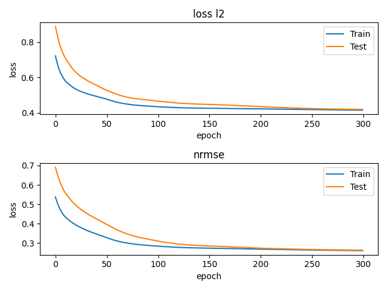

# Diabetes Numpy Regression

___

```python
import time

import sklearn.datasets
import numpy as np
import matplotlib.pyplot as plt
```


```python
# Normalize X,Y in range -1 , 1
X = 2 * (((X - np.min(X)) / (np.max(X) - np.min(X))) - 0.5)
Y = 2 * (((Y - np.min(Y)) / (np.max(Y) - np.min(Y))) - 0.5)
```

#### Variable class representing data point value and gradient:

```python
class Variable:
    def __init__(self, value):
        self.value: np.ndarray
        self.grad: np.ndarray = np.zeros_like(value)
```


#### Linear Layer implementation

```python
class LayerLinear(object):
    def __init__(self, in_features: int, out_features: int):
        self.W = Variable(
            value=np.random.random((out_features, in_features))
        )
        self.b = Variable(
            value=np.zeros((out_features,))
        )
        self.x: Variable = None
        self.output: Variable = None

    def forward(self, x: Variable):
        self.x = x
        self.output = Variable(
            np.matmul(self.W.value, x.value.transpose()).transpose() + self.b.value
        )
        return self.output

    def backward(self):
        self.b.grad = 1 * self.output.grad
        self.W.grad = np.matmul(
            np.expand_dims(self.output.grad, axis=2),
            np.expand_dims(self.x.grad, axis=1),
        )
        self.x.grad = np.matmul(
            self.W.value.transpose(),
            self.output.grad.transpose()
        ).transpose()
```

#### Rectified Linear Unit activation function:

```python
class LayerReLU:
    def __init__(self):
        self.x = None
        self.output = None

    def forward(self, x: Variable) -> Variable:
        self.x = x
        self.output = Variable(
            (x.value >= 0) * x.value
        )
        return self.output

    def backward(self):
        self.x.grad = (self.x.value >= 0) * self.output.grad
```

#### Mean Absolute Error Loss function:

```python
class LossMAE:
    def __init__(self):
        self.y: Variable = None
        self.y_prim: Variable = None

    def forward(self, y: Variable, y_prim: Variable) -> float:
        self.y = y
        self.y_prim = y_prim
        loss = np.mean(np.abs(y.value - y_prim.value))
        return loss

    def backward(self):
        self.y_prim.grad = (self.y_prim.value - self.y.value) / np.abs(self.y.value - self.y_prim.value)
```

#### Model Class:

```python
class Model:
    def __init__(self):
        self.layers = [
            LayerLinear(in_features=10, out_features=5),
            LayerReLU(),
            LayerLinear(in_features=5, out_features=5),
            LayerReLU(),
            LayerLinear(in_features=5, out_features=1)
        ]

    def forward(self, x: Variable) -> Variable:
        out = x
        for layer in self.layers:
            out = layer.forward(out)
        return out

    def backward(self):
        for layer in reversed(self.layers):
            layer.backward()

    def parameters(self): # List[Variables]
        variables = []
        for layer in self.layers:
            if isinstance(layer, LayerLinear):
                variables.append(layer.W)
                variables.append(layer.b)
        return variables
```

#### Stochastic Gradient Descent Optimizer:


```python
class OptimizerSGD:
    def __init__(self, parameters, learning_rate):
        self.parameters = parameters  # List[Variable]
        self.learning_rate = learning_rate

    def step(self):
        for param in self.parameters:
            param.value -= np.mean(param.grad, axis=0) * self.learning_rate
```

#### Initialization and Dataset Split:

```python
LEARNING_RATE = 1e-3
BATCH_SIZE = 8

model = Model()
optimizer = OptimizerSGD(
    model.parameters(),
    LEARNING_RATE
)
loss_fn = LossMAE()

np.random.seed(0)
# shuffle
idxes_rand = np.random.permutation(len(X))
X = X[idxes_rand]
Y = Y[idxes_rand]

idx_split = int(len(X) * 0.8)  # 80% for training and 20% for testing
dataset_train = (X[:idx_split], Y[:idx_split])
dataset_test = (X[idx_split:], Y[idx_split:])

np.random.seed(int(time.time()))
```

#### Main Training Loop:

```python
losses_train = []
losses_test = []
nrmse_plot_train = []
nrmse_plot_test = []
y_max_train = np.max(dataset_train[1])
y_min_train = np.min(dataset_train[1])
y_max_test = np.max(dataset_test[1])
y_min_test = np.min(dataset_test[1])

for epoch in range(1, 301):

    for dataset in [dataset_train, dataset_test]:
        X, Y = dataset
        losses = []
        nrmses = []
        for idx in range(0, len(X)-BATCH_SIZE, BATCH_SIZE):
            x = X[idx:idx+BATCH_SIZE]
            y = Y[idx:idx+BATCH_SIZE]

            y_prim = model.forward(Variable(x))
            loss = loss_fn.forward(Variable(y), y_prim)

            losses.append(loss)

            # nrmse
            scaler = 1 / (y_max_test - y_min_test)
            if dataset == dataset_train:
                scaler = 1 / (y_max_train - y_min_train)
            nrmse = scaler * np.sqrt(np.mean(np.power((y - y_prim.value), 2)))
            nrmses.append(nrmse)

            if dataset == dataset_train:  # Optimize only in training dataset
                loss_fn.backward()
                model.backward()
                optimizer.step()


        if dataset == dataset_train:
            nrmse_plot_train.append(np.mean(nrmses))
            losses_train.append(np.mean(losses))
        else:
            nrmse_plot_test.append(np.mean(nrmses))
            losses_test.append(np.mean(losses))

    print(f"Epoch: {epoch} "
          f"losses_train: {losses_train[-1]} "
          f"losses_test: {losses_test[-1]} "
          f"nrmse_train: {nrmse_plot_train[-1]} "
          f"nrmse_test: {nrmse_plot_test[-1]} "
          )
	
    # Plot training progress every 50 epochs
    if epoch % 50 == 0:
        plt.subplot(2, 1, 1)
        plt.title('loss l2')
        plt.plot(losses_train)
        plt.plot(losses_test)
        plt.xlabel('epoch')
        plt.ylabel('loss')
        plt.legend(['Train', 'Test'])
        
        plt.subplot(2, 1, 2)
        plt.title('nrmse')
        plt.plot(nrmse_plot_train)
        plt.plot(nrmse_plot_test)
        plt.xlabel('epoch')
        plt.ylabel('loss')
        plt.legend(['Train', 'Test'])
        
		plt.show()
```

___

#### Screen shot:


