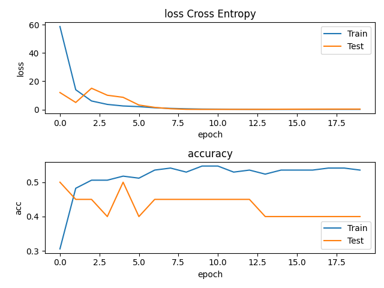

# Regression and Classification

___

1. Standardization fix for Diabetes Regression:

   ```python
   #standardized_dataset = (dataset - mean(dataset)) / standard_deviation(dataset))
   X_std = (X - np.mean(X, axis=0)) / np.std(X, axis=0)
   Y_std = (Y - np.mean(Y)) / np.std(Y)
   
   # encode gender feature (from float to int value (0 or 1))
   X_std[:, 0] = X_std[:, 0] >= 0
   ```

2. Use Embeddings Layer for categorical feature.

   ```python
   class LayerEmbedding:
       def __init__(self, num_embeddings, embedding_dim):
           self.x: Variable = None
           self.num_embeddings = num_embeddings
           self.embedding_dim = embedding_dim
           self.emb_m = Variable(np.zeros((num_embeddings, embedding_dim)))
           self.output: Variable = None
   
       def forward(self, x: Variable):
           self.x = x
           self.output = []
           for index, sample in enumerate(x.value):
               category = int(sample[1])
               sex_one_hot = np.zeros(self.num_embeddings,)
               sex_one_hot[category] = 1.0
               sex_one_hot = np.expand_dims(sex_one_hot, axis=0)
               sex_emb = np.squeeze(sex_one_hot @ self.emb_m.value)  # [e_1, e_2, e_3] (3,)
   
               embedded_sample = np.concatenate((sample[:1], sex_emb, sample[2:]), axis=0)  # (12,)
               self.output.append(embedded_sample)
   
           self.output = Variable(np.array(self.output))
           return self.output
   
       def backward(self):
           # Grab only the gradient for category embedding
           out_grad = self.output.grad[:, 1:4]  # (B, 3)
           # Slice off the category feature from data
           sex_category = np.array(self.x.value[:, 1], dtype=int)
   
           sex_one_hot = np.zeros((len(sex_category), self.num_embeddings))
           sex_one_hot[np.arange(len(sex_one_hot)), sex_category] = 1.0
   
           self.emb_m.grad = np.matmul(
               np.expand_dims(sex_one_hot, axis=2),
               np.expand_dims(out_grad, axis=1)
           ) # (B, 2, 3)
   ```

   ```python
   class Model:
       def __init__(self):
           self.layers = [
               LayerEmbedding(num_embeddings=2, embedding_dim=3),
               LayerLinear(in_features=12, out_features=8),
               LayerReLU(),
               LayerLinear(in_features=8, out_features=4),
               LayerReLU(),
               LayerLinear(in_features=4, out_features=1)
           ]
   
       #...
   
       def parameters(self): # List[Variables]
           variables = []
           for layer in self.layers:
               if isinstance(layer, LayerLinear):
                   variables.append(layer.W)
                   variables.append(layer.b)
               if isinstance(layer, LayerEmbedding):
                   variables.append(layer.emb_m)
           return variables
   ```

   Embeddings after training:

   

   

3.  Loss and nrmse plot:

   

___

## Regression in Pytorch

- Created Dataset class:

  ```python
  class DatasetDiabetes(torch.utils.data.Dataset):
      def __init__(self, is_train):
          super().__init__()
          self.data = sklearn.datasets.load_diabetes(return_X_y=True)
          self.is_train = is_train
          self.standardize()
  
      def __len__(self):
          X, Y = self.data
          return len(X)
  
      def __getitem__(self, idx):
          x = self.data[0][idx]
          y = self.data[1][idx]
  
          return x, y
  
      def standardize(self):
          np_x, np_y = self.data
          np_y = np.expand_dims(np_y, axis=1)
  
          x = torch.FloatTensor(np_x)
          y = torch.FloatTensor(np_y)
  
          # Separate categorical
          X_cat = torch.unsqueeze(x[:, 1], dim=1)
          # encode sex feature as a number 1 or 0 instead of float value
          X_cat[:, 0] = X_cat[:, 0] >= 0
  
          # Get all of the continuous data
          X_contin = torch.cat((x[:, :1], x[:, 2:]), 1)
          # pytorch standardization
          x_means = torch.mean(X_contin, dim=0, keepdim=True)
          x_stds = torch.std(X_contin, dim=0, keepdim=True)
          X_norm = (X_contin - x_means) / x_stds
  
          y_mean = torch.mean(y, dim=0, keepdim=True)
          y_std = torch.std(y, dim=0, keepdim=True)
          Y_norm = (y - y_mean) / y_std
  
          # Add everything back together after normalising continuous variables
          X_norm = torch.cat((X_norm[:, :1], X_cat, X_norm[:, 1:]), 1)
  
          torch.manual_seed(0)
          # split training/test data
          idxes_rand = torch.randperm(len(X_norm))
          X = X_norm[idxes_rand]
          Y = Y_norm[idxes_rand]
  
          idx_split = int(len(X) * 0.8)  # 80% for training and 20% for testing
          dataset_train = (X[:idx_split], Y[:idx_split])
          dataset_test = (X[idx_split:], Y[idx_split:])
  			
          #torch.manual_seed(int(time.time()))   
          
          if self.is_train:
              self.data = dataset_train
          else:
              self.data = dataset_test
  ```

  ```python
  dataloader_train = torch.utils.data.DataLoader(
      dataset=DatasetDiabetes(is_train=True),
      batch_size=BATCH_SIZE,
      shuffle=False
  )
  dataloader_test = torch.utils.data.DataLoader(
      dataset=DatasetDiabetes(is_train=False),
      batch_size=BATCH_SIZE,
      shuffle=False
  )
  ```

  Embeddings for categorical feature:

  ```python
  class Embedding(torch.nn.Module):
      def __init__(self, num_embeddings, embedding_dim):
          super().__init__()
          self.embedding = torch.nn.Embedding(num_embeddings, embedding_dim)
  
      def forward(self, x: torch.Tensor) -> torch.Tensor:
          # Separate categorical
          X_cat = torch.unsqueeze(x[:, 1], dim=1)
          X_cat = X_cat.type(torch.IntTensor)
  
          cat_emb = torch.squeeze(self.embedding(X_cat))  # (BATCH_SIZE, 3)
          X_emb = torch.cat((x[:, :1], cat_emb, x[:, 2:]), 1)
  
          return X_emb  # (BATCH_SIZE, 12)
  ```

  Model:

  ```python
  class Model(torch.nn.Module):
      def __init__(self):
          super().__init__()
          self.layers = torch.nn.Sequential(
              Embedding(num_embeddings=2, embedding_dim=3),
              torch.nn.Linear(in_features=12, out_features=8),
              torch.nn.ReLU(),
              torch.nn.Linear(in_features=8, out_features=8),
              torch.nn.ReLU(),
              torch.nn.Linear(in_features=8, out_features=5),
              torch.nn.ReLU(),
              torch.nn.Linear(in_features=5, out_features=1)
          )
  
      def forward(self, x):
          y_prim = self.layers.forward(x)
          return y_prim
  ```

  Main loop:

  ```python
  model = Model()
  optimizer = torch.optim.Adam(
      params=model.parameters(),
      lr=LEARNING_RATE
  )
  
  metrics = {}
  for stage in ['train', 'test']:
      for metric in [
        'loss',
        'r2_score'
      ]:
          metrics[f'{stage}_{metric}'] = []
  
  for epoch in range(1, 1001):
      for data_loader in [dataloader_train, dataloader_test]:
          metrics_epoch = {key: [] for key in metrics.keys()}
  
          stage = 'train'
          if data_loader == dataloader_test:
              stage = 'test'
  
          for x, y in data_loader:
              y_prim = model.forward(x)
              loss = torch.mean(torch.abs(y - y_prim)) # l1
              #loss = torch.mean(torch.pow((y - y_prim), 2)) # l2
  
              y = y.detach()
              y_prim = y_prim.detach()
              # r-2 metric
              r_square = 1 - (torch.sum(torch.pow((y - y_prim), 2)) / 		torch.sum(torch.pow((y - torch.mean(y)), 2)))
  
              if stage == 'train':  # Optimize only in training dataset
                  loss.backward()
                  optimizer.step()
  
              metrics_epoch[f'{stage}_loss'].append(loss.item())
              metrics_epoch[f'{stage}_r2_score'].append(r_square.item())
  
          metrics_strs = []
          for key in metrics_epoch.keys():
              if stage in key:
                  value = np.mean(metrics_epoch[key])
                  metrics[key].append(value)
                  metrics_strs.append(f'{key}: {round(value, 2)}')
  
          print(f'epoch: {epoch} {" ".join(metrics_strs)}')
  
      if epoch % 100 == 0:
          plt.subplot(2, 1, 1)
          plt.title('loss l1')
          plt.plot(metrics['train_loss'])
          plt.plot(metrics['test_loss'])
          plt.xlabel('epoch')
          plt.ylabel('loss')
          plt.legend(['Train', 'Test'])
  
          plt.subplot(2, 1, 2)
          plt.title('r2_score')
          plt.plot(metrics['train_r2_score'])
          plt.plot(metrics['test_r2_score'])
          plt.xlabel('epoch')
          plt.ylabel('r2')
          plt.legend(['Train', 'Test'])
  
          plt.tight_layout()
  		plt.show()
  ```

  ```python
  LEARNING_RATE = 1e-5
  BATCH_SIZE = 7
  ```

  

  Plots:

  


````python
LEARNING_RATE = 1e-4
````

Fail:


___

## Classification (numpy)

- Load, preprocess and standardize the dataset:

  ```python
  class DatasetPlacements():
      def __init__(self):
          self.data = pd.read_csv('archive/Placement_Data_Full_Class.csv', sep=',')
          self.features = None
          self.preprocess()
          self.standardize()
  
      def preprocess(self):
          self.data = self.data.drop(columns=['sl_no'])
          self.data["salary"].fillna(0.0, inplace=True)
  
          for col_name in self.data.columns.values:
              if self.data[col_name].dtype == 'object':
                  category_vec = self.data[col_name].unique()
                  one_hot_vec = np.arange(len(self.data[col_name].unique()))
  
                  for el_index, el in enumerate(self.data[col_name]):
                      for cat_index, cat in enumerate(category_vec):
                          if el == cat:
                              # Categorize the variable to number
                              self.data.at[el_index, col_name] = one_hot_vec[cat_index]
  
          self.features  = self.data.columns.values
          # Convert to numpy
          self.data = self.data.to_numpy().astype(float)
          Y = self.data[:, 5]
          X = np.concatenate((self.data[:, :5], self.data[:, 6:]), 1)
          self.data = (X, Y)
  
      def standardize(self):
          x, y = self.data
  
          # Separate categorical (don't need to standardize them), only standardize continuous
          contin_col = [1, 3, 5, 8, 10, 12]
          for col in contin_col:
              # Standardize
              x_mean = np.mean(x[:, col])
              x_std = np.std(x[:, col])
              x[:, col] = (x[:, col] - x_mean) / x_std
  
          self.data = (x, y)
  
      def load_data(self):
          return self.data
  ```

- Softmax layer and Categorical loss entropy:

  ```python
  class LayerSoftmax():
      def __init__(self):
          self.x = None
          self.output = None
  
      def forward(self, x):
          self.x = x
          np_x = np.array(x.value)
          np_x -= np.max(np_x, axis=1, keepdims=True) #numerical stability hack
          self.output = Variable(np.exp(np_x) + 1e-8 / np.sum(np.exp(np_x), axis=1, keepdims=True))
          return self.output
  
      def backward(self):
          J = np.zeros((BATCH_SIZE, 3, 3))
          a = self.output.value
  
          for i in range(3):
              for j in range(3):
                  if i == j:
                      J[:, i, j] = a[:, i] * (1 - a[:, j])  # identity part
                  else:
                      J[:, i, j] = -a[:, i] * a[:, j]
  
          self.x.grad = np.matmul(J, np.expand_dims(self.output.grad, axis=2)).squeeze()
  
  
  class LossCrossEntropy():
      def __init__(self):
          self.y_prim = None
  
      def forward(self, y, y_prim):
          self.y_prim = y_prim
          self.y = y
          return -np.sum(y.value * np.log(y_prim.value + 1e-8))
  
      def backward(self):
          self.y_prim.grad = -self.y.value / (self.y_prim.value + 1e-8)
  ```

- Embeddings layer (6 columns with 2 categorical features and 1 column with 3):

  ```python
  class LayerEmbedding:
      """
      2d - means two different categories for given column, so 3d is 3 etc
  
      Dataset has categorical values in columns [0, 2, 4, 6, 7, 9, 11], but 6th has 3 different categories,
          so we separate it from calculation since it needs bigger embeddings matrix.
  
      offset_index is used to keep track of column position after inserting embeddings vector.
          For example: column 0 and column 2.
              vector before embedding     -> [0, 1, 0]
              and after embedding value 0 -> [0.0, 0.0, 0.0, 1, 0]
              now column 2 index has changed to 4
      """
      def __init__(self):
          self.x: Variable = None
          self.num_embeddings_2d = 2
          self.embedding_dim_2d = 3
          self.num_embeddings_3d = 3
          self.embedding_dim_3d = 5
          self.categorical_columns_2d = [0, 2, 4, 7, 9, 11]
          self.categorical_columns_3d = [12]
          self.offset = 0
          self.fix_offset()
          """
          len(self.categorical_columns_2d) -> for every categorical data feature we need separate embeddings matrix
          """
          self.emb_m_2d = Variable(np.zeros((len(self.categorical_columns_2d), self.num_embeddings_2d, self.embedding_dim_2d)))
          self.emb_m_3d = Variable(np.zeros((len(self.categorical_columns_3d), self.num_embeddings_3d, self.embedding_dim_3d)))
          self.output: Variable = None
  
      def fix_offset(self):
          # calculate the offset for 6th column after embedding 2d categorical
          for n in self.categorical_columns_2d:
              if n < 6:
                  self.offset += 2 # Every embedding for 2 categorical values is adding 2 new columns
  
      def forward(self, x: Variable):
          self.x = x
          self.output = []
          """
          Embed each sample in Batch replacing categorical data with embeddings vector.
          """
          for index, sample in enumerate(x.value):
              # Embedding for 2 categories
              embedded_sample = self.embed(sample, self.categorical_columns_2d, self.num_embeddings_2d, self.embedding_dim_2d, self.emb_m_2d)
              # Embedding for 3 categories
              embedded_sample = self.embed(embedded_sample, self.categorical_columns_3d, self.num_embeddings_3d, self.embedding_dim_3d, self.emb_m_3d)
              self.output.append(embedded_sample)
  
          self.output = Variable(np.array(self.output))
          return self.output
  
      """
      Helper function, that "embeds" replaces categorical value with embeddings vector, e.g: 1 with vector [0.0, 0.0, 0.0]
      Vector size depends on number of categories.
      """
      def embed(self, embed_sample, categorical_columns, num_embeddings, embedding_dim, emb_m):
          offset_index = 0
          embedded_sample = embed_sample
          for index, cat in enumerate(categorical_columns):  # for every column that has categorical data (here predefined)
              category = int(embedded_sample[cat + offset_index])
              category_one_hot = np.zeros(num_embeddings, )
              category_one_hot[category] = 1.0
              category_one_hot = np.expand_dims(category_one_hot, axis=0)
              category_emb = np.squeeze(category_one_hot @ emb_m.value[index])
  
              embedded_sample = np.concatenate((embedded_sample[:cat + offset_index], category_emb, embedded_sample[cat + offset_index + 1:]), 0)
              offset_index += embedding_dim - 1
          return embedded_sample
  
      def backward(self):
          self.emb_m_2d.grad = self.get_embedding_grad(self.categorical_columns_2d, self.embedding_dim_2d, self.num_embeddings_2d, offset=0)
          self.emb_m_3d.grad = self.get_embedding_grad(self.categorical_columns_3d, self.embedding_dim_3d, self.num_embeddings_3d, offset=self.offset)
  
      def get_embedding_grad(self, categorical_col, embedding_dim, num_embeddings, offset):
          embed_m = np.zeros((len(self.output.grad), len(categorical_col), num_embeddings, embedding_dim))
  
          # Calculate grad for categorical data with 2 categories
          offset_index = 0
          for index, cat in enumerate(categorical_col):
              # Grab only the gradient for category embedding
              out_grad = self.output.grad[:, cat + offset_index:cat + offset_index + embedding_dim]
              # Slice off the category feature from data before embedding (so we need to offset the column 12 back to 6)
              category = np.array(self.x.value[:, cat-offset], dtype=int)
  
              category_one_hot = np.zeros((len(category), num_embeddings))
              category_one_hot[np.arange(len(category_one_hot)), category] = 1
  
              emb_m = np.matmul(
                  np.expand_dims(category_one_hot, axis=2),
                  np.expand_dims(out_grad, axis=1)
              )  # (16, self.num_embeddings, self.embedding_dim)
              # Insert calculated embedding matrix to its corresponding position
              embed_m[:, index] = emb_m
  
              offset_index += embedding_dim - 1
  
          return embed_m
  ```

- Model class:

  ```python
  class Model:
      def __init__(self):
          self.layers = [
              LayerEmbedding(),
              LayerLinear(in_features=29, out_features=20),
              LayerReLU(),
              LayerLinear(in_features=20, out_features=15),
              LayerReLU(),
              LayerLinear(in_features=15, out_features=10),
              LayerReLU(),
              LayerLinear(in_features=10, out_features=3),
              LayerSoftmax()
          ]
  
      def forward(self, x):
          out = x
          for layer in self.layers:
              out = layer.forward(out)
          return out
  
      def backward(self):
          for layer in reversed(self.layers):
              layer.backward()
  
      def parameters(self):
          variables = []
          for layer in self.layers:
              if isinstance(layer, LayerLinear):
                  variables.append(layer.W)
                  variables.append(layer.b)
              if isinstance(layer, LayerEmbedding):
                  variables.append(layer.emb_m_2d)
                  variables.append(layer.emb_m_3d)
          return variables
  ```

- Setup and training loop:

  ```python
  model = Model()
  optimizer = OptimizerSGD(
      model.parameters(),
      learning_rate=5e-4
  )
  loss_fn = LossCrossEntropy()
  
  dataset = DatasetPlacements()
  X, Y = dataset.load_data()
  Y = Y.astype(int)
  
  
  # shuffle
  np.random.seed(0)
  idxes_rand = np.random.permutation(len(Y))
  X = X[idxes_rand]
  Y = Y[idxes_rand]
  
  # Slice off 5 samples to make batch of 10 possible to split
  X = X[:-5]
  Y = Y[:-5]
  
  Y_idxs = Y
  Y = np.zeros((len(Y), 3))
  Y[np.arange(len(Y)), Y_idxs] = 1.0
  
  idx_split = int(len(X) * 0.8572)
  dataset_train = (X[:idx_split], Y[:idx_split])
  dataset_test = (X[idx_split:], Y[idx_split:])
  
  np.random.seed(int(time.time()))
  
  BATCH_SIZE = 10
  
  train_losses_plot = []
  test_losses_plot = []
  train_acc_plot = []
  test_acc_plot = []
  
  for epoch in range(20):
      for dataset in [dataset_train, dataset_test]:
          X, Y = dataset
          losses = []
          accuracies = []
          for idx in range(0, len(X)-BATCH_SIZE, BATCH_SIZE):
              x = X[idx:idx+BATCH_SIZE]
              y = Y[idx:idx+BATCH_SIZE]
  
              y_prim = model.forward(Variable(value=x))
              loss = loss_fn.forward(Variable(value=y), y_prim)
              # Accuracy
              pred_max = np.argmax(y_prim.value, axis=1)
              actual_max = np.argmax(y, axis=1)
              true_val = (pred_max == actual_max) * 1
              accuracy = np.sum(true_val) / len(true_val)
  
              losses.append(loss)
              accuracies.append(accuracy)
  
              if len(dataset[0]) == len(dataset_train[0]):
                  loss_fn.backward()
                  model.backward()
                  optimizer.step()
  
          if len(dataset[0]) == len(dataset_train[0]):
              train_losses_plot.append(np.mean(losses))
              train_acc_plot.append(np.mean(accuracies))
          else:
              test_losses_plot.append(np.mean(losses))
              test_acc_plot.append(np.mean(accuracies))
  
      print(f'Epoch: {epoch} '
            f'train_loss: {train_losses_plot[-1]} '
            f'train_accuracy: {train_acc_plot[-1]} '
            f'test_loss: {test_losses_plot[-1]} '
            f'test_accuracy: {test_acc_plot[-1]}')
  
  plt.subplot(2, 1, 1)
  plt.title('loss Cross Entropy')
  plt.plot(train_losses_plot)
  plt.plot(test_losses_plot)
  plt.xlabel('epoch')
  plt.ylabel('loss')
  plt.legend(['Train', 'Test'])
  
  plt.subplot(2, 1, 2)
  plt.title('accuracy')
  plt.plot(train_acc_plot)
  plt.plot(test_acc_plot)
  plt.xlabel('epoch')
  plt.ylabel('acc')
  plt.legend(['Train', 'Test'])
  
  plt.tight_layout()
  plt.show()
  
  ```

- Plots:

  ```python
  BATCH_SIZE = 10
  LEARNING_RATE = 5e-4
  ```

  

___

## Classification (pytorch)

- Dataset class using torch.utils.data.Dataset:

  ```python
  class DatasetPlacements(torch.utils.data.Dataset):
      def __init__(self, is_train):
          super().__init__()
          self.data = pd.read_csv('archive/Placement_Data_Full_Class.csv', sep=',')
          self.is_train = is_train
          self.features = None
          self.preprocess()
          self.standardize()
          self.load_data()
  
      def __len__(self):
          X, Y = self.data
          return len(X)
  
      def __getitem__(self, idx):
          x = self.data[0][idx]
          y = self.data[1][idx]
  
          return x, y
  
      def preprocess(self):
          self.data = self.data.drop(columns=['sl_no'])
          self.data["salary"].fillna(0.0, inplace=True)
  
          for col_name in self.data.columns.values:
              if self.data[col_name].dtype == 'object':
                  category_vec = self.data[col_name].unique()
                  one_hot_vec = np.arange(len(self.data[col_name].unique()))
  
                  for el_index, el in enumerate(self.data[col_name]):
                      for cat_index, cat in enumerate(category_vec):
                          if el == cat:
                              # Categorize the variable to number
                              self.data.at[el_index, col_name] = one_hot_vec[cat_index]
  
          self.features  = self.data.columns.values
          # Convert to numpy
          self.data = self.data.to_numpy().astype(float)
          self.data = torch.FloatTensor(self.data)
          Y = self.data[:, 5].type(torch.IntTensor)
          X = torch.cat((self.data[:, :5], self.data[:, 6:]), 1)
          self.data = (X, Y)
  
      def standardize(self):
          x, y = self.data
  
          # Separate categorical (don't need to standardize them), only standardize continuous
          contin_col = [1, 3, 5, 8, 10, 12]
          for col in contin_col:
              # Standardize
              x_mean = torch.mean(x[:, col])
              x_std = torch.std(x[:, col])
              x[:, col] = (x[:, col] - x_mean) / x_std
  
          self.data = (x, y)
  
      def load_data(self):
          X, Y = self.data
  
          # shuffle
          torch.manual_seed(0)
  
          idxes_rand = torch.randperm(len(Y))
          X = X[idxes_rand]
          Y = Y[idxes_rand]
  
          # Slice off 5 samples to make batch of 10 possible to split
          X = X[:-5]
          Y = Y[:-5]
  
          Y_idxs = np.array(Y)
          Y = torch.zeros((len(Y), 3))
          Y[torch.arange(len(Y)), Y_idxs] = 1.0
  
          idx_split = int(len(X) * 0.8572)
          dataset_train = (X[:idx_split], Y[:idx_split])
          dataset_test = (X[idx_split:], Y[idx_split:])
  
          torch.manual_seed(int(time.time()))
  
          if self.is_train:
              self.data = dataset_train
          else:
              self.data = dataset_test
  ```

- Create data loaders for train and test data:

  ```python
  dataloader_train = torch.utils.data.DataLoader(
      dataset=DatasetPlacements(is_train=True),
      batch_size=BATCH_SIZE,
      shuffle=False
  )
  dataloader_test = torch.utils.data.DataLoader(
      dataset=DatasetPlacements(is_train=False),
      batch_size=BATCH_SIZE,
      shuffle=False
  )
  ```

- Embedding class:

  ```python
  class Embedding(torch.nn.Module):
      """
      2d - means two different categories for given column, so 3d is 3 etc
  
      Dataset has categorical values in columns [0, 2, 4, 6, 7, 9, 11], but 6th has 3 different categories, so we separate it from calculation since it needs bigger embeddings matrix.
  
      offset_index is used to keep track of column position after inserting embeddings vector.
          For example: column 0 and column 2.
              vector before embedding     -> [0, 1, 0]
              and after embedding value 0 -> [0.0, 0.0, 0.0, 1, 0]
              now column 2 index has changed to 4
      """
      def __init__(self):
          super().__init__()
          self.num_embeddings_2d = 2
          self.embedding_dim_2d = 3
          self.num_embeddings_3d = 3
          self.embedding_dim_3d = 5
          self.categorical_columns_2d = [0, 2, 4, 7, 9, 11]
          self.categorical_columns_3d = [12]
          self.offset = 0
          self.calc_offset()
          """
              len(self.categorical_columns_2d) -> for every categorical data feature we need separate embeddings matrix
          """
          self.embedding_2d = torch.nn.Embedding(self.num_embeddings_2d, len(self.categorical_columns_2d) * self.embedding_dim_2d)
          self.embedding_3d = torch.nn.Embedding(self.num_embeddings_3d, len(self.categorical_columns_3d) * self.embedding_dim_3d)
  
      def calc_offset(self):
          # calculate the offset for 6th column after embedding 2d categorical
          for n in self.categorical_columns_2d:
              if n < 6:
                  self.offset += 2 # Every embedding for 2 categorical values is adding 2 new columns
  
      def forward(self, x: torch.Tensor) -> torch.Tensor:
          X_emb = []
          """
          Embed each sample in Batch replacing categorical data with embeddings vector.
          """
          for index, sample in enumerate(x):
              # Embedding for 2 categories
              embedded_sample = self.embed(sample, self.categorical_columns_2d, self.num_embeddings_2d, self.embedding_dim_2d, self.embedding_2d)
              # Embedding for 3 categories
              embedded_sample = self.embed(embedded_sample, self.categorical_columns_3d, self.num_embeddings_3d, self.embedding_dim_3d, self.embedding_3d)
              X_emb.append(embedded_sample)
  
          X_emb = torch.stack(X_emb)
          return X_emb
  
      """
      Helper function, that "embeds" replaces categorical value with embeddings vector, e.g: 1 with vector [0.0, 0.0, 0.0]
      Vector size depends on number of categories.
      """
      def embed(self, embed_sample, categorical_columns, num_embeddings, embedding_dim, emb_m):
          offset_index = 0
          embedded_sample = embed_sample
          for index, cat in enumerate(categorical_columns):  # for every column that has categorical data (here predefined)
              category = int(embedded_sample[cat + offset_index])
              category_one_hot = torch.zeros(num_embeddings, )
              category_one_hot[category] = 1.0
              category_one_hot = torch.unsqueeze(category_one_hot, 0)
              category_emb = torch.squeeze(category_one_hot @ emb_m.weight.data[:, index * embedding_dim:(index * embedding_dim) + embedding_dim])
  
              embedded_sample = torch.cat((embedded_sample[:cat + offset_index], category_emb, embedded_sample[cat + offset_index + 1:]), 0)
              offset_index += embedding_dim - 1
          return embedded_sample
  ```

- Model:

  ```python
  class Model(torch.nn.Module):
      def __init__(self):
          super().__init__()
          self.layers = torch.nn.Sequential(
              Embedding(),
              torch.nn.Linear(in_features=29, out_features=22),
              torch.nn.ReLU(),
              torch.nn.Linear(in_features=22, out_features=15),
              torch.nn.ReLU(),
              torch.nn.Linear(in_features=15, out_features=10),
              torch.nn.ReLU(),
              torch.nn.Linear(in_features=10, out_features=3),
              torch.nn.Softmax()
          )
  
      def forward(self, x):
          y_prim = self.layers.forward(x)
          return y_prim
  ```

- Training:

  ```python
  model = Model()
  optimizer = torch.optim.Adam(
      params=model.parameters(),
      lr=LEARNING_RATE
  )
  
  metrics = {}
  for stage in ['train', 'test']:
      for metric in [
        'loss',
        'acc'
      ]:
          metrics[f'{stage}_{metric}'] = []
  
  for epoch in range(1, 801):
      for data_loader in [dataloader_train, dataloader_test]:
          metrics_epoch = {key: [] for key in metrics.keys()}
  
          stage = 'train'
          if data_loader == dataloader_test:
              stage = 'test'
  
          for x, y in data_loader:
              y_prim = model.forward(x)
              loss = torch.mean(-torch.sum(y * torch.log(y_prim + 1e-8)))
  
              y = y.detach()
              y_prim = y_prim.detach()
              # Accuracy
              pred_max = torch.argmax(y_prim, 1)
              actual_max = torch.argmax(y, 1)
              true_val = (pred_max == actual_max) * 1
              accuracy = torch.sum(true_val) / len(true_val)
  
              if stage == 'train':
                  loss.backward()
                  optimizer.step()
  
              metrics_epoch[f'{stage}_loss'].append(loss.item())
              metrics_epoch[f'{stage}_acc'].append(accuracy.item())
  
          metrics_strs = []
          for key in metrics_epoch.keys():
              if stage in key:
                  value = np.mean(metrics_epoch[key])
                  metrics[key].append(value)
                  metrics_strs.append(f'{key}: {round(value, 2)}')
  
          print(f'epoch: {epoch} {" ".join(metrics_strs)}')
  
      if epoch % 100 == 0:
          plt.subplot(2, 1, 1)
          plt.title('loss Cross Entropy')
          plt.plot(metrics['train_loss'])
          plt.plot(metrics['test_loss'])
          plt.xlabel('epoch')
          plt.ylabel('loss')
          plt.legend(['Train', 'Test'])
  
          plt.subplot(2, 1, 2)
          plt.title('accuracy')
          plt.plot(metrics['train_acc'])
          plt.plot(metrics['test_acc'])
          plt.xlabel('epoch')
          plt.ylabel('acc')
          plt.legend(['Train', 'Test'])
  
          plt.tight_layout()
          plt.show()
  
  ```

- Plots:

  ```python
  BATCH_SIZE = 10
  LEARNING_RATE=1e-5
  ```

  
  
  ```python
  BATCH_SIZE = 10
  LEARNING_RATE=1e-4
  ```
  
  To agresive learning rate:
  
  
