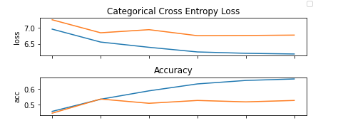
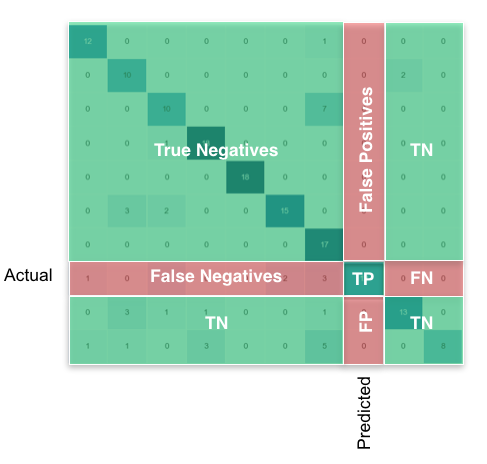
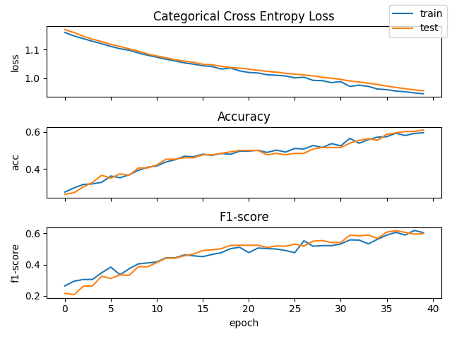
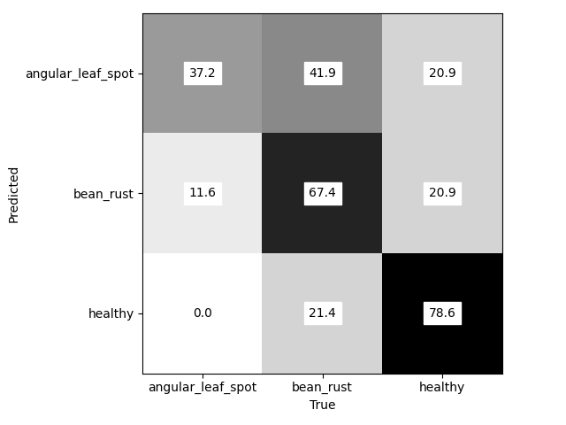
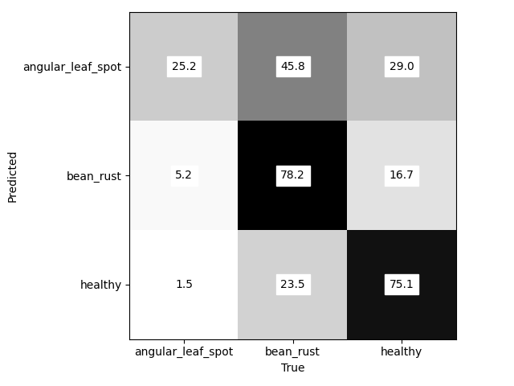
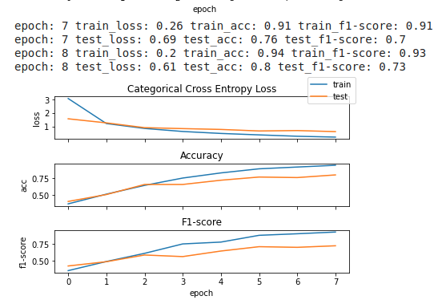
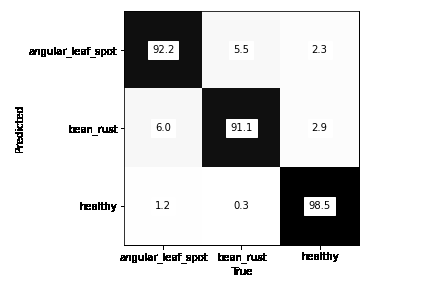

# Session 5

___

## Pytorch Model Embeddings Fix

Diabetes Regression

```python
class Model(torch.nn.Module):
    def __init__(self):
        super().__init__()
        self.layers = torch.nn.Sequential(
            torch.nn.Linear(in_features=12, out_features=8),
            torch.nn.ReLU(),
            torch.nn.Linear(in_features=8, out_features=8),
            torch.nn.ReLU(),
            torch.nn.Linear(in_features=8, out_features=5),
            torch.nn.ReLU(),
            torch.nn.Linear(in_features=5, out_features=1)
        )
        self.embedding_gender = torch.nn.Embedding(num_embeddings=2, embedding_dim=3)

    def forward(self, x_scalars, x_gender):
        emb_gender = self.embedding_gender(x_gender)
        x_cat = torch.cat((x_scalars, emb_gender), dim=-1)

        y_prim = self.layers.forward(x_cat)
        return y_prim
```

Placement Data Regression

```python
class Model(torch.nn.Module):
    def __init__(self):
        super().__init__()
        self.layers = torch.nn.Sequential(
            torch.nn.Linear(in_features=29, out_features=22),
            torch.nn.ReLU(),
            torch.nn.Linear(in_features=22, out_features=15),
            torch.nn.ReLU(),
            torch.nn.Linear(in_features=15, out_features=10),
            torch.nn.ReLU(),
            torch.nn.Linear(in_features=10, out_features=3),
            torch.nn.Softmax()
        )
        self.gender_embedding = torch.nn.Embedding(num_embeddings=2, embedding_dim=3)
        self.ssc_b_embedding = torch.nn.Embedding(num_embeddings=2, embedding_dim=3)
        self.hsc_b_embedding = torch.nn.Embedding(num_embeddings=2, embedding_dim=3)
        self.degree_embedding = torch.nn.Embedding(num_embeddings=3, embedding_dim=5)
        self.workex_embedding = torch.nn.Embedding(num_embeddings=2, embedding_dim=3)
        self.spec_embedding = torch.nn.Embedding(num_embeddings=2, embedding_dim=3)
        self.status_embedding = torch.nn.Embedding(num_embeddings=2, embedding_dim=3)

    def forward(self, x_scal, x_cat):
        # assign categorical data for according name
        gender, ssc_b, hsc_b, degree, workex, spec, status = [x_cat[:, i] for i in range(len(x_cat[0]))]

        emb_gender = self.gender_embedding(gender)
        emb_ssc_b = self.ssc_b_embedding(ssc_b)
        emb_hsc_b = self.hsc_b_embedding(hsc_b)
        emb_degree = self.degree_embedding(degree)
        emb_workex = self.workex_embedding(workex)
        emb_spec = self.spec_embedding(spec)
        emb_status = self.status_embedding(status)

        x_cat = torch.cat((x_scal, emb_gender, emb_ssc_b, emb_hsc_b,
                           emb_degree, emb_workex, emb_spec, emb_status), dim=-1)

        y_prim = self.layers.forward(x_cat)
        return y_prim
```

____

## Kernel Function from scratch / ConvNet

```python
import torch
import numpy as np
import tensorflow_datasets as tfds
import matplotlib.pyplot as plt
import torch.utils.data
import torch.nn.functional

LEARNING_RATE = 1e-4
BATCH_SIZE = 16
# Reduce training samples for faster training since we implement kernel function from scratch
TRAIN_MAX_LEN = 320
TEST_MAX_LEN = 64
IMAGE_SIZE = 200
DEVICE = 'cpu'

if torch.cuda.is_available():
    DEVICE = 'cuda'
    TRAIN_MAX_LEN = 640
    TEST_MAX_LEN = 112
```

Data Class and loaders:

```python
class DatasetBeans(torch.utils.data.Dataset):
    def __init__(self, is_train, max_length, rescale_size=None):
        super().__init__()
        self.split = 'train' if is_train else 'test'
        self.max_length = max_length
        self.data = []
        self.load_beans_dataset()

        self.rescale_size = rescale_size

    def __len__(self):
        if self.max_length:
            return self.max_length
        return len(self.data)

    def __getitem__(self, idx):
        img, y_idx = self.data[idx]
        np_img = np.array(img)
        img = torch.FloatTensor(np_img)

        # Change dimensions/permute (W, H, C) -> (C, W, H)
        img = img.permute(2, 0, 1)

        if self.rescale_size:
            img = torch.nn.functional.adaptive_avg_pool2d(
                img, output_size=(self.rescale_size, self.rescale_size))

        return img, y_idx

    def load_beans_dataset(self):
        ds, ds_info = tfds.load('beans', split=self.split, with_info=True)
        ds_extract = [(item['image'].numpy(), item['label'].numpy()) for item in ds]
        self.data = np.array(ds_extract, dtype=object)


data_loader_train = torch.utils.data.DataLoader(
    dataset=DatasetBeans(is_train=True, max_length=TRAIN_MAX_LEN, rescale_size=IMAGE_SIZE),
    batch_size=BATCH_SIZE,
    shuffle=True
)

data_loader_test = torch.utils.data.DataLoader(
    dataset=DatasetBeans(is_train=False, max_length=TEST_MAX_LEN, rescale_size=IMAGE_SIZE),
    batch_size=BATCH_SIZE,
    shuffle=False
)
```

Convolution class:

```python
class Conv2d(torch.nn.Module):
    def __init__(
            self,
            in_channels,
            out_channels,
            kernel_size,
            stride,
            padding
    ):
        super().__init__()
        self.in_channels = in_channels
        self.out_channels = out_channels
        self.kernel_size = kernel_size
        self.stride = stride
        self.padding = padding

        self.K = torch.nn.Parameter(
            torch.FloatTensor(kernel_size, kernel_size, in_channels, out_channels)
        )
        torch.nn.init.xavier_uniform_(self.K)

    def forward(self, x):
        batch_size = x.size(0)
        in_size = x.size(-1)  # last dim from (B, C, W, H)
        out_size = get_out_size(in_size, self.padding, self.kernel_size, self.stride)

        out = torch.zeros(batch_size, self.out_channels, out_size, out_size).to(DEVICE)

        x_padded_size = in_size+self.padding*2
        x_padded = torch.zeros(batch_size, self.in_channels, x_padded_size, x_padded_size).to(DEVICE)
        x_padded[:, :, self.padding:-self.padding, self.padding:-self.padding] = x

        K = self.K.view(-1, self.out_channels)  # self.kernel_size*self.kernel_size*self.in_channels

        i_out = 0
        for i in range(0, x_padded_size - self.kernel_size, self.stride):
            j_out = 0
            for j in range(0, x_padded_size - self.kernel_size, self.stride):
                x_part = x_padded[:, :, i:i+self.kernel_size, j:j+self.kernel_size]
                x_part = x_part.reshape(batch_size, -1)  # self.kernel_size*self.kernel_size*self.in_channels

                out_part = x_part @ K  # (B, out_channels)
                out[:, :, i_out, j_out] = out_part

                j_out += 1
            i_out += 1

        return out
```

Model:

```python
class Model(torch.nn.Module):
    def __init__(self):
        super().__init__()

        out_channels = 8
        self.encoder = torch.nn.Sequential(
            Conv2d(in_channels=3, out_channels=5, kernel_size=5, stride=2, padding=1),
            torch.nn.ReLU(),
            Conv2d(in_channels=5, out_channels=8, kernel_size=3, stride=1, padding=1),
            torch.nn.ReLU(),
            Conv2d(in_channels=8, out_channels=out_channels, kernel_size=3, stride=1, padding=1),
            torch.nn.ReLU(),
            torch.nn.MaxPool2d(kernel_size=2)
        )

        o_1 = get_out_size(IMAGE_SIZE, kernel_size=5, stride=2, padding=1)
        o_2 = get_out_size(o_1, kernel_size=3, stride=1, padding=1)
        o_3 = get_out_size(o_2, kernel_size=3, stride=1, padding=1)
        o_3 = o_3//2  # After maxpooling

        self.fc = torch.nn.Linear(
            in_features=out_channels*o_3*o_3,
            out_features=3
        )

    def forward(self, x):
        batch_size = x.size(0)  # x.size() => (B, C_in, W_in, H_in)
        out = self.encoder.forward(x)  # out.size() => (B, C_out, W_out, H_out)
        out_flat = out.view(batch_size, -1)  # out_flat.size() => (B, F)
        logits = self.fc.forward(out_flat)
        y_prim = torch.softmax(logits, dim=1)
        return y_prim
```

Training:

```python
model = Model()
model = model.to(DEVICE)
optimizer = torch.optim.Adam(model.parameters(), lr=LEARNING_RATE)

metrics = {}
for stage in ['train', 'test']:
    for metric in [
        'loss',
        'acc'
    ]:
        metrics[f'{stage}_{metric}'] = []

for epoch in range(1, 101):
    for data_loader in [data_loader_train, data_loader_test]:
        metrics_epoch = {key: [] for key in metrics.keys()}

        stage = 'train'
        batch_count = 0
        if data_loader == data_loader_test:
            stage = 'test'

        for x, y_idx in data_loader:
            batch_count += 1
            x = x.to(DEVICE)
            y_idx = y_idx.to(DEVICE)

            y_prim = model.forward(x)

            idx = range(len(y_idx))
            loss = torch.mean(-torch.log(y_prim + 1e-8)[idx, y_idx])

            if data_loader == data_loader_train:
                loss.backward()
                optimizer.step()
                optimizer.zero_grad()

            np_y_prim = y_prim.cpu().data.numpy()
            np_y_idx = y_idx.cpu().data.numpy()
            idx_y_prim = np.argmax(np_y_prim, axis=1)
            acc = np.average((np_y_idx == idx_y_prim) * 1.0)

            print(f'Batch {batch_count} done.')

            metrics_epoch[f'{stage}_acc'].append(acc)
            metrics_epoch[f'{stage}_loss'].append(loss.cpu().item())

        metrics_strs = []
        for key in metrics_epoch.keys():
            if stage in key:
                value = np.mean(metrics_epoch[key])
                metrics[key].append(value)
                metrics_strs.append(f'{key}: {round(value, 2)}')

        print(f'epoch: {epoch} {" ".join(metrics_strs)}')

    if epoch % 2 == 0:
        params = {
            'loss': 'Categorical Cross Entropy Loss',
            'acc': 'Accuracy'
        }

        fig, axs = plt.subplots(3, sharex=True)
        for param, ax in zip(params, axs):
            ax.set_title(params[param])
            ax.set_ylabel(param)
            ax.plot(metrics[f'train_{param}'], label='train')
            ax.plot(metrics[f'test_{param}'], label='test')

        lines, labels = axs[-1].get_legend_handles_labels()
        fig.legend(lines, labels, loc='upper right')
        plt.xlabel('epoch')
        plt.tight_layout()
        plt.show()
```

Plot for only 6 epochs (~55min in google colab GPU):



___

## Full Convolutional Net + Tensorboard

Setup argument parsing:

```python
parser = argparse.ArgumentParser(description='Model trainer')
parser.add_argument('-run_name', default=f'run_{time.time()}', type=str)
parser.add_argument('-sequence_name', default=f'seq_default', type=str)
parser.add_argument('-is_cuda', default=False, type=lambda x: (str(x).lower() == 'true'))
parser.add_argument('-learning_rate', default=1e-5, type=float)
parser.add_argument('-batch_size', default=16, type=int)
parser.add_argument('-epochs', default=40, type=int)
args = parser.parse_args()
```

This time use all the training/testing samples available:

```python
LEARNING_RATE = args.learning_rate
BATCH_SIZE = args.batch_size
TRAIN_MAX_LEN = 0
TEST_MAX_LEN = 0
IMAGE_SIZE = 250
DEVICE = 'cpu'

if args.is_cuda:
    DEVICE = 'cuda'
    TRAIN_MAX_LEN = 0
    TEST_MAX_LEN = 0
```

Model Class:

```python
class Model(torch.nn.Module):
    def __init__(self):
        super().__init__()
        self.out_channels = 3
        self.encoder = torch.nn.Sequential(
            torch.nn.Conv2d(
                in_channels=3,
                out_channels=5,
                kernel_size=(5, 5),
                stride=(2, 2),
                padding=1
            ),
            torch.nn.BatchNorm2d(
                num_features=5
            ),
            torch.nn.LeakyReLU(),

            torch.nn.Conv2d(
                in_channels=5,
                out_channels=8,
                kernel_size=(3, 3),
                stride=(2, 2),
                padding=1
            ),
            torch.nn.BatchNorm2d(
                num_features=8
            ),
            torch.nn.LeakyReLU(),
            torch.nn.BatchNorm2d(
                num_features=8
            ),

            torch.nn.Conv2d(
                in_channels=8,
                out_channels=3,
                kernel_size=(3, 3),
                stride=(1, 1),
                padding=1
            ),
            torch.nn.AdaptiveAvgPool2d(output_size=(1, 1))
        )

    def forward(self, x):
        # x.shape = (B, 1, W, H)
        out = self.encoder.forward(x)
        y_prim = out.view(-1, self.out_channels)
        y_prim = torch.softmax(y_prim, dim=1)
        return y_prim
```

### Training:

F1_score calculation - 



```python
def f1_score(conf_m: np.ndarray):
    FP = np.sum(conf_m.sum(axis=0) - np.diag(conf_m))
    FN = np.sum(conf_m.sum(axis=1) - np.diag(conf_m))
    TP = np.sum(np.diag(conf_m))
    TN = np.sum(conf_m.sum() - (FP + FN + TP))

    f1_sc = (2 * TP) / (2 * TP + FP + FN)
    return f1_sc
```

Initialize model, metrics and Summary writer for Tensorboard:

```python
model = Model()
model = model.to(DEVICE)
optimizer = torch.optim.Adam(model.parameters(), lr=LEARNING_RATE)

summary_writer = tensorboard_utils.CustomSummaryWriter(
    logdir=f'{args.sequence_name}/{args.run_name}'
)

metrics = {}
for stage in ['train', 'test']:
    for metric in [
        'loss',
        'acc',
        'f1-score'
    ]:
        metrics[f'{stage}_{metric}'] = []
```

```python
for epoch in range(1, args.epochs + 1):
    for data_loader in [data_loader_train, data_loader_test]:
        metrics_epoch = {key: [] for key in metrics.keys()}

        stage = 'train'
        if data_loader == data_loader_test:
            stage = 'test'

        class_count = 3
        conf_matrix = np.zeros((class_count, class_count))
        for x, y_idx in data_loader:
            #CAUTION random resize here!!! model must work regardless
            out_size = int(IMAGE_SIZE * (random.random() * 0.3 + 1.0))
            x = torch.nn.functional.adaptive_avg_pool2d(x, output_size=(out_size, out_size))

            x = x.to(DEVICE)
            y = y_idx.to(DEVICE)

            y_prim = model.forward(x)
            idx = range(len(y_idx))
            loss = torch.mean(-torch.log(y_prim + 1e-8)[idx, y_idx])

            if data_loader == data_loader_train:
                loss.backward()
                optimizer.step()
                optimizer.zero_grad()

            np_y_prim = y_prim.cpu().data.numpy()
            np_y_idx = y_idx.cpu().data.numpy()
            idx_y_prim = np.argmax(np_y_prim, axis=1)
            acc = np.average((np_y_idx == idx_y_prim) * 1.0)

            # Confusion matrix
            for idx_sample in range(len(y_idx)):
                conf_matrix[y_idx[idx_sample], idx_y_prim[idx_sample]] += 1

            # f1 score
            f1 = f1_score(conf_matrix)
            #f1 = f1_score(y_idx, idx_y_prim, average='micro')  ## Scikit learn metric

            metrics_epoch[f'{stage}_f1-score'].append(f1)
            metrics_epoch[f'{stage}_acc'].append(acc)
            metrics_epoch[f'{stage}_loss'].append(loss.cpu().item())

        """
        Update all the metrics with current value and best value so far
        """
        metrics_strs = []
        best_value = 0
        for key in metrics_epoch.keys():
            if stage in key:
                value = np.mean(metrics_epoch[key])
                metrics[key].append(value)
                metrics_strs.append(f'{key}: {round(value, 2)}')

                summary_writer.add_scalar(
                    tag=f'{key}',
                    scalar_value=round(value, 2),
                    global_step=epoch
                )

                if 'loss' in key:
                    best_value = np.min(metrics[key])
                else:
                    best_value = np.max(metrics[key])

                summary_writer.add_hparams(
                    hparam_dict=args.__dict__,
                    metric_dict={
                       f'best_{key}': best_value
                    },
                    name=args.run_name,
                    global_step=epoch
                )

        """
        Visualize confusion matrix and add it to Tensorboard
        """
        fig = plt.figure()
        plt.imshow(conf_matrix, interpolation='nearest', cmap=plt.get_cmap('Greys'))
        plt.xticks([0, 1, 2], ['angular_leaf_spot', 'bean_rust', 'healthy'])
        plt.yticks([0, 1, 2], ['angular_leaf_spot', 'bean_rust', 'healthy'])
        for x in range(class_count):
            for y in range(class_count):
                plt.annotate(
                    str(round(100 * conf_matrix[x, y] / np.sum(conf_matrix[x]), 1)), xy=(y, x),
                    horizontalalignment='center',
                    verticalalignment='center',
                    backgroundcolor='white'
                )
        plt.xlabel('True')
        plt.ylabel('Predicted')
        plt.tight_layout()

        summary_writer.add_figure(
            tag=f'{stage}_conf_matrix',
            figure=fig,
            global_step=epoch
        )

        print(f'epoch: {epoch} {" ".join(metrics_strs)}')

    """
    Plot every 2 epochs
    """
    if epoch % 2 == 0:
        params = {
            'loss' : 'Categorical Cross Entropy Loss',
            'acc' :  'Accuracy',
            'f1-score' : 'F1-score'
        }

        fig, axs = plt.subplots(3, sharex=True)
        for param, ax in zip(params, axs):
            ax.set_title(params[param])
            ax.set_ylabel(param)
            ax.plot(metrics[f'train_{param}'], label='train')
            ax.plot(metrics[f'test_{param}'], label='test')

        lines, labels = axs[-1].get_legend_handles_labels()
        fig.legend(lines, labels, loc='upper right')
        plt.xlabel('epoch')
        plt.tight_layout()
        plt.show()

    summary_writer.flush()
summary_writer.close()
```

Plot:

learning rate: 1e-5, batch_size: 16, Image_size: 250x250



#### From Tensorboard:

Test confusion matrix:



Train confusion matrix:



___

## Pretrained Convolutional Net Task

Model:

```python
class Model(torch.nn.Module):
    def __init__(self):
        super().__init__()
        self.encoder = torchvision.models.vgg11(pretrained=True).features
        self.fc = torch.nn.Linear(
            in_features=25088,
            out_features=3
        )

    def forward(self, x):
        batch_size = x.size(0)
        out = self.encoder.forward(x)
        out_flat = out.view(batch_size, -1)  # x.size() (B, 25088) with image size 250
        logits = self.fc.forward(out_flat)
        y_prim = torch.softmax(logits, dim=1)
        return y_prim
```

Plot from Google Colab:



 Tensorboard:

Test Confusion matrix:


Train Confusion matrix:


