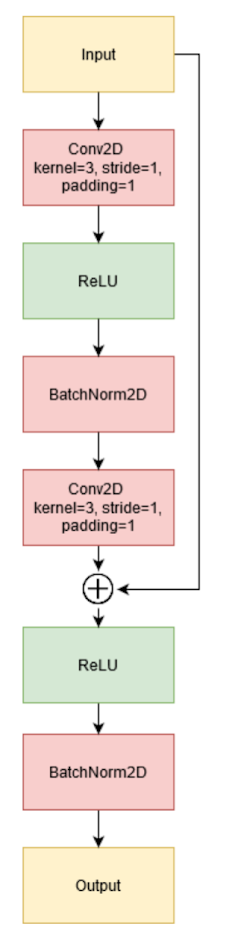

# Session 6 /ResNet-DenseNet-InceptionNet

___

##### From previous session

#### Dot function correction:

```python
    
   def forward(self, x):
        batch_size = x.size(0)
        in_size = x.size(-1)  # last dim from (B, C, W, H)
        out_size = get_out_size(in_size, self.padding, self.kernel_size, self.stride)

        out = torch.zeros(batch_size, self.out_channels, out_size, out_size).to(DEVICE)

        x_padded_size = in_size+self.padding*2
        x_padded = torch.zeros(batch_size, self.in_channels, x_padded_size, x_padded_size).to(DEVICE)
        x_padded[:, :, self.padding:-self.padding, self.padding:-self.padding] = x

        K = self.K.view(-1, self.out_channels)  # (self.kernel_size*self.kernel_size*self.in_channels, self.out_channels)

        i_out = 0
        for i in range(0, x_padded_size - self.kernel_size, self.stride):
            j_out = 0
            for j in range(0, x_padded_size - self.kernel_size, self.stride):
                x_part = x_padded[:, :, i:i+self.kernel_size, j:j+self.kernel_size]
                x_part = x_part.reshape(batch_size, -1)

                # x_part.shape (BATCH_SIZE, self.kernel_size*self.kernel_size*self.in_channels)
                # K.shape (self.kernel_size*self.kernel_size*self.in_channels, self.out_channels)
                out_part = torch.matmul(
                    torch.unsqueeze(x_part, dim=1), # (BATCH_SIZE, 1, self.kernel_size*self.kernel_size*self.in_channels)
                    torch.unsqueeze(K, dim=0) # (1, self.kernel_size*self.kernel_size*self.in_channels, self.out_channels)
                )  # (B, 1, self.out_channels)
                out[:, :, i_out, j_out] = torch.squeeze(out_part, dim=1)  # (B, self.out_channels)

                j_out += 1
            i_out += 1

       	return out
```


## Fully Connected ConvNet/CsvUtils

- Get arguments and create run combinations:

```python
"""
Add argument parsing from command-line run
"""
parser = argparse.ArgumentParser(description='Model trainer')
parser.add_argument('-run_name', default='run', type=str)
parser.add_argument('-sequence_name', default=f'seq_run', type=str)
parser.add_argument('-is_cuda', default=False, type=lambda x: (str(x).lower() == 'true'))
parser.add_argument('-learning_rate', nargs="+", default=[1e-4, 1e-5], type=float)
parser.add_argument('-batch_size', nargs="+", default=[16, 32, 64], type=int)
parser.add_argument('-epochs', default=50, type=int)
args = parser.parse_args()

"""
Create every combination of runs from batch_size and learning_rate
"""
args_with_multiple_values = {}
for key, value in args.__dict__.items():
    if isinstance(value, list):
        if len(value) > 1:
            args_with_multiple_values[key] = value
grid_runs = list(ParameterGrid(args_with_multiple_values))
```

Create directory paths, add transforms and create dataloaders:

```python
...

run_num = 0
for run in grid_runs:
    run_num += 1
    path_run = f'./results/{args.sequence_name}_{run_num}/{args.run_name}_{run_num}'
    path_artifacts = f'./artifacts/{args.sequence_name}_{run_num}/{args.run_name}_{run_num}'
    path_sequence = './results'
    # create argument dictionary for each run
    args_dict = copy.deepcopy(args.__dict__)
    args_dict["run_name"] = f"run_{run_num}"
    args_dict["sequence_name"] = f"seq_run_{run_num}"
    args_dict["learning_rate"] = run['learning_rate']
    args_dict["batch_size"] = run['batch_size']
    FileUtils.createDir(path_run)
    FileUtils.createDir(path_artifacts)
    FileUtils.writeJSON(f'{path_run}/args.json', args_dict)

    CsvUtils2.create_global(path_sequence=f'{path_sequence}')
    CsvUtils2.create_local(path_sequence=f'{path_sequence}', run_name=f'{args.run_name}_{run_num}')

    transformer = transforms.Compose([
        transforms.ToTensor(),  # Converts numpy.ndarray to torch.Tensor Values from 0:255 to 0:1
        transforms.Resize((IMAGE_SIZE, IMAGE_SIZE)),
        transforms.RandomRotation(degrees=90),
        transforms.CenterCrop(size=IMAGE_SIZE),
        transforms.RandomHorizontalFlip()
    ])

    data_loader_train = torch.utils.data.DataLoader(
        dataset=DatasetBeans(is_train=True, max_length=TRAIN_MAX_LEN, transform=transformer),
        batch_size=run['batch_size'],
        shuffle=True
    )

    data_loader_test = torch.utils.data.DataLoader(
        dataset=DatasetBeans(is_train=False, max_length=TEST_MAX_LEN, transform=transformer),
        batch_size=run['batch_size'],
        shuffle=False
    )

    model = Model()
    model = model.to(DEVICE)
    optimizer = torch.optim.Adam(model.parameters(), lr=run['learning_rate'])
   
	...
```

```python
		...
    	"""
        Get best metrics value
        """
        best_metrics = {}
        for stage in ['train', 'test']:
            for metric in [
                'loss',
                'acc',
                'f1-score'
            ]:
                if metric == 'loss':
                    best_metrics[f'best_{stage}_{metric}'] = min(metrics[f'{stage}_{metric}'])
                else:
                    best_metrics[f'best_{stage}_{metric}'] = max(metrics[f'{stage}_{metric}'])

        CsvUtils2.add_hparams(
            path_sequence=path_sequence,
            run_name=f'{args.run_name}_{run_num}',
            args_dict=args.__dict__,
            metrics_dict=best_metrics,  # add only best values
            global_step=epoch
        )
        best_metrics['epochs'] = epoch
        FileUtils.writeJSON(f'{path_run}/best_metrics.json', best_metrics)

        """
        Check if training is converging
        """
        if epoch >= 10:
            train_acc_delta = np.max(metrics["train_acc"][-5:]) - np.min(metrics["train_acc"][-5:])
            test_acc_delta = np.max(metrics["test_acc"][-5:]) - np.min(metrics["test_acc"][-5:])
            train_loss_delta = np.max(metrics["train_loss"][-5:]) - np.min(metrics["train_loss"][-5:])
            test_loss_delta = np.max(metrics["test_loss"][-5:]) - np.min(metrics["test_loss"][-5:])

            if train_loss_delta < 0.01 and test_loss_delta < 0.01:
                break  # stop training

        summary_writer.flush()
    summary_writer.close()
```

1. ### run

   args.json

   ```json
   {
       "run_name": "run_1",
       "sequence_name": "seq_run_1",
       "is_cuda": false,
       "learning_rate": 0.0001,
       "batch_size": 16,
       "epochs": 50
   }
   ```

   best_metrics.json

   ```json
   {
       "best_train_loss": 0.7612871225063618,
       "best_train_acc": 0.6832692307692307,
       "best_train_f1-score": 0.6932829100701251,
       "best_test_loss": 0.7148073427379131,
       "best_test_acc": 0.6953125,
       "best_test_f1-score": 0.7230096726190476,
       "epochs": 33
   }
   ```


2. ### run

   args.json

   ```json
   {
       "run_name": "run_2",
       "sequence_name": "seq_run_2",
       "is_cuda": false,
       "learning_rate": 1e-05,
       "batch_size": 16,
       "epochs": 50
   }
   ```

   best_metrics.json

   ```json
   {
       "best_train_loss": 0.9419406744150015,
       "best_train_acc": 0.6184615384615385,
       "best_train_f1-score": 0.6528834028413325,
       "best_test_loss": 0.954173855483532,
       "best_test_acc": 0.6171875,
       "best_test_f1-score": 0.6868861607142858,
       "epochs": 50
   }
   ```

   

   ### 3.run

   args.json

   ```json
   {
       "run_name": "run_3",
       "sequence_name": "seq_run_3",
       "is_cuda": false,
       "learning_rate": 0.0001,
       "batch_size": 32,
       "epochs": 50
   }
   ```

   best_metrics.json

   ```json
   {
       "best_train_loss": 0.759580337640011,
       "best_train_acc": 0.6867424242424243,
       "best_train_f1-score": 0.7035772005910347,
       "best_test_loss": 0.7292145192623138,
       "best_test_acc": 0.703125,
       "best_test_f1-score": 0.7265625,
       "epochs": 50
   }
   ```

   

   ...

   Csv example:

   

___

## ResNet

Resnet block:



```python
class ResBlock(torch.nn.Module):
    def __init__(self, in_channels, out_channels, stride=1):
        super().__init__()
        self.conv1 = torch.nn.Conv2d(in_channels=in_channels, out_channels=out_channels,
                                     kernel_size=(3, 3), stride=(stride, stride), padding=(1, 1), bias=False)
        self.bn1 = torch.nn.BatchNorm2d(num_features=out_channels)
        self.conv2 = torch.nn.Conv2d(in_channels=out_channels, out_channels=out_channels,
                                     kernel_size=(3, 3), stride=(1, 1), padding=(1, 1), bias=False)
        self.bn2 = torch.nn.BatchNorm2d(num_features=out_channels)

        self.is_bottleneck = False
        if stride != 1 or in_channels != out_channels:
            self.is_bottleneck = True
            self.shortcut = torch.nn.Conv2d(in_channels=in_channels, out_channels=out_channels,
                                            kernel_size=(1, 1), stride=(stride, stride), bias=False)

    def forward(self, x):
        residual = x

        out = self.conv1.forward(x)
        out = F.relu(out)
        out = self.bn1.forward(out)
        out = self.conv2.forward(out)

        if self.is_bottleneck:
            residual = self.shortcut.forward(x)

        out += residual

        out = F.relu(out)
        out = self.bn2.forward(out)
        return out
```

ResNet:

```python
class ModelResnet(torch.nn.Module):
    def __init__(self):
        super().__init__()
        self.conv1 = torch.nn.Conv2d(in_channels=3, out_channels=4,
                                     kernel_size=(7, 7), stride=(2, 2), padding=(3, 3), bias=False)
        self.bn1 = torch.nn.BatchNorm2d(num_features=4)
        self.max_pool = torch.nn.MaxPool2d(kernel_size=3, stride=2, padding=1)

        # Make ResBlock's
        self.identity_block_1 = ResBlock(in_channels=4, out_channels=4)
        self.identity_block_2 = ResBlock(in_channels=4, out_channels=4)

        self.bottleneck_block_1 = ResBlock(in_channels=4, out_channels=8, stride=2)
        self.identity_block_3 = ResBlock(in_channels=8, out_channels=8)

        self.bottleneck_block_2 = ResBlock(in_channels=8, out_channels=16, stride=2)
        self.identity_block_4 = ResBlock(in_channels=16, out_channels=16)

        self.bottleneck_block_3 = ResBlock(in_channels=16, out_channels=32, stride=2)
        self.identity_block_5 = ResBlock(in_channels=32, out_channels=32)

        self.linear = torch.nn.Linear(in_features=32, out_features=5)

    def forward(self, x):
        out = self.bn1.forward(F.relu(self.conv1.forward(x)))
        out = self.max_pool.forward(out)

        out = self.identity_block_1.forward(out)
        out = self.identity_block_2.forward(out)

        out = self.bottleneck_block_1.forward(out)
        out = self.identity_block_3.forward(out)

        out = self.bottleneck_block_2.forward(out)
        out = self.identity_block_4.forward(out)

        out = self.bottleneck_block_3.forward(out)
        out = self.identity_block_5.forward(out)

        out = F.avg_pool2d(out, 4)
        out = out.view(out.size(0), -1)
        out = self.linear.forward(out)
        out = F.softmax(out, dim=1)

        return out
```

Learning rate: 1e-4


___

## DenseNet

DenseNet block:


```python
class DenseBlock(torch.nn.Module):
    def __init__(self):
        super().__init__()

        self.bn1 = torch.nn.BatchNorm2d(num_features=32)
        self.bn2 = torch.nn.BatchNorm2d(num_features=64)
        self.bn3 = torch.nn.BatchNorm2d(num_features=96)
        self.bn4 = torch.nn.BatchNorm2d(num_features=128)

        self.conv1 = torch.nn.Conv2d(in_channels=32, out_channels=32, kernel_size=(3, 3), stride=(1, 1), padding=(1, 1))
        self.conv2 = torch.nn.Conv2d(in_channels=64, out_channels=32, kernel_size=(3, 3), stride=(1, 1), padding=(1, 1))
        self.conv3 = torch.nn.Conv2d(in_channels=96, out_channels=32, kernel_size=(3, 3), stride=(1, 1), padding=(1, 1))
        self.conv4 = torch.nn.Conv2d(in_channels=128, out_channels=32, kernel_size=(3, 3), stride=(1, 1),
                                     padding=(1, 1))

    def forward(self, x):
        conv1 = self.conv1.forward((self.bn1.forward(F.relu(x))))
        conv2_in = torch.cat([x, conv1], dim=1)

        conv2 = self.conv2.forward((self.bn2.forward(F.relu(conv2_in))))
        conv3_in = torch.cat([x, conv1, conv2], dim=1)

        conv3 = self.conv3.forward((self.bn3.forward(F.relu(conv3_in))))
        conv4_in = torch.cat([x, conv1, conv2, conv3], dim=1)

        conv4 = self.conv4.forward((self.bn4.forward(F.relu(conv4_in))))
        out = torch.cat([x, conv1, conv2, conv3, conv4], dim=1)

        return out
```

Transition Layer:


```python
class TransitionLayer(torch.nn.Module):
    def __init__(self, in_channels, out_channels):
        super().__init__()

        self.conv = torch.nn.Conv2d(in_channels=in_channels, out_channels=out_channels, kernel_size=(1, 1), bias=False)
        self.bn = torch.nn.BatchNorm2d(num_features=out_channels)
        self.avg_pool = torch.nn.AvgPool2d(kernel_size=2, stride=2, padding=0)

    def forward(self, x):
        out = self.bn.forward(F.relu(self.conv.forward(x)))
        out = self.avg_pool.forward(out)
        return out
```


DenseNet:

```python
class DenseNet(torch.nn.Module):
    def __init__(self):
        super().__init__()

        self.conv = torch.nn.Conv2d(in_channels=3, out_channels=32, kernel_size=(7, 7),
                                    stride=(2, 2), padding=(3, 3), bias=False)
        self.max_pool = torch.nn.MaxPool2d(kernel_size=3, stride=2, padding=1)

        # Make DenseBlock's
        self.dense_block_1 = DenseBlock()
        self.dense_block_2 = DenseBlock()
        self.dense_block_3 = DenseBlock()

        # Make Transition Layer's
        self.transition_layer_1 = TransitionLayer(in_channels=160, out_channels=32)
        self.transition_layer_2 = TransitionLayer(in_channels=160, out_channels=32)
        self.transition_layer_3 = TransitionLayer(in_channels=160, out_channels=32)

        # Classifier 288 = 32x3x3
        self.linear = torch.nn.Linear(288, 5)

    def forward(self, x):
        out = self.conv.forward(x)
        out = self.max_pool.forward(out)

        out = self.dense_block_1.forward(out)
        out = self.transition_layer_1.forward(out)

        out = self.dense_block_2.forward(out)
        out = self.transition_layer_2.forward(out)

        out = self.dense_block_3.forward(out)
        out = self.transition_layer_3.forward(out)

        out = out.view(-1, 288)
        out = self.linear.forward(out)
        out = F.softmax(out, dim=1)

        return out
```

Learning rate: 1e-4


___

## InceptionNet/InceptionNet_v1(GoogleNet)

InceptionNet block:


```python
class InceptionBlockA(torch.nn.Module):
    def __init__(self, in_channels, out_1x1, red_5x5, out_5x5, red_3x3,
                       out_3x3_1, out_3x3, out_1x1pool, stride=1):
        super().__init__()
        self.out_total_channels = sum([out_1x1, out_5x5, out_3x3, out_1x1pool])
        self.batch_norm = torch.nn.BatchNorm2d(num_features=self.out_total_channels)

        self.branch1 = torch.nn.Conv2d(in_channels=in_channels, out_channels=out_1x1, kernel_size=(1, 1))
        self.branch2 = torch.nn.Sequential(
            torch.nn.Conv2d(in_channels=in_channels, out_channels=red_5x5, kernel_size=(1, 1)),
            torch.nn.Conv2d(in_channels=red_5x5, out_channels=out_5x5, kernel_size=(5, 5), padding=2)
        )
        self.branch3 = torch.nn.Sequential(
            torch.nn.Conv2d(in_channels=in_channels, out_channels=red_3x3, kernel_size=(1, 1)),
            torch.nn.Conv2d(in_channels=red_3x3, out_channels=out_3x3_1, kernel_size=(3, 3), padding=1),
            torch.nn.Conv2d(in_channels=out_3x3_1, out_channels=out_3x3, kernel_size=(3, 3), padding=1)
        )
        self.branch4 = torch.nn.Sequential(
            torch.nn.AvgPool2d(kernel_size=(3, 3), stride=1, padding=1),
            torch.nn.Conv2d(in_channels=in_channels, out_channels=out_1x1pool, kernel_size=(1, 1))
        )

        self.is_bottleneck = False
        if stride != 1:
            self.is_bottleneck = True
            self.shortcut = torch.nn.Conv2d(in_channels=in_channels, out_channels=in_channels,
                                            kernel_size=(1, 1), stride=(stride, stride), bias=False)

    def forward(self, x):
        if self.is_bottleneck:
            x = self.shortcut.forward(x)

        out = torch.cat([
            self.branch1.forward(x),
            self.branch2.forward(x),
            self.branch3.forward(x),
            self.branch4.forward(x)],
            dim=1)
        out = self.batch_norm.forward(F.relu(out))

        return out
```

InceptionNet:


```python
class InceptionNet(torch.nn.Module):
    def __init__(self):
        super().__init__()
        # self.max_pool = torch.nn.MaxPool2d(kernel_size=(2, 2))
        self.conv1 = torch.nn.Conv2d(in_channels=3, out_channels=16, kernel_size=(5, 5))
        self.conv2 = torch.nn.Conv2d(in_channels=88, out_channels=64, kernel_size=(5, 5))
        """
            In this order: in_channels, out_1x1, red_5x5, out_5x5, red_3x3, out_3x3_1, out_3x3, out_1x1pool, stride?
        """
        self.inception_block1 = InceptionBlockA(16, 16, 8, 24, 8, 16, 32, 16, stride=2)
        self.inception_block2 = InceptionBlockA(64, 32, 32, 48, 32, 32, 64, 64, stride=2)

        self.linear = torch.nn.Linear(in_features=100672, out_features=5)  # in_features = out_channels*img_size*img_size

    def forward(self, x):
        out = self.conv1.forward(x)
        # out = self.max_pool.forward(out)
        out = F.relu(out)
        out = self.inception_block1.forward(out)

        out = self.conv2.forward(out)
        # out = self.max_pool.forward(out)
        out = F.relu(out)
        out = self.inception_block2.forward(out)

        # (64, channels*conv_image_size*conv_image_size) -> (64, channels*22*22)
        out = out.view(out.size(0), -1)
        out = self.linear.forward(out)
        out = F.softmax(out, dim=1)

        return out
```

Learning rate: 1e-6


## Inception variation 1 (GoogleNet)

Used different dataset for GoogleNet because of architecture params. For example image size in input is 224x224 by default in GoogleNet. Apples have only 100x100.

https://www.kaggle.com/crowww/a-large-scale-fish-dataset

This dataset contains 9 different seafood types. 

Before the segmentation, feature extraction, and classification process, the dataset was resized to 590 x 445
by preserving the aspect ratio. After resizing the images, all labels in the dataset were augmented (by flipping and rotating).

GoogleNet architecture:


Get dataset:

```python
transformer = transforms.Compose([
    transforms.Resize(IMAGE_SIZE),
    transforms.ToTensor(),  # Converts numpy.ndarray to torch.Tensor Values from 0:255 to 0:1
    # transforms.ColorJitter(brightness=0.4, contrast=0.4, saturation=0.4, hue=0.2),
    # transforms.RandomRotation(degrees=90),
    transforms.CenterCrop(size=IMAGE_SIZE),
    transforms.RandomHorizontalFlip(p=0.4),
    transforms.RandomVerticalFlip(p=0.4)
])

dataset_full = datasets.ImageFolder("../data/archive/Fish_Dataset/Fish_Dataset", transform=transformer)

train_test_split = int(len(dataset_full) * TRAIN_TEST_SPLIT)
dataset_train, dataset_test = torch.utils.data.random_split(
    dataset_full,
    [train_test_split, len(dataset_full) - train_test_split],
    generator=torch.Generator().manual_seed(0)
)
```

Convolutions Block, Inception Block and Auxiliary classifier:

```python
class ConvBlock(nn.Module):
    def __init__(self, in_channels, out_channels, **kwargs):
        super().__init__()
        self.relu = nn.ReLU()
        self.conv = nn.Conv2d(in_channels, out_channels, **kwargs)
        self.batchnorm = nn.BatchNorm2d(out_channels)

    def forward(self, x):
        return self.relu.forward(self.batchnorm.forward(self.conv.forward(x)))


class InceptionBlock(nn.Module):
    def __init__(self, in_channels, out_1x1, red_3x3, out_3x3, red_5x5, out_5x5, out_1x1pool):
        super().__init__()

        self.branch1 = ConvBlock(in_channels, out_1x1, kernel_size=1)
        self.branch2 = nn.Sequential(
            ConvBlock(in_channels, red_3x3, kernel_size=1),
            ConvBlock(red_3x3, out_3x3, kernel_size=3, padding=1)
        )
        self.branch3 = nn.Sequential(
            ConvBlock(in_channels, red_5x5, kernel_size=1),
            ConvBlock(red_5x5, out_5x5, kernel_size=5, padding=2)
        )
        self.branch4 = nn.Sequential(
            nn.MaxPool2d(kernel_size=3, stride=1, padding=1),
            ConvBlock(in_channels, out_1x1pool, kernel_size=1)
        )

    def forward(self, x):
        return torch.cat([
            self.branch1.forward(x),
            self.branch2.forward(x),
            self.branch3.forward(x),
            self.branch4.forward(x)
        ], dim=1)


class InceptionAux(nn.Module):
    def __init__(self, in_channels, num_classes):
        super().__init__()
        self.relu = nn.ReLU()
        self.dropout = nn.Dropout(p=0.7)
        self.pool = nn.AvgPool2d(kernel_size=5, stride=3)
        self.conv = ConvBlock(in_channels=in_channels, out_channels=128, kernel_size=1)
        self.fc1 = nn.Linear(2048, 1024)
        self.fc2 = nn.Linear(1024, num_classes)

    def forward(self, x):
        x = self.pool.forward(x)
        x = self.conv.forward(x)
        x = self.relu.forward(x)
        x = x.reshape(x.shape[0], -1)
        x = self.relu.forward(self.fc1.forward(x))
        x = self.dropout.forward(x)
        x = self.fc2.forward(x)
        x = F.softmax(x, dim=1)

        return x
```

GoogleNet:

```python
class GoogleNet(nn.Module):
    def __init__(self, num_classes=9):
        super().__init__()
        self.conv1 = ConvBlock(in_channels=3,
                                out_channels=64,
                                kernel_size=(7,7),
                                stride=(2,2),
                                padding=(3,3))
        self.maxpool = nn.MaxPool2d(kernel_size=3, stride=2, ceil_mode=True)
        self.conv2 = ConvBlock(64, 64, kernel_size=1)
        self.conv3 = ConvBlock(64, 192, kernel_size=3, padding=1)

        """
            In this order: in_channels, out_1x1, red_3x3, out_3x3, red_5x5, out_5x5, out_1x1pool
        """
        self.inception3a = InceptionBlock(192, 64, 96, 128, 16, 32, 32)
        self.inception3b = InceptionBlock(256, 128, 128, 192, 32, 96, 64)

        self.inception4a = InceptionBlock(480, 192, 96, 208, 16, 48, 64)
        self.inception4b = InceptionBlock(512, 160, 112, 224, 24, 64, 64)
        self.inception4c = InceptionBlock(512, 128, 128, 256, 24, 64, 64)
        self.inception4d = InceptionBlock(512, 112, 144, 288, 32, 64, 64)
        self.inception4e = InceptionBlock(528, 256, 160, 320, 32, 128, 128)

        self.inception5a = InceptionBlock(832, 256, 160, 320, 32, 128, 128)
        self.inception5b = InceptionBlock(832, 384, 192, 384, 48, 128, 128)

        self.avgpool = nn.AvgPool2d(kernel_size=(7,7), stride=1)
        self.dropout = nn.Dropout(p=0.4)
        self.fc1 = nn.Linear(1024, num_classes)  # 1024 = out_1x1+out_3x3+out_5x5+out_1x1pool


        self.aux1 = InceptionAux(512, num_classes)
        self.aux2 = InceptionAux(528, num_classes)


    def forward(self, x):
        x = self.conv1.forward(x)
        x = self.maxpool.forward(x)
        x = self.conv2.forward(x)
        x = self.conv3.forward(x)
        x = self.maxpool.forward(x)

        x = self.inception3a.forward(x)
        x = self.inception3b.forward(x)
        x = self.maxpool.forward(x)

        x = self.inception4a.forward(x)

        aux1 = self.aux1.forward(x)

        x = self.inception4b.forward(x)
        x = self.inception4c.forward(x)
        x = self.inception4d.forward(x)

        aux2 = self.aux2.forward(x)

        x = self.inception4e.forward(x)
        x = self.maxpool.forward(x)

        x = self.inception5a.forward(x)
        x = self.inception5b.forward(x)
        x = self.avgpool.forward(x)
        x = x.reshape(x.shape[0], -1)
        x = self.dropout.forward(x)
        x = self.fc1.forward(x)
        x = F.softmax(x, dim=1)

        return aux1, aux2, x
```

```python
model = GoogleNet()
optimizer = torch.optim.RMSprop(model.parameters(), lr=1e-6)
```

Calculate total loss based on auxiliary classifiers to avoid network dying out. And only in training.

```python
        ...
    	for x, y_idx in tqdm(data_loader):
            if USE_CUDA:
                x = x.cuda()
                y_idx = y_idx.cuda()

            aux1, aux2, y_prim = model.forward(x)

            idx = range(len(y_idx))
            if data_loader == data_loader_train:
                # The total loss used by the inception net during training.
                # total_loss = real_loss + 0.3 * aux_loss_1 + 0.3 * aux_loss_2
                aux1_loss = torch.mean(-torch.log(aux1 + 1e-20)[idx, y_idx])
                aux2_loss = torch.mean(-torch.log(aux2 + 1e-20)[idx, y_idx])
                real_loss = torch.mean(-torch.log(y_prim + 1e-20)[idx, y_idx])
                loss = real_loss + 0.3*aux1_loss + 0.3*aux2_loss

                loss.backward()
                optimizer.step()
                optimizer.zero_grad()
            else:
                loss = torch.mean(-torch.log(y_prim + 1e-20)[idx, y_idx])
            ...
```


