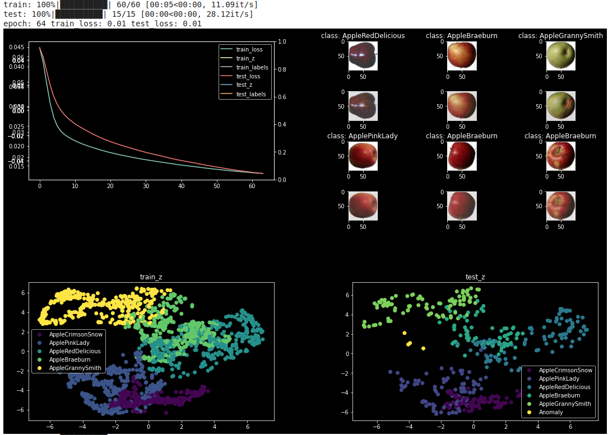

# AE/VAE/Thesis subject

Bakalaura darba grafiks šajā semestrī:


Tēmas kuras ieinteresē (no dotajām estudijās):


Nākamajā tikšanās reizē varētu izlemt par tēmu un tad es aizpildīšu iesnieguma veidlapu.

___

## Autoencoders

Autoencoder model:

```python
class AutoEncoder(torch.nn.Module):
    def __init__(self):
        super().__init__()
        self.encoder = torch.nn.Sequential(
            EncoderBlock(in_channels=3, out_channels=8, num_groups=2, size=64),
            EncoderBlock(in_channels=8, out_channels=16, num_groups=4, size=32),
            EncoderBlock(in_channels=16, out_channels=32, num_groups=8, size=16),
            EncoderBlock(in_channels=32, out_channels=64, num_groups=16, size=4),
            EncoderBlock(in_channels=64, out_channels=128, num_groups=32, size=2),
            EncoderBlock(in_channels=128, out_channels=256, num_groups=64, size=1, lastblock=True)
        )

        self.decoder = torch.nn.Sequential(
            DecoderBlock(in_channels=256, out_channels=256, num_groups=64, size=2),
            DecoderBlock(in_channels=256, out_channels=128, num_groups=64),
            DecoderBlock(in_channels=128, out_channels=128, num_groups=16),
            DecoderBlock(in_channels=128, out_channels=96, num_groups=32, size=4),
            DecoderBlock(in_channels=96, out_channels=96, num_groups=32),
            DecoderBlock(in_channels=96, out_channels=96, num_groups=16),
            DecoderBlock(in_channels=96, out_channels=64, num_groups=16, size=16),
            DecoderBlock(in_channels=64, out_channels=64, num_groups=16),
            DecoderBlock(in_channels=64, out_channels=64, num_groups=8),
            DecoderBlock(in_channels=64, out_channels=32, num_groups=8, size=32),
            DecoderBlock(in_channels=32, out_channels=32, num_groups=8),
            DecoderBlock(in_channels=32, out_channels=16, num_groups=4),
            DecoderBlock(in_channels=16, out_channels=16, num_groups=4, size=64),
            DecoderBlock(in_channels=16, out_channels=8, num_groups=4),
            DecoderBlock(in_channels=8, out_channels=8, num_groups=2),
            DecoderBlock(in_channels=8, out_channels=3, num_groups=1, size=100),
            DecoderBlock(in_channels=3, out_channels=3, num_groups=1, lastblock=True)
        )

    def forward(self, x):
        z = self.encoder.forward(x)
        z = z.view(-1, 256)
        y_prim = self.decoder.forward(z.view(-1, 256, 1, 1))
        return y_prim, z
```

Add anomaly images:

```python
# Add anomaly label
dataset_full.labels += ['Anomaly']
img_paths = ['anom1_wrench.jpg', 'anom2_screwdriver.jpg', 'anom3_saw.jpg', 'anom4_shovel.jpg']
anomaly_images = torch.zeros((len(img_paths), 3, 100, 100))
for i, path in enumerate(img_paths):
    img = io.imread(path)
    img = transform.resize(img, (100,100))
    anomaly_images[i] = torch.FloatTensor(img).permute(2, 0, 1)

anomaly_label = torch.ones((len(img_paths),)) * 5
```

Pass anomaly images through model:

```python
    ...
    for data_loader in [data_loader_train, data_loader_test]:
        stage = 'train'
        if data_loader == data_loader_test:
            stage = 'test'

        for x, y_target, y_label in tqdm(data_loader, desc=stage):
            x = x.to(DEVICE)
            y_target = y_target.to(DEVICE)
            y_label = y_label.squeeze().to(DEVICE)

            ...

        # Add anomaly
        if stage == 'test':
            anomaly_images = anomaly_images.to(DEVICE)
            anomaly_label = anomaly_label.to(DEVICE)
            anomaly_y_prim, anomaly_z = model.forward(anomaly_images)
            metrics_epoch[f'{stage}_z'] += anomaly_z.cpu().data.numpy().tolist()
            metrics_epoch[f'{stage}_labels'] += anomaly_label.cpu().data.numpy().tolist()
    ...
```

Results:

without anomaly-


adding anomaly images to model:

|       |     |
| --------------------------------------- | ---------------------------------- |
|  |  |



___

## Variational Autoencoders

Decoder block:

```python
class DecoderBlock(torch.nn.Module):
    def __init__(self, in_channels, out_channels, num_groups, out_size):
        super().__init__()

        self.out_size = out_size
        self.layers = torch.nn.Sequential(
            torch.nn.Conv2d(in_channels=in_channels, out_channels=out_channels,
                            kernel_size=(3, 3), stride=(1, 1), padding=1),
            torch.nn.GroupNorm(num_groups, out_channels),
            torch.nn.Mish(),
            torch.nn.Conv2d(in_channels=out_channels, out_channels=out_channels,
                            kernel_size=(3, 3), stride=(1, 1), padding=1),
            torch.nn.GroupNorm(num_groups, out_channels),
            torch.nn.Mish()
        )

    def forward(self, x):
        y_prim = self.layers.forward(x)

        if x.size(-1) != self.out_size:
            y_prim = torch.nn.functional.interpolate(y_prim, size=self.out_size)

            if args.is_skip:
                y_skip = torch.nn.functional.adaptive_avg_pool3d(
                    x, output_size=(y_prim.size(1), self.out_size, self.out_size))
                y_prim += y_skip

        return y_prim
```

VAE model:

```python
class VAE(torch.nn.Module):
    def __init__(self):
        super().__init__()

        self.encoder = torchvision.models.resnet18( # 3, W, H
            pretrained=True
        )
        self.encoder_mu = torch.nn.Linear(
            in_features=self.encoder.fc.in_features,
            out_features=Z_SIZE
        )
        self.encoder_sigma = torch.nn.Linear(
            in_features=self.encoder.fc.in_features,
            out_features=Z_SIZE
        )
        self.encoder.fc = torch.nn.Identity()

        self.decoder = torch.nn.Sequential(
            DecoderBlock(in_channels=Z_SIZE, out_channels=64, num_groups=16, out_size=1),
            DecoderBlock(in_channels=64, out_channels=32, num_groups=16, out_size=2),
            DecoderBlock(in_channels=32, out_channels=16, num_groups=8, out_size=4),
            DecoderBlock(in_channels=16, out_channels=16, num_groups=8, out_size=8),
            DecoderBlock(in_channels=16, out_channels=8, num_groups=4, out_size=16),
            DecoderBlock(in_channels=8, out_channels=3, num_groups=1, out_size=32),

            torch.nn.Sigmoid()
        )

    def forward(self, x):
        out = self.encoder.forward(x)
        out_flat = out.view(x.size(0), -1)

        z_sigma = torch.sigmoid(self.encoder_sigma.forward(out_flat))
        z_mu = torch.tanh(self.encoder_mu.forward(out_flat))

        eps = torch.normal(mean=0.0, std=1.0, size=z_mu.size()).to(DEVICE)
        # re-parameterization trick
        z = z_mu + z_sigma * eps

        z_2d = z.view(-1, Z_SIZE, 1, 1)
        y_prim = self.decoder.forward(z_2d)
        return y_prim, z, z_sigma, z_mu
```

Loss calculation:

```python
loss_rec = torch.mean(torch.abs(y_prim - y))
loss_kl = torch.mean(VAE_BETA * torch.mean(-0.5 * (2.0 * torch.log(z_sigma + 1e-8) - z_sigma**2 - z_mu**2 + 1), dim=0))
loss = loss_rec + loss_kl
```

Results:

```python
LEARNING_RATE=1e-3
BATCH_SIZE=16
VAE_BETA=1e-4
Z_SIZE=48
```


```python
LEARNING_RATE=1e-3
BATCH_SIZE=16
VAE_BETA=1e-3
Z_SIZE=64
```


```python
LEARNING_RATE=1e-3
BATCH_SIZE=16
VAE_BETA=5e-3
Z_SIZE=48
```


```python
LEARNING_RATE=1e-3
BATCH_SIZE=16
VAE_BETA=1e-3
Z_SIZE=64

9 classes
```


