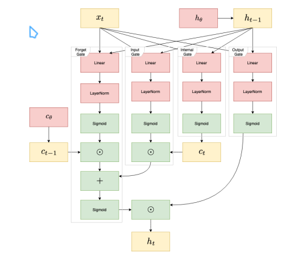
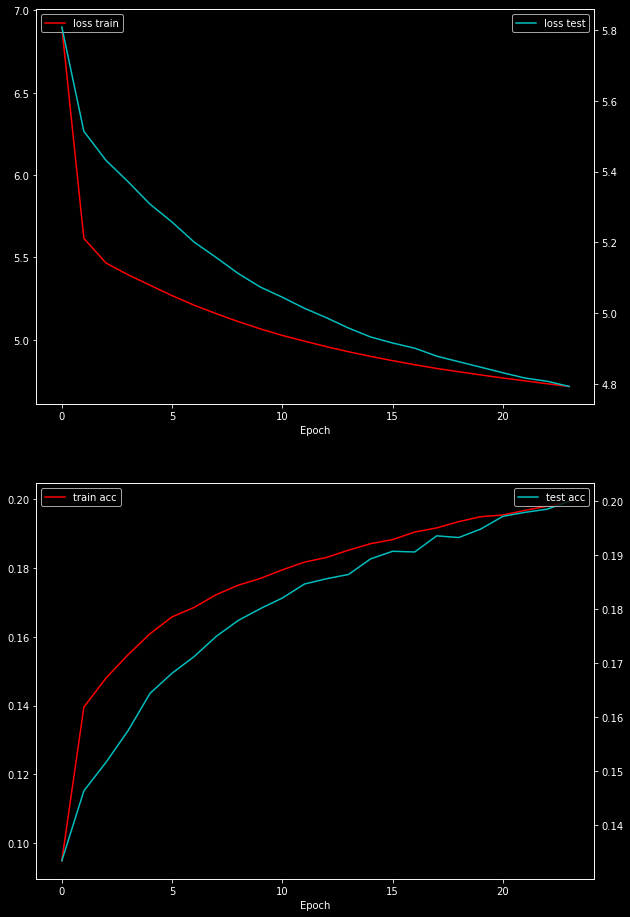
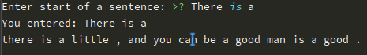
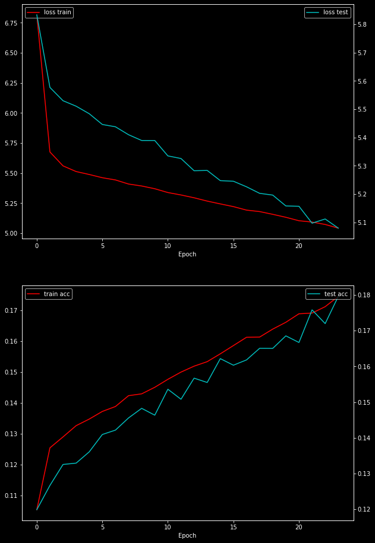
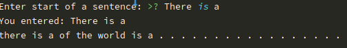
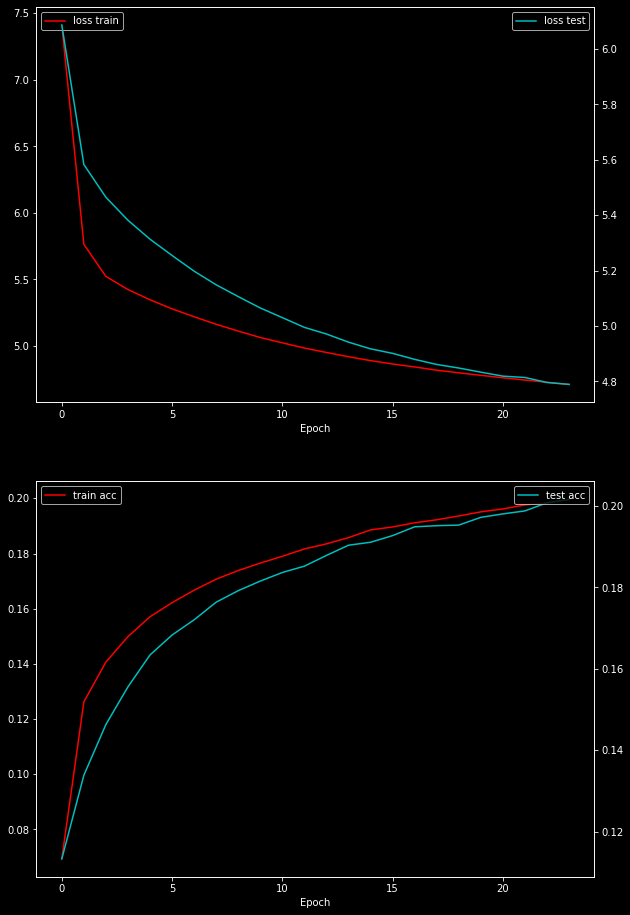
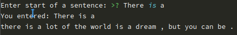
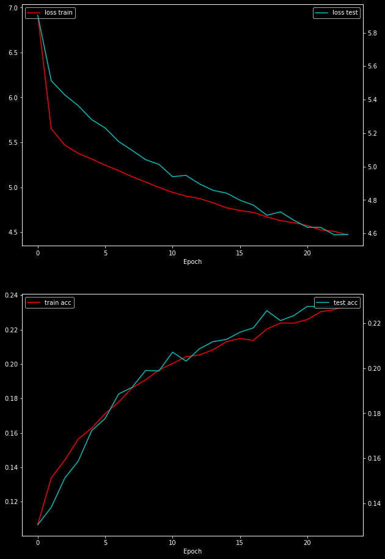
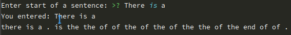

# Meeting 8 Report

Improved LSTM/GRU

___



- Layer Norm before sigmoid (LSTM):

  ```python
          ...
          for x_t in x_seq:
              # forget gate
              f_t = (self.W_f.t() @ x_t.unsqueeze(dim=-1)).squeeze(dim=-1) +\
                    (self.U_f.t() @ hidden.unsqueeze(dim=-1)).squeeze(dim=-1) +\
                    self.b_f
              f_t = self.forget_layer_norm.forward(f_t.unsqueeze(dim=1)).squeeze(dim=1)
              f_t = self.sigmoid.forward(f_t)
              # input
              i_t = (self.W_i.t() @ x_t.unsqueeze(dim=-1)).squeeze(dim=-1) +\
                    (self.U_i.t() @ hidden.unsqueeze(dim=-1)).squeeze(dim=-1) +\
                    self.b_i
              i_t = self.input_layer_norm.forward(i_t.unsqueeze(dim=1)).squeeze(dim=1)
              i_t = self.sigmoid.forward(i_t)
              # output
              o_t = (self.W_o.t() @ x_t.unsqueeze(dim=-1)).squeeze(dim=-1) +\
                    (self.U_o.t() @ hidden.unsqueeze(dim=-1)).squeeze(dim=-1) +\
                    self.b_o
              o_t = self.output_layer_norm.forward(o_t.unsqueeze(dim=1)).squeeze(dim=1)
              o_t = self.sigmoid.forward(o_t)
              # candidate memory
              c_hat_t = (self.W_c.t() @ x_t.unsqueeze(dim=-1)).squeeze(dim=-1) +\
                        (self.U_c.t() @ hidden.unsqueeze(dim=-1)).squeeze(dim=-1) +\
                        self.b_c
              c_hat_t = self.internal_layer_norm.forward(c_hat_t.unsqueeze(dim=1)).squeeze(dim=1)
              c_hat_t = self.sigmoid.forward(c_hat_t)
  ```

- Layer Norm in GRU:

  ```python
          for x_t in x_seq:
              # x_t => (B, EMBEDDING_SIZE)
              # update gate allows us to control how much of the new state is just a copy of the old state
              z = (self.W_z.t() @ x_t.unsqueeze(dim=-1)).squeeze(dim=-1) +\
                  (self.U_z.t() @ hidden.unsqueeze(dim=-1)).squeeze(dim=-1) +\
                  self.b_z
              z = self.z_layer_norm.forward(z.unsqueeze(dim=1)).squeeze(dim=1)
              z = self.sigmoid.forward(z)
              # reset gate allows us to control how much of the previous state we might still want to remember
              r = (self.W_r.t() @ x_t.unsqueeze(dim=-1)).squeeze(dim=-1) +\
                  (self.U_r.t() @ hidden.unsqueeze(dim=-1)).squeeze(dim=-1) +\
                  self.b_r
              r = self.r_layer_norm.forward(r.unsqueeze(dim=1)).squeeze(dim=1)
              r = self.sigmoid.forward(r)
              # Candidate hidden state
              h_hat = (self.W_h.t() @ x_t.unsqueeze(dim=-1)).squeeze(dim=-1) +\
                  r * (self.U_h.t() @ hidden.unsqueeze(dim=-1)).squeeze(dim=-1) +\
                  self.b_z
              h_hat = self.h_layer_norm.forward(h_hat.unsqueeze(dim=1)).squeeze(dim=1)
              h_hat = self.sigmoid.forward(h_hat)
  ```

  

- Hidden state's as learnable parameters (LSTM):

  ```python
  self.hidden = torch.nn.Parameter(
  	torch.FloatTensor(BATCH_SIZE, self.hidden_size).zero_()
  )
  self.c_hidden = torch.nn.Parameter(
  	torch.FloatTensor(BATCH_SIZE, self.hidden_size).zero_()
  )
  ```

- Hidden state as learnable parameter (GRU):

  ```python
  self.hidden = torch.nn.Parameter(
  	torch.FloatTensor(BATCH_SIZE, self.hidden_size).zero_()
  )
  ```

- Initialize forget gate bias to 1 in LSTM:

  ```python
  self.b_f = torch.nn.Parameter(
  	torch.FloatTensor(self.hidden_size).fill_(value=1)
  )
  ```

- Initialize reset gate bias to -1 in GRU:

  ```python
  self.b_r = torch.nn.Parameter(
      torch.FloatTensor(self.hidden_size).fill_(value=-1)
  )
  ```

- Skip connections with input:

  ```python
  class LSTM_Block(torch.nn.Module):
      def __init__(self, input_size, hidden_size):
          super().__init__()
          self.lstm1 = LSTM(input_size=input_size, hidden_size=hidden_size)
          self.lstm2 = LSTM(input_size=hidden_size, hidden_size=hidden_size)
          self.lstm3 = LSTM(input_size=hidden_size, hidden_size=hidden_size)
  
      def forward(self, x, hidden):
          residual = x.data
  
          out, hidden = self.lstm1.forward(x, hidden)
          out_res = out.data + residual
          out_seq = PackedSequence(
              data=out_res,
              batch_sizes=x.batch_sizes,
              sorted_indices=x.sorted_indices
          )
          out, hidden = self.lstm2.forward(out_seq, hidden)
          out_res = out.data + residual
          out_seq = PackedSequence(
              data=out_res,
              batch_sizes=x.batch_sizes,
              sorted_indices=x.sorted_indices
          )
          out, hidden = self.lstm3.forward(out_seq, hidden)
  
          return out, hidden
  ```

- Model:

  ```python
  class Model(torch.nn.Module):
      def __init__(self):
          super().__init__()
          self.emb = torch.nn.Embedding(
              num_embeddings=len(dataset_full.vocabulary_keys),
              embedding_dim=EMBEDDING_SIZE
          )
  
          self.linear = torch.nn.Linear(in_features=EMBEDDING_SIZE, out_features=RNN_HIDDEN_SIZE)
  
          self.lstm_block_1 = LSTM_Block(input_size=RNN_HIDDEN_SIZE, hidden_size=RNN_HIDDEN_SIZE)
          # self.lstm_block_2 = LSTM_Block(input_size=RNN_HIDDEN_SIZE, hidden_size=RNN_HIDDEN_SIZE)
          # self.gru_block_1 = GRU_Block(input_size=RNN_HIDDEN_SIZE, hidden_size=RNN_HIDDEN_SIZE)
          # self.gru_block_2 = GRU_Block(input_size=RNN_HIDDEN_SIZE, hidden_size=RNN_HIDDEN_SIZE)
  
          self.fc = torch.nn.Linear(
              in_features=RNN_HIDDEN_SIZE,
              out_features=EMBEDDING_SIZE
          )
  
      def forward(self, x: PackedSequence, hidden=None):
          x_emb = self.emb.forward(x.data)  # x.data == Long sausage a_1, a_2, a_3, b_1, b_2 ...
  
          out_linear = self.linear.forward(x_emb)  # Add a linear layer for input data before RNN layers
          out_seq = PackedSequence(
              data=out_linear,
              batch_sizes=x.batch_sizes,
              sorted_indices=x.sorted_indices
          )
  
          ###
          out, hidden = self.lstm_block_1.forward(out_seq, hidden)
          # out, hidden = self.lstm_block_2.forward(out, hidden)
          ###
  
          out_fc = self.fc.forward(out.data)
          y_prim_logits = (self.emb.weight @ out_fc.unsqueeze(dim=-1)).squeeze(dim=-1)
          y_prim = torch.softmax(y_prim_logits, dim=-1)
          y_prim_packed = PackedSequence(
              data=y_prim,
              batch_sizes=x.batch_sizes,
              sorted_indices=x.sorted_indices
          )
  
          return y_prim_packed, hidden
  ```

  

- Zoneout vs Dropout (LSTM): self.zoneout_prob = 0.3

  ```python
  # zoneout (keep previous state value with probability 0.3)
  p = np.random.uniform(0, 1)
  c_hidden = (p <= self.zoneout_prob)*c_hidden + \
  	(1 - (p <= self.zoneout_prob))*(f_t * c_hidden + i_t * c_hat_t)
  hidden = (p <= self.zoneout_prob)*hidden + \
  	(1 - (p <= self.zoneout_prob))*(o_t * self.sigmoid.forward(c_hidden))
  
  # dropout
  c_hidden = f_t * c_hidden + i_t * c_hat_t
  hidden = o_t * self.sigmoid.forward(c_hidden)
  c_hidden = self.dropout.forward(c_hidden)
  hidden = self.dropout.forward(hidden)
  ```

  Zoneout vs Dropout (GRU): self.zoneout_prob = 0.3

  ```python
  # zoneout
  p = np.random.uniform(0, 1)
  hidden = (p <= self.zoneout_prob) * hidden + \
           (1 - (p <= self.zoneout_prob)) * (z * hidden + (1 - z) * h_hat)
  
  # dropout
  hidden = z * hidden + (1 - z) * h_hat
  hidden = self.dropout.forward(hidden)
  ```

  - Compare zoneout vs dropout with GRU and LSTM 24 epochs:

    LSTM dropout:

    

    Sentence generation (There is a):

    

​			LSTM zoneout:

​			

​			Sentence generation (There is a):

​						

Šķiet, ka ar zoneout ir problēma.

​			GRU dropout:

​			

​			Sentence generation (There is a):

​			

​			GRU zoneout:

​			

​			Sentence generation (There is a):

​			